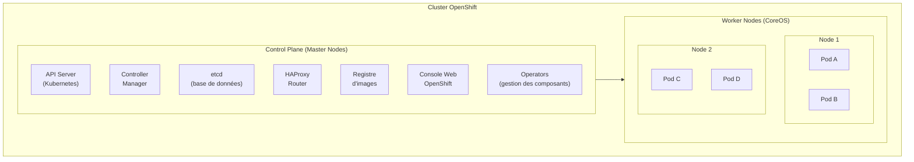

---
tags:
  - OpenShift
  - Débutant
  - Concept
description: "Introduction à OpenShift"
estimated_time: "40 min"
fiche_number: 1
total_fiches: 6
cursus: "OpenShift"
---

# 01 - Introduction à OpenShift

> **En bref** : À la fin de cette fiche, tu sauras ce qu'est OpenShift, en quoi il diffère de Kubernetes standard, et tu comprendras ses concepts spécifiques (Routes, BuildConfig, ImageStreams, Projects, SCC). Lecture estimée : 40 min.


## Prérequis

- Fiche **[BC03 - 05 - Les Bases de Kubernetes](../../00-blocs-competences/BC03-cloud-computing/05-kubernetes-bases.md)**
- Fiche **[01 - Introduction à Podman](../01-podman/01-introduction-podman.md)**
- Connaître les concepts de base de Kubernetes : Pod, Service, Deployment, Namespace
- Aucune connaissance préalable d'OpenShift n'est requise (tout est expliqué ci-dessous)

## Versions utilisées dans cette fiche

| Technologie | Version |
| ----------- | ------- |
| OpenShift | 4.14+ |
| CLI oc | 4.14+ |

## Objectif de cette fiche

À la fin de cette fiche, tu sauras ce qu'est OpenShift, en quoi il diffère de Kubernetes standard, et tu comprendras ses concepts spécifiques (Routes, BuildConfig, ImageStreams, Projects, SCC).

---

## Concepts

Cette section explique tous les concepts nécessaires. Lis-la entièrement avant de passer aux étapes pratiques.

### Qu'est-ce qu'OpenShift ?

**Définition** : OpenShift est une distribution Kubernetes entreprise créée et maintenue par Red Hat. C'est Kubernetes avec des fonctionnalités supplémentaires pour la production.

**Le problème qu'OpenShift résout** :

Sans OpenShift, voici les problèmes rencontrés avec Kubernetes seul :

1. **Pas de registre d'images intégré** : Tu dois installer et configurer un registre externe (Docker Hub, Harbor) pour stocker tes images de conteneurs.
2. **Pas de CI/CD intégré** : Tu dois installer des outils externes (Jenkins, GitLab CI) pour construire et déployer automatiquement tes applications.
3. **Pas de console web complète** : Le dashboard Kubernetes de base est limité. Tu ne peux pas gérer facilement les déploiements, les logs et les métriques depuis une interface graphique.
4. **Gestion TLS/routes complexe** : Exposer une application avec HTTPS nécessite d'installer et configurer un Ingress Controller et des certificats manuellement.
5. **Sécurité par défaut insuffisante** : Kubernetes permet par défaut d'exécuter des conteneurs en tant que root, ce qui est un risque de sécurité.

**Comment OpenShift résout ces problèmes** :

| Problème | Solution apportée par OpenShift |
| -------- | ------------------------------- |
| Pas de registre d'images intégré | Registre d'images interne au cluster, prêt à l'emploi |
| Pas de CI/CD intégré | BuildConfig et pipelines Tekton intégrés |
| Pas de console web complète | Console web riche avec gestion des déploiements, logs, métriques |
| Gestion TLS/routes complexe | Routes avec terminaison TLS automatique en une commande |
| Sécurité par défaut insuffisante | SCC (Security Context Constraints) qui bloquent root par défaut |

**Analogie concrète** : Kubernetes est comme un châssis de voiture. Il fournit le moteur, les roues et la transmission. Mais pour rouler sur la route, tu as besoin d'une carrosserie, d'un tableau de bord, d'un GPS et d'airbags. OpenShift est la voiture complète : le châssis Kubernetes plus tous les équipements nécessaires pour rouler en production.

**Ce qu'OpenShift n'est PAS** :

- OpenShift n'est pas un concurrent de Kubernetes. OpenShift _est_ Kubernetes. Toutes les commandes `kubectl` fonctionnent sur OpenShift. OpenShift ajoute des fonctionnalités par-dessus Kubernetes.
- OpenShift n'est pas gratuit. Il nécessite une licence Red Hat pour le support et les mises à jour. Cependant, OKD est la version communautaire et gratuite d'OpenShift.
- OpenShift n'est pas un outil de développement local. C'est une plateforme conçue pour la production. Pour le développement local, on utilise CRC (Red Hat OpenShift Local, anciennement CodeReady Containers), que l'on verra dans la fiche 02.

---

### OpenShift vs Kubernetes : les différences

**Définition** : OpenShift est une distribution Kubernetes. Cela signifie qu'il utilise Kubernetes comme base et ajoute des couches supplémentaires. Voici les différences principales.

**Le problème que ces différences résolvent** :

Sans les ajouts d'OpenShift, voici les tâches complexes avec Kubernetes seul :

1. **Exposer une application** : Tu dois configurer un Ingress Controller, créer un Ingress, gérer les certificats TLS manuellement.
2. **Construire une image** : Tu dois utiliser un outil externe (Docker, Buildah) en dehors du cluster pour construire une image, puis la pousser dans un registre.
3. **Suivre les mises à jour d'images** : Tu dois surveiller manuellement les nouvelles versions de tes images de base.
4. **Isoler les équipes** : Les Namespaces Kubernetes n'ont ni quotas ni réseau isolé par défaut. Tu dois configurer ResourceQuota et NetworkPolicy séparément.
5. **Appliquer des règles de sécurité** : Les PodSecurityPolicies de Kubernetes sont complexes à configurer et ont été dépréciées.

**Comment OpenShift résout ces problèmes** :

| Problème Kubernetes | Solution OpenShift | Concept OpenShift |
| ------------------- | ------------------ | ----------------- |
| Ingress complexe à configurer | Exposition en une commande | Route |
| Construction d'images externe | Construction dans le cluster | BuildConfig |
| Pas de suivi des images | Détection automatique des nouvelles versions | ImageStream |
| Namespaces sans isolation par défaut | Isolation réseau et quotas intégrés | Project |
| PodSecurityPolicy complexe | Politiques prédéfinies et assignables | SCC |
| Pas de console web riche | Interface complète de gestion | Console web |
| kubectl limité | Commandes supplémentaires | CLI oc |

**Tableau comparatif détaillé : Kubernetes vs OpenShift** :

| Fonctionnalité | Kubernetes standard | OpenShift |
| -------------- | ------------------- | --------- |
| Exposition réseau | Ingress (nécessite un controller) | Route (intégré nativement) |
| Construction d'images | Externe (Docker, Buildah) | BuildConfig (dans le cluster) |
| Registre d'images | Externe (Docker Hub, Harbor) | Registre interne intégré |
| Gestion des images | Image + tag | ImageStream (abstraction + suivi) |
| Isolation des équipes | Namespace (basique) | Project (Namespace + quotas + isolation) |
| Sécurité des conteneurs | PodSecurity (depuis K8s 1.25) | SCC (plus granulaire, plus ancien) |
| Interface graphique | Dashboard basique | Console web complète |
| CLI | kubectl | oc (superset de kubectl) |
| CI/CD | Externe (Jenkins, ArgoCD) | Tekton Pipelines intégré |
| Runtime de conteneurs | containerd ou CRI-O | CRI-O uniquement |
| Système d'exploitation des nœuds | Libre choix | CoreOS (optimisé pour les conteneurs) |
| Gestion du cluster | Manuelle ou Helm | Operators Framework intégré |

---

### Qu'est-ce qu'une Route ?

**Définition** : Une Route est un objet OpenShift qui expose un Service vers l'extérieur du cluster via un nom de domaine (URL). C'est le remplacement simplifié de l'Ingress Kubernetes.

**Le problème que les Routes résolvent** :

Sans Routes, voici les problèmes rencontrés pour exposer une application :

1. **Ingress Controller manquant** : Kubernetes n'inclut pas d'Ingress Controller par défaut. Tu dois en installer un (NGINX, Traefik).
2. **Configuration TLS manuelle** : Tu dois créer des certificats, les stocker dans des Secrets, et les référencer dans l'Ingress.
3. **Multiples fichiers YAML** : Pour exposer une application, tu as besoin d'un Ingress + un Secret TLS + la configuration du controller.

**Comment les Routes résolvent ces problèmes** :

| Problème | Solution apportée par les Routes |
| -------- | -------------------------------- |
| Ingress Controller manquant | HAProxy Router intégré dans OpenShift |
| Configuration TLS manuelle | Terminaison TLS automatique avec `oc expose` |
| Multiples fichiers YAML | Une seule commande ou un seul fichier YAML |

**Analogie concrète** : Avec Kubernetes standard, exposer une application c'est comme ouvrir un magasin : tu dois toi-même construire la porte d'entrée, installer la serrure, poser l'enseigne et paver le trottoir. Avec une Route OpenShift, c'est comme louer un local dans un centre commercial : la porte, l'enseigne et l'accès sont fournis. Tu donnes juste le nom de ton magasin.

**Ce qu'une Route n'est PAS** :

- Une Route n'est pas un Service. Le Service connecte les Pods entre eux à l'intérieur du cluster. La Route expose le Service vers l'extérieur.
- Une Route n'est pas un Ingress. Bien qu'OpenShift supporte aussi les Ingress Kubernetes, les Routes offrent des fonctionnalités supplémentaires (terminaison TLS edge/passthrough/reencrypt).

**Comparaison Route vs Ingress** :

| Route (OpenShift) | Ingress (Kubernetes) |
| ------------------ | -------------------- |
| Intégrée nativement | Nécessite un controller externe |
| TLS automatique | TLS manuelle via Secrets |
| Une commande : `oc expose` | Fichier YAML obligatoire |
| Supporte edge, passthrough, reencrypt | Dépend du controller installé |
| Spécifique à OpenShift | Standard Kubernetes |

---

### Qu'est-ce qu'un BuildConfig ?

**Définition** : Un BuildConfig est un objet OpenShift qui décrit comment construire une image de conteneur directement dans le cluster. Il remplace le besoin d'utiliser Docker ou Buildah en dehors du cluster.

**Le problème que BuildConfig résout** :

Sans BuildConfig, voici les problèmes rencontrés pour construire des images :

1. **Outil externe nécessaire** : Tu dois installer Docker ou Buildah sur ta machine locale ou sur un serveur CI/CD.
2. **Push manuel** : Après la construction, tu dois pousser l'image vers un registre avec `docker push` ou `buildah push`.
3. **Pas de déclenchement automatique** : Si le code source change, tu dois reconstruire l'image manuellement.

**Comment BuildConfig résout ces problèmes** :

| Problème | Solution apportée par BuildConfig |
| -------- | --------------------------------- |
| Outil externe nécessaire | Construction dans le cluster, aucun outil local requis |
| Push manuel | L'image est automatiquement poussée dans le registre interne |
| Pas de déclenchement automatique | Webhooks Git et triggers pour construire automatiquement |

**Analogie concrète** : Sans BuildConfig, c'est comme cuisiner chez toi puis transporter le plat au restaurant. Avec BuildConfig, c'est comme donner ta recette (le Dockerfile) directement au restaurant : la cuisine du restaurant prépare le plat sur place. Si tu modifies la recette, le restaurant prépare automatiquement la nouvelle version.

**Ce qu'un BuildConfig n'est PAS** :

- Un BuildConfig n'est pas un Dockerfile. Le Dockerfile est la recette de l'image. Le BuildConfig est l'objet OpenShift qui décrit quand et comment utiliser cette recette.
- Un BuildConfig n'est pas un Deployment. Le BuildConfig construit l'image. Le Deployment lance les Pods à partir de cette image.

**Les trois stratégies de Build** :

| Stratégie | Description | Quand l'utiliser |
| --------- | ----------- | ---------------- |
| **Docker** | Utilise un Dockerfile/Containerfile | Quand tu as un Dockerfile existant |
| **Source-to-Image (S2I)** | Construit à partir du code source sans Dockerfile | Quand tu ne veux pas écrire de Dockerfile |
| **Custom** | Stratégie personnalisée avec une image builder custom | Cas spéciaux nécessitant un processus de build sur mesure |

---

### Qu'est-ce qu'un ImageStream ?

**Définition** : Un ImageStream est une abstraction OpenShift qui référence une ou plusieurs images de conteneurs. Il surveille les changements et peut déclencher automatiquement un nouveau déploiement quand une image est mise à jour.

**Le problème que les ImageStreams résolvent** :

Sans ImageStreams, voici les problèmes rencontrés avec les images :

1. **Référence directe fragile** : Si tu utilises `image: nginx:latest` dans un Deployment, Kubernetes ne sait pas quand une nouvelle version de `nginx:latest` est disponible.
2. **Pas de notification de mise à jour** : Tu dois vérifier manuellement si une image de base a été mise à jour.
3. **Pas d'historique** : Tu ne peux pas voir les versions précédentes d'une image utilisée dans tes déploiements.

**Comment les ImageStreams résolvent ces problèmes** :

| Problème | Solution apportée par les ImageStreams |
| -------- | -------------------------------------- |
| Référence directe fragile | Référence via ImageStream + tag, indépendante du registre |
| Pas de notification de mise à jour | Triggers automatiques quand une nouvelle image est détectée |
| Pas d'historique | Liste des tags et de leurs images associées |

**Analogie concrète** : Sans ImageStream, c'est comme coller la photo d'un produit sur ton bon de commande. Si le produit change, ta photo est obsolète et tu ne le sais pas. Avec un ImageStream, c'est comme avoir un catalogue qui se met à jour automatiquement : quand un produit change, la nouvelle photo apparaît dans le catalogue et tu es prévenu.

**Ce qu'un ImageStream n'est PAS** :

- Un ImageStream n'est pas un registre d'images. Le registre stocke les images. L'ImageStream est un pointeur qui référence des images dans un ou plusieurs registres.
- Un ImageStream n'est pas une image. C'est une abstraction qui pointe vers une image. Plusieurs ImageStreams peuvent pointer vers la même image.

---

### Qu'est-ce qu'un Project ?

**Définition** : Un Project est un objet OpenShift qui étend le Namespace Kubernetes. Il fournit l'isolation, les quotas de ressources et les droits d'accès pour une équipe ou une application.

**Le problème que les Projects résolvent** :

Sans Projects, voici les problèmes rencontrés avec les Namespaces Kubernetes :

1. **Pas de quotas par défaut** : Un Namespace Kubernetes n'a aucune limite de ressources par défaut. Une application peut consommer toutes les ressources du cluster.
2. **Pas d'isolation réseau par défaut** : Les Pods d'un Namespace peuvent communiquer avec les Pods de tous les autres Namespaces.
3. **Gestion des droits basique** : Les RBAC Kubernetes sont complexes à configurer pour chaque Namespace.

**Comment les Projects résolvent ces problèmes** :

| Problème | Solution apportée par les Projects |
| -------- | ---------------------------------- |
| Pas de quotas par défaut | Quotas et limites de ressources appliqués automatiquement |
| Pas d'isolation réseau par défaut | Réseau isolé entre Projects par défaut |
| Gestion des droits basique | Rôles prédéfinis (admin, edit, view) assignables par Project |

**Analogie concrète** : Un Namespace Kubernetes est comme un bureau ouvert dans un open space. Tout le monde peut y accéder, il n'y a pas de limite sur l'espace utilisé, et tout le monde entend tout. Un Project OpenShift est comme un bureau fermé avec une porte, un badge d'accès, et un compteur électrique dédié : l'accès est contrôlé, la consommation est limitée, et les autres bureaux ne sont pas affectés.

**Ce qu'un Project n'est PAS** :

- Un Project n'est pas différent d'un Namespace au niveau technique. Un Project _est_ un Namespace avec des métadonnées supplémentaires. Les commandes `kubectl get namespaces` et `oc get projects` affichent les mêmes résultats.
- Un Project n'est pas un cluster séparé. Tous les Projects partagent le même cluster. L'isolation est logique, pas physique.

**Comparaison Namespace vs Project** :

| Namespace (Kubernetes) | Project (OpenShift) |
| ---------------------- | ------------------- |
| Pas de quotas par défaut | Quotas configurables par défaut |
| Pas d'isolation réseau | Isolation réseau par défaut |
| RBAC à configurer manuellement | Rôles prédéfinis (admin, edit, view) |
| Créé avec `kubectl create namespace` | Créé avec `oc new-project` |
| Pas de description | Description et labels intégrés |

---

### Qu'est-ce que les Security Context Constraints (SCC) ?

**Définition** : Les Security Context Constraints (SCC) sont des politiques de sécurité OpenShift qui contrôlent ce que les Pods ont le droit de faire : exécuter en tant que root, accéder au réseau de l'hôte, utiliser des volumes, etc.

**Le problème que les SCC résolvent** :

Sans SCC, voici les problèmes de sécurité rencontrés :

1. **Conteneurs root par défaut** : Beaucoup d'images Docker s'exécutent en tant que root. Un conteneur root compromis peut accéder au système hôte.
2. **Accès réseau non contrôlé** : Un conteneur peut accéder au réseau de la machine hôte si rien ne l'en empêche.
3. **Volumes sensibles montables** : Un conteneur peut monter des répertoires sensibles du système hôte (comme `/etc`, `/var/run`).

**Comment les SCC résolvent ces problèmes** :

| Problème | Solution apportée par les SCC |
| -------- | ----------------------------- |
| Conteneurs root par défaut | SCC `restricted` interdit l'exécution en tant que root |
| Accès réseau non contrôlé | SCC contrôle l'accès au réseau hôte |
| Volumes sensibles montables | SCC limite les types de volumes autorisés |

**Analogie concrète** : Les SCC sont comme les règles de sécurité d'un immeuble de bureaux. Le règlement par défaut (SCC `restricted`) dit : tu n'as pas le droit d'utiliser les clés du concierge (root), tu ne peux pas accéder au local technique (réseau hôte), et tu ne peux stocker tes affaires que dans ton casier attribué (volumes autorisés). Si tu as besoin d'un accès spécial, tu dois faire une demande au gestionnaire (administrateur du cluster).

**Ce que les SCC ne sont PAS** :

- Les SCC ne sont pas des pare-feu réseau. Les SCC contrôlent les permissions des conteneurs. Les NetworkPolicy contrôlent le trafic réseau entre Pods.
- Les SCC ne sont pas les mêmes que les PodSecurity Admission de Kubernetes. Les SCC sont plus anciens et plus granulaires. OpenShift supporte les deux, mais les SCC sont la méthode recommandée.

**Les SCC prédéfinies dans OpenShift** :

| SCC | Description | Niveau de restriction |
| --- | ----------- | --------------------- |
| `restricted-v2` | Politique par défaut (depuis OpenShift 4.11), interdit root, exige seccomp | Le plus restrictif |
| `restricted` | Ancienne politique par défaut (avant 4.11), interdit root | Très restrictif |
| `nonroot-v2` | Autorise tout sauf root, exige seccomp | Restrictif |
| `anyuid` | Autorise n'importe quel UID (y compris root) | Permissif |
| `hostaccess` | Autorise l'accès au réseau et aux volumes hôte | Très permissif |
| `privileged` | Aucune restriction | Aucune restriction |

**Règle importante** : Par défaut, tous les Pods dans OpenShift 4.11+ utilisent la SCC `restricted-v2`. Si une application a besoin de plus de permissions (par exemple pour tourner en root), l'administrateur doit explicitement accorder une SCC plus permissive comme `anyuid`.

---

### L'architecture d'OpenShift

**Définition** : L'architecture d'OpenShift repose sur Kubernetes mais ajoute des composants spécifiques. Voici les éléments principaux.

**Les composants d'OpenShift** :



**Les composants spécifiques à OpenShift** :

| Composant | Rôle | Équivalent Kubernetes |
| --------- | ---- | --------------------- |
| **HAProxy Router** | Route le trafic externe vers les Services | Ingress Controller (à installer soi-même) |
| **Registre d'images** | Stocke les images construites dans le cluster | Aucun (externe requis) |
| **Console Web** | Interface graphique complète | Dashboard basique |
| **Operators** | Gèrent l'installation et la mise à jour des composants | Helm charts (moins intégrés) |
| **CRI-O** | Runtime de conteneurs | containerd ou CRI-O (au choix) |
| **RHCOS** | Système d'exploitation des nœuds (obligatoire pour masters, par défaut pour workers) | Ubuntu, CentOS, ou autre (au choix) |

**Points importants sur l'architecture** :

- **CRI-O** est le seul runtime de conteneurs autorisé sur OpenShift. Docker n'est pas utilisé.
- **RHCOS (Red Hat CoreOS)** est le système d'exploitation obligatoire pour les nœuds du Control Plane. Pour les nœuds Worker, RHCOS est le choix par défaut, mais RHEL est aussi supporté. RHCOS se met à jour automatiquement via les Operators.
- **Les Operators** sont le mécanisme central de gestion. Chaque composant du cluster (monitoring, logging, networking) est géré par un Operator.

---

### La CLI oc

**Définition** : `oc` est l'outil en ligne de commande officiel d'OpenShift. C'est un superset de `kubectl` : toutes les commandes `kubectl` fonctionnent avec `oc`, et `oc` ajoute des commandes spécifiques à OpenShift.

**Le problème que oc résout** :

Sans `oc`, voici les limitations de `kubectl` avec OpenShift :

1. **Pas de gestion des Projects** : `kubectl` ne connaît pas les Projects OpenShift, seulement les Namespaces.
2. **Pas de construction d'images** : `kubectl` ne peut pas déclencher un BuildConfig.
3. **Pas d'exposition simplifiée** : `kubectl` ne peut pas créer des Routes OpenShift.
4. **Pas de création rapide d'applications** : `kubectl` n'a pas d'équivalent à `oc new-app`.

**Comment oc résout ces problèmes** :

| Problème | Solution apportée par oc |
| -------- | ------------------------ |
| Pas de gestion des Projects | `oc new-project`, `oc project` |
| Pas de construction d'images | `oc start-build`, `oc new-build` |
| Pas d'exposition simplifiée | `oc expose` crée une Route automatiquement |
| Pas de création rapide d'applications | `oc new-app` crée Deployment + Service en une commande |

**Analogie concrète** : `kubectl` est comme une télécommande basique qui contrôle le volume, les chaînes et le bouton on/off. `oc` est la même télécommande avec des boutons supplémentaires : accès direct aux favoris, enregistrement, et guide des programmes. Tous les boutons de base fonctionnent de la même manière.

**Ce que oc n'est PAS** :

- `oc` n'est pas un remplacement de `kubectl`. C'est une extension. Si tu connais `kubectl`, tu sais déjà utiliser `oc` pour les commandes standard.
- `oc` n'est pas nécessaire pour toutes les opérations. Les commandes `kubectl` standard fonctionnent sur OpenShift. `oc` est nécessaire uniquement pour les fonctionnalités spécifiques à OpenShift.

**Commandes kubectl vs commandes oc** :

| Action | kubectl | oc |
| ------ | ------- | -- |
| Lister les Pods | `kubectl get pods` | `oc get pods` |
| Voir les logs | `kubectl logs <pod>` | `oc logs <pod>` |
| Appliquer un YAML | `kubectl apply -f fichier.yaml` | `oc apply -f fichier.yaml` |
| Créer un Namespace/Project | `kubectl create namespace mon-ns` | `oc new-project mon-projet` |
| Exposer un Service | `kubectl create ingress ...` (complexe) | `oc expose svc/mon-service` |
| Créer une application | _(pas d'équivalent simple)_ | `oc new-app nginx:latest` |
| Lancer une construction | _(pas d'équivalent)_ | `oc start-build mon-build` |
| Changer de Project | `kubectl config set-context --current --namespace=x` | `oc project mon-projet` |

---

## Étapes Pratiques

Cette fiche est théorique. L'installation pratique et l'utilisation de CRC (CodeReady Containers) sont détaillées dans la fiche 02.

Les étapes ci-dessous te permettent de vérifier ta compréhension des concepts.

### Étape 1 : Comprendre la correspondance Kubernetes - OpenShift

Voici un tableau récapitulatif de la correspondance entre les concepts Kubernetes et OpenShift.

Lis ce tableau attentivement. Tu le retrouveras dans l'exercice pratique.

| Concept Kubernetes | Équivalent OpenShift | Différence principale |
| ------------------ | -------------------- | --------------------- |
| Namespace | Project | Project ajoute quotas, isolation réseau et rôles |
| Ingress | Route | Route est intégrée nativement, supporte TLS automatique |
| _(pas d'équivalent)_ | BuildConfig | Construction d'images directement dans le cluster |
| Image + tag | ImageStream | Abstraction avec détection de nouvelles versions |
| PodSecurity Admission | SCC | SCC plus granulaire et plus ancien |
| kubectl | oc | oc est un superset de kubectl |
| Ingress Controller (externe) | HAProxy Router (intégré) | Router intégré par défaut |
| containerd ou CRI-O | CRI-O uniquement | CRI-O est le seul runtime autorisé |
| Helm charts | Operators | Operators gèrent le cycle de vie complet |

---

### Étape 2 : Découvrir la CLI oc (aperçu)

L'installation de `oc` sera détaillée dans la fiche 02. Voici un aperçu des commandes principales que tu utiliseras.

**Vérifier la version de oc** :

```bash
oc version
```

**Résultat attendu** :

```text
Client Version: 4.14.x
Kubernetes Version: v1.27.x
```

**Afficher l'aide de oc** :

```bash
oc help
```

**Résultat attendu** (extrait) :

```text
OpenShift Client

This client helps you develop, build, deploy, and run your applications on any
OpenShift or Kubernetes cluster.

Basic Commands:
  login           Log in to a server
  new-project     Request a new project
  new-app         Create a new application
  status          Show an overview of the current project
  project         Switch to another project
  projects        Display existing projects
  explain         Get documentation for a resource

Build and Deploy Commands:
  rollout         Manage a Kubernetes deployment or OpenShift deployment config
  rollback        Revert part of an application back to a previous deployment
  new-build       Create a new build configuration
  start-build     Start a new build
  cancel-build    Cancel running, pending, or new builds
  import-image    Import images from a container image registry
  tag             Tag existing images into image streams

Application Management Commands:
  create          Create a resource from a file or from stdin
  apply           Apply a configuration to a resource by file name or stdin
  get             Display one or many resources
  describe        Show details of a specific resource or group of resources
  edit            Edit a resource on the server
  set             Commands that help set specific features on objects
  label           Update the labels on a resource
  expose          Expose a resource as a new Kubernetes service or OpenShift route
```

**Les commandes spécifiques à OpenShift (non disponibles dans kubectl)** :

| Commande | Action |
| -------- | ------ |
| `oc login` | Se connecter à un cluster OpenShift |
| `oc new-project` | Créer un nouveau Project |
| `oc new-app` | Créer une application (Deployment + Service) |
| `oc expose` | Créer une Route pour exposer un Service |
| `oc start-build` | Lancer la construction d'une image |
| `oc new-build` | Créer un nouveau BuildConfig |
| `oc import-image` | Importer une image dans un ImageStream |
| `oc project` | Changer de Project actif |
| `oc projects` | Lister les Projects disponibles |
| `oc status` | Afficher un résumé du Project actif |

---

## Commandes Utiles

| Commande | Action |
| -------- | ------ |
| `oc version` | Afficher la version du client oc et du serveur |
| `oc status` | Afficher un résumé de l'état du Project actif |
| `oc get pods` | Lister les Pods du Project actif |
| `oc get routes` | Lister les Routes du Project actif |
| `oc get builds` | Lister les Builds en cours et terminés |
| `oc get imagestreams` | Lister les ImageStreams du Project |
| `oc get projects` | Lister tous les Projects accessibles |
| `oc describe route <nom>` | Afficher les détails d'une Route |
| `oc new-project <nom>` | Créer un nouveau Project |
| `oc new-app <image>` | Créer une application à partir d'une image |
| `oc expose svc/<nom>` | Créer une Route pour un Service existant |
| `oc logs <pod>` | Afficher les logs d'un Pod |
| `oc logs build/<nom>` | Afficher les logs d'un Build |
| `oc start-build <nom>` | Déclencher un nouveau Build |
| `oc project <nom>` | Basculer vers un autre Project |
| `oc whoami` | Afficher l'utilisateur connecté |

---

## Pièges Fréquents

### Piège 1 : Confondre OpenShift et Kubernetes

**Problème** : Croire qu'OpenShift est un outil différent de Kubernetes.

**Explication** : OpenShift _est_ Kubernetes. Il utilise la même API, les mêmes objets de base (Pod, Service, Deployment), et les mêmes commandes (`kubectl`). OpenShift ajoute des fonctionnalités par-dessus, mais tout ce qui fonctionne sur Kubernetes fonctionne sur OpenShift.

**Règle à retenir** : Si tu connais Kubernetes, tu connais déjà 80% d'OpenShift. Les 20% restants sont les fonctionnalités supplémentaires (Routes, BuildConfig, ImageStreams, Projects, SCC).

---

### Piège 2 : Utiliser kubectl au lieu de oc

**Problème** : Utiliser `kubectl` pour des opérations spécifiques à OpenShift.

**Explication** : `kubectl` fonctionne sur OpenShift pour les ressources Kubernetes standard (Pods, Services, Deployments). Cependant, certaines ressources OpenShift nécessitent `oc`.

**Exemples** :

```bash
# ✅ Fonctionne avec kubectl ET oc
kubectl get pods
oc get pods

# ✅ Fonctionne avec kubectl ET oc
kubectl apply -f deployment.yaml
oc apply -f deployment.yaml

# ❌ Ne fonctionne PAS avec kubectl (ressource OpenShift)
kubectl new-app nginx:latest

# ✅ Fonctionne uniquement avec oc
oc new-app nginx:latest
```

**Règle à retenir** : Utilise `oc` par défaut sur un cluster OpenShift. Toutes les commandes `kubectl` fonctionnent avec `oc`, mais l'inverse n'est pas vrai.

---

### Piège 3 : Ignorer les SCC

**Problème** : Une image qui fonctionne sur Kubernetes standard ne fonctionne pas sur OpenShift. Le Pod reste en état `CrashLoopBackOff` ou `Error`.

**Explication** : OpenShift utilise la SCC `restricted` par défaut. Cette SCC interdit l'exécution en tant que root. Beaucoup d'images Docker s'exécutent en tant que root par défaut.

**Exemple** :

```text
# Message d'erreur typique dans les logs du Pod
Error: container has runAsNonRoot and image will run as root
```

**Solution** :

1. Utiliser une image compatible (qui ne nécessite pas root)
2. Modifier le Dockerfile pour utiliser un utilisateur non-root
3. Demander à l'administrateur d'accorder la SCC `anyuid` au ServiceAccount

```bash
# Solution 3 : accorder anyuid (nécessite les droits admin)
oc adm policy add-scc-to-user anyuid -z default -n mon-projet
```

**Règle à retenir** : Sur OpenShift, teste toujours tes images avec un utilisateur non-root. Privilégie les images officielles Red Hat qui sont conçues pour respecter les SCC.

---

### Piège 4 : Chercher des tutoriels Kubernetes génériques

**Problème** : Suivre un tutoriel Kubernetes standard et obtenir des résultats inattendus sur OpenShift.

**Explication** : Certaines choses fonctionnent différemment sur OpenShift :

| Tutoriel Kubernetes dit | Sur OpenShift |
| ----------------------- | ------------- |
| "Installez un Ingress Controller" | Pas nécessaire, le Router HAProxy est intégré |
| "Utilisez Docker pour construire" | Docker n'est pas disponible, utiliser BuildConfig ou Buildah |
| "Exécutez en tant que root" | Bloqué par défaut par les SCC |
| "Créez un Namespace" | Fonctionne, mais préférer `oc new-project` |
| "Installez un dashboard" | La console web est déjà intégrée |

**Règle à retenir** : Pour OpenShift, cherche des tutoriels spécifiques à OpenShift. La documentation officielle est sur docs.openshift.com.

---

## Checklist de Validation

- [ ] Je sais qu'OpenShift est une distribution Kubernetes maintenue par Red Hat
- [ ] Je connais les 5 différences principales entre Kubernetes et OpenShift :
  - [ ] Routes (remplacent Ingress)
  - [ ] BuildConfig (construction d'images dans le cluster)
  - [ ] ImageStreams (abstraction des images avec suivi des mises à jour)
  - [ ] Projects (Namespaces avec quotas et isolation)
  - [ ] SCC (politiques de sécurité plus strictes)
- [ ] Je comprends que `oc` est un superset de `kubectl`
- [ ] Je sais que CRI-O est le runtime de conteneurs (pas Docker)
- [ ] Je sais que CoreOS est le système d'exploitation des nœuds
- [ ] Je sais que les Operators gèrent les composants du cluster
- [ ] Je sais que la SCC `restricted` interdit l'exécution en tant que root par défaut

---

## Exercice Pratique

**Énoncé** : Remplis le tableau comparatif ci-dessous sans regarder les sections précédentes. Le but est de vérifier que tu as compris les correspondances entre Kubernetes et OpenShift.

**Tableau à compléter** :

| Concept Kubernetes | Équivalent OpenShift | Ce qu'OpenShift ajoute |
| ------------------ | -------------------- | ---------------------- |
| Namespace | ________________ | ________________ |
| Ingress | ________________ | ________________ |
| _(pas d'équivalent)_ | ________________ | ________________ |
| Image + tag | ________________ | ________________ |
| PodSecurity Admission | ________________ | ________________ |
| kubectl | ________________ | ________________ |
| containerd ou CRI-O | ________________ | ________________ |

**Deuxième partie** : Pour chaque affirmation, indique si elle est vraie ou fausse.

| Affirmation | Vrai / Faux |
| ----------- | ----------- |
| OpenShift est un concurrent de Kubernetes | ______ |
| Les commandes kubectl fonctionnent sur OpenShift | ______ |
| Docker est le runtime de conteneurs par défaut sur OpenShift | ______ |
| Les conteneurs s'exécutent en tant que root par défaut sur OpenShift | ______ |
| OKD est la version communautaire gratuite d'OpenShift | ______ |
| Une Route et un Ingress font exactement la même chose | ______ |
| Un Project est techniquement un Namespace | ______ |

---

## Solution de l'Exercice

> **Note** : Cette section contient la solution complète. Essaie d'abord de résoudre l'exercice par toi-même avant de consulter cette solution.

---

**Tableau comparatif complété** :

| Concept Kubernetes | Équivalent OpenShift | Ce qu'OpenShift ajoute |
| ------------------ | -------------------- | ---------------------- |
| Namespace | **Project** | Quotas par défaut, isolation réseau, rôles prédéfinis |
| Ingress | **Route** | TLS automatique, intégré nativement, pas de controller externe |
| _(pas d'équivalent)_ | **BuildConfig** | Construction d'images directement dans le cluster |
| Image + tag | **ImageStream** | Détection automatique des nouvelles versions, triggers |
| PodSecurity Admission | **SCC** | Plus granulaire, politiques prédéfinies (restricted, anyuid, etc.) |
| kubectl | **oc** | Commandes supplémentaires (new-app, expose, start-build, etc.) |
| containerd ou CRI-O | **CRI-O uniquement** | Seul runtime autorisé, optimisé pour Kubernetes |

**Vrai / Faux complété** :

| Affirmation | Réponse | Explication |
| ----------- | ------- | ----------- |
| OpenShift est un concurrent de Kubernetes | **Faux** | OpenShift _est_ Kubernetes avec des fonctionnalités supplémentaires |
| Les commandes kubectl fonctionnent sur OpenShift | **Vrai** | `oc` est un superset de `kubectl`, toutes les commandes kubectl fonctionnent |
| Docker est le runtime de conteneurs par défaut sur OpenShift | **Faux** | CRI-O est le seul runtime autorisé sur OpenShift |
| Les conteneurs s'exécutent en tant que root par défaut sur OpenShift | **Faux** | La SCC `restricted` interdit root par défaut |
| OKD est la version communautaire gratuite d'OpenShift | **Vrai** | OKD est le projet upstream gratuit d'OpenShift |
| Une Route et un Ingress font exactement la même chose | **Faux** | Les Routes supportent des fonctionnalités supplémentaires (TLS edge/passthrough/reencrypt) |
| Un Project est techniquement un Namespace | **Vrai** | Un Project est un Namespace avec des métadonnées supplémentaires |

---

## Navigation

→ Fiche suivante : **[Installer un Cluster Local avec CRC](02-installation-crc.md)**
