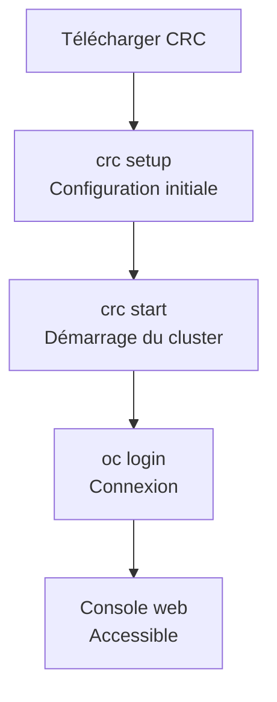

---
tags:
  - OpenShift
  - Débutant
  - Pratique
description: "Installer un Cluster Local avec CRC"
estimated_time: "80 min"
fiche_number: 2
total_fiches: 6
cursus: "OpenShift"
---

# 02 - Installer un Cluster Local avec CRC

> **En bref** : À la fin de cette fiche, tu auras installé CRC sur ta machine, démarré un cluster OpenShift local, créé ton premier projet, et accédé à la console web OpenShift. Lecture estimée : 80 min.


## Prérequis

- Avoir lu la fiche **[01 - Introduction à OpenShift](01-introduction-openshift.md)**
- 35 Go d'espace disque libre minimum sur ton ordinateur
- 9 Go de RAM disponible minimum (de préférence 12 Go)
- Processeur avec support de la virtualisation matérielle (VT-x sur Intel, AMD-V sur AMD, ou Apple Silicon)
- Un compte gratuit sur console.redhat.com (création en ligne nécessaire avant de passer en offline)

## Versions utilisées dans cette fiche

| Technologie | Version |
| ----------- | ------- |
| CRC (Red Hat OpenShift Local) | 2.x |
| OpenShift | 4.14+ |
| oc (CLI OpenShift) | 4.14+ |

## Objectif de cette fiche

À la fin de cette fiche, tu auras installé CRC sur ta machine, démarré un cluster OpenShift local, créé ton premier projet, et accédé à la console web OpenShift.

---

## Concepts

Cette section explique tous les concepts nécessaires. Lis-la entièrement avant de passer aux étapes pratiques.

### Qu'est-ce que CRC (CodeReady Containers) ?

**Définition** : CRC est un outil créé par Red Hat qui installe un cluster OpenShift complet mais minimal sur ta machine locale. Ce cluster tourne dans une seule machine virtuelle (VM) et contient tous les composants d'OpenShift.

**Nom officiel** : Red Hat a renommé CRC en "Red Hat OpenShift Local". La commande en ligne reste `crc`, et la communauté utilise encore le nom CRC.

**Le problème que CRC résout** :

Sans CRC, voici les problèmes rencontrés pour apprendre OpenShift :

1. **Cluster coûteux** : Un vrai cluster OpenShift nécessite plusieurs serveurs physiques ou virtuels. Cela coûte plusieurs centaines d'euros par mois en infrastructure cloud.

2. **Installation complexe** : Installer OpenShift sur des serveurs nécessite des connaissances avancées en réseau, stockage et administration système. La procédure prend plusieurs heures.

3. **Accès limité** : Si tu utilises un cluster partagé dans une entreprise ou une école, tu n'as pas les droits administrateur. Tu ne peux pas tout explorer librement.

4. **Dépendance à Internet** : Un cluster cloud nécessite une connexion Internet permanente pour y accéder.

**Comment CRC résout ces problèmes** :

| Problème | Solution apportée par CRC |
| --- | --- |
| Cluster coûteux | CRC est gratuit. Il tourne sur ton propre ordinateur |
| Installation complexe | Une seule commande (`crc setup`) prépare tout automatiquement |
| Accès limité | Tu es administrateur de ton propre cluster. Tu peux tout explorer |
| Dépendance à Internet | Une fois CRC démarré, tout fonctionne en local, sans connexion Internet |

**Analogie concrète** : CRC est comme une maquette à l'échelle d'un bâtiment. Un architecte construit une maquette miniature pour tester et visualiser le bâtiment avant de le construire en vrai. La maquette a la même structure que le vrai bâtiment (murs, étages, portes), mais en plus petit. CRC fonctionne pareil : c'est un cluster OpenShift miniature avec la même architecture que le vrai, mais qui tient sur un seul ordinateur.

**Ce que CRC n'est PAS** :

- CRC n'est pas un cluster de production. Il est conçu uniquement pour le développement et l'apprentissage. Il ne supporte pas de charge de travail réelle.
- CRC n'est pas multi-nœud. Un vrai cluster OpenShift a plusieurs machines (nœuds). CRC n'en a qu'une seule. Tu ne peux pas tester la répartition de charge ou la haute disponibilité.
- CRC n'est pas fait pour héberger des applications accessibles publiquement. Les applications déployées sur CRC ne sont accessibles que depuis ton ordinateur.

Le diagramme suivant résume les étapes d'installation et de démarrage de CRC.



**Comparaison CRC vs Minikube** :

| Critère | CRC | Minikube |
| --- | --- | --- |
| Plateforme | OpenShift (Kubernetes + outils Red Hat) | Kubernetes vanilla (sans ajout) |
| Console web | Console OpenShift complète incluse | Pas de console web par défaut |
| Ressources requises | 9 Go RAM, 35 Go disque | 2 Go RAM, 20 Go disque |
| Registre d'images | Registre interne OpenShift inclus | Pas de registre par défaut |
| Cas d'usage | Apprendre et développer pour OpenShift | Apprendre Kubernetes de base |
| Complexité | Plus lourd mais plus complet | Plus léger mais plus basique |

---

### Qu'est-ce que le Pull Secret ?

**Définition** : Le Pull Secret est un fichier JSON qui contient tes identifiants d'authentification. Ces identifiants permettent à CRC de télécharger les images de conteneurs nécessaires depuis les registres Red Hat.

**Le problème que le Pull Secret résout** :

Sans Pull Secret, voici les problèmes rencontrés :

1. **Images inaccessibles** : Les images OpenShift sont stockées dans des registres privés Red Hat. Sans authentification, CRC ne peut pas les télécharger.

2. **Pas de vérification d'identité** : Red Hat a besoin de savoir qui utilise ses logiciels, même dans la version gratuite. Le Pull Secret sert de carte d'identité.

**Comment le Pull Secret résout ces problèmes** :

| Problème | Solution apportée par le Pull Secret |
| --- | --- |
| Images inaccessibles | Le Pull Secret autorise l'accès aux registres Red Hat |
| Pas de vérification | Le Pull Secret identifie ton compte Red Hat |

**Analogie concrète** : Le Pull Secret est comme un badge d'accès à un bâtiment. Le bâtiment (les registres Red Hat) est fermé au public. Pour y entrer, tu dois présenter ton badge (le Pull Secret). L'obtention du badge est gratuite, mais tu dois t'inscrire une fois pour le recevoir.

**Ce que le Pull Secret n'est PAS** :

- Le Pull Secret n'est pas un abonnement payant. La création du compte Red Hat et le téléchargement du Pull Secret sont entièrement gratuits.
- Le Pull Secret n'est pas une licence logicielle. C'est un fichier d'authentification, pas un contrat.
- Le Pull Secret n'est pas nécessaire à chaque démarrage. Tu le fournis une seule fois lors du premier `crc start`. Ensuite, CRC le conserve.

**Informations pratiques** : Tu télécharges le Pull Secret une seule fois depuis console.redhat.com. C'est un fichier JSON d'environ 3 Ko. Il contient des jetons d'authentification (pas de mot de passe en clair). La durée de validité dépend de ton compte Red Hat. Si tu obtiens une erreur d'authentification, retélécharge un nouveau Pull Secret depuis la console.

---

### Quels sont les utilisateurs par défaut ?

**Définition** : Quand CRC démarre, deux utilisateurs sont créés automatiquement. Ces utilisateurs te permettent de te connecter au cluster sans avoir à créer de compte.

**Le problème que les utilisateurs par défaut résolvent** :

Sans utilisateurs préconfigurés, voici les problèmes rencontrés :

1. **Pas d'accès initial** : Pour te connecter au cluster, tu aurais besoin d'un utilisateur. Mais pour créer un utilisateur, tu dois d'abord être connecté au cluster. C'est un cercle vicieux.

2. **Configuration manuelle** : Configurer un fournisseur d'identité (LDAP, OAuth) nécessite des compétences avancées en administration système.

**Comment les utilisateurs par défaut résolvent ces problèmes** :

| Problème | Solution apportée |
| --- | --- |
| Pas d'accès initial | Deux utilisateurs sont prêts immédiatement après le démarrage |
| Configuration manuelle | Aucune configuration requise. Les identifiants sont fournis par CRC |

**Les deux utilisateurs** :

| Propriété | kubeadmin | developer |
| --- | --- | --- |
| Rôle | Administrateur du cluster | Utilisateur standard |
| Mot de passe | Généré aléatoirement (affiché au démarrage) | `developer` |
| Droits | Accès complet à tout le cluster | Accès limité à ses propres projets |
| Usage | Configurer le cluster, gérer les nœuds, voir tout | Déployer des applications, gérer ses projets |
| Quand l'utiliser | Pour l'administration du cluster | Pour le développement au quotidien |

**Analogie concrète** : Les deux utilisateurs sont comme les clés d'un immeuble. Le gestionnaire de l'immeuble (kubeadmin) a un passe-partout qui ouvre toutes les portes. Le locataire (developer) a une clé qui ouvre uniquement son appartement. Au quotidien, tu utilises la clé du locataire. Tu n'utilises le passe-partout que pour les tâches d'administration.

**Ce que les utilisateurs par défaut ne sont PAS** :

- Ce ne sont pas des utilisateurs de production. En production, on crée des utilisateurs personnalisés avec des droits spécifiques.
- Le mot de passe de kubeadmin n'est pas fixe. Il change à chaque réinstallation de CRC (commande `crc delete` puis `crc start`).

**Règle** : Utilise `developer` pour le travail quotidien. Utilise `kubeadmin` uniquement pour les tâches d'administration du cluster.

---

### Qu'est-ce que la console web OpenShift ?

**Définition** : La console web OpenShift est une interface graphique accessible via un navigateur web. Elle permet de gérer le cluster, les projets et les applications sans utiliser la ligne de commande.

**Le problème que la console web résout** :

Sans console web, voici les problèmes rencontrés :

1. **Tout en ligne de commande** : Il faudrait utiliser uniquement la commande `oc` pour chaque opération. Cela demande de mémoriser beaucoup de commandes.

2. **Pas de vue d'ensemble** : En ligne de commande, tu vois les informations une par une. Tu ne peux pas visualiser l'état global de ton projet en un coup d'oeil.

3. **Courbe d'apprentissage** : Pour un débutant, la ligne de commande est moins intuitive qu'une interface graphique.

**Comment la console web résout ces problèmes** :

| Problème | Solution apportée par la console web |
| --- | --- |
| Tout en ligne de commande | Interface graphique avec des boutons et des formulaires |
| Pas de vue d'ensemble | Tableaux de bord visuels montrant l'état du cluster et des applications |
| Courbe d'apprentissage | Navigation intuitive avec des menus et des assistants |

**Les deux perspectives de la console** :

La console web offre deux vues différentes, appelées "perspectives" :

| Perspective | Destinée à | Ce qu'elle montre |
| --- | --- | --- |
| Administrator | Les administrateurs du cluster | Nœuds, stockage, réseau, configuration globale |
| Developer | Les développeurs | Projets, applications, logs, déploiements |

Pour changer de perspective, clique sur le menu déroulant en haut à gauche de la console.

**Analogie concrète** : La console web est comme le tableau de bord d'une voiture. Au lieu de vérifier chaque composant du moteur manuellement (ligne de commande), tu regardes les indicateurs sur le tableau de bord (console web). Le compteur de vitesse, la jauge d'essence et le témoin de température te donnent une vue d'ensemble rapide.

**Ce que la console web n'est PAS** :

- La console web n'est pas un remplacement de la ligne de commande. Certaines opérations avancées ne sont possibles qu'avec `oc`. La console est un complément.
- La console web n'est pas accessible depuis Internet quand tu utilises CRC. Elle n'est accessible que depuis ton ordinateur local.

**URL de la console avec CRC** : `https://console-openshift-console.apps-crc.testing` (la commande `crc console` ouvre directement le navigateur).

---

### Qu'est-ce qu'un Project OpenShift ?

**Définition** : Un Project est un espace de travail isolé dans OpenShift. Il regroupe toutes les ressources liées à une application : conteneurs, services, routes, configurations.

**Le problème que les Projects résolvent** :

Sans Projects, voici les problèmes rencontrés :

1. **Mélange des ressources** : Toutes les applications et leurs ressources seraient mélangées dans un seul espace. Il serait difficile de savoir quelle ressource appartient à quelle application.

2. **Conflits de noms** : Deux applications pourraient avoir un service avec le même nom, ce qui créerait des conflits.

3. **Pas d'isolation** : Un développeur pourrait modifier les ressources d'un autre développeur par erreur.

**Comment les Projects résolvent ces problèmes** :

| Problème | Solution apportée par les Projects |
| --- | --- |
| Mélange des ressources | Chaque application a son propre Project avec ses propres ressources |
| Conflits de noms | Deux Projects peuvent contenir des ressources avec le même nom sans conflit |
| Pas d'isolation | Chaque développeur travaille dans son propre Project |

**Analogie concrète** : Un Project est comme un dossier sur ton ordinateur. Tu ranges les fichiers de chaque cours dans un dossier séparé ("Maths", "Physique", "Informatique"). Les Projects fonctionnent pareil : tu ranges les ressources de chaque application dans un Project séparé.

**Ce qu'un Project n'est PAS** :

- Un Project n'est pas une application. C'est un conteneur logique qui regroupe les ressources d'une application. Un Project peut contenir zéro, une ou plusieurs applications.
- Un Project n'est pas un utilisateur. Les utilisateurs ont des droits d'accès aux Projects, mais un Project n'est pas lié à un seul utilisateur.

**Relation avec Kubernetes** : Dans Kubernetes, le concept équivalent s'appelle un "Namespace". Un Project OpenShift est un Namespace avec des fonctionnalités supplémentaires : droits d'accès automatiques, quotas, et visibilité dans la console web.

---

## Étapes Pratiques

### Étape 1 : Télécharger CRC et le Pull Secret

1. Ouvre ton navigateur et va sur console.redhat.com/openshift/create/local

2. Connecte-toi avec ton compte Red Hat (ou crée un compte gratuit si tu n'en as pas)

3. Télécharge le fichier CRC correspondant à ton système d'exploitation :

   - **macOS (Apple Silicon)** : fichier `.pkg` pour les Mac M1, M2, M3, M4
   - **macOS (Intel)** : fichier `.pkg` pour les anciens Mac
   - **Linux** : fichier `.tar.xz`
   - **Windows** : fichier `.msi`

4. Sur la même page, clique sur le bouton **"Download pull secret"** pour télécharger le fichier `pull-secret.json`

5. Place le fichier `pull-secret.json` dans un endroit accessible :

```bash
# Crée un dossier et déplace le pull secret
mkdir -p ~/crc
mv ~/Downloads/pull-secret.json ~/crc/pull-secret.json
```

---

### Étape 2 : Installer CRC

- **macOS** : Double-clique sur le fichier `.pkg` téléchargé et suis l'assistant d'installation
- **Linux** : Extrais l'archive (`tar -xvf crc-linux-amd64.tar.xz`) et déplace l'exécutable (`sudo mv crc-linux-*-amd64/crc /usr/local/bin/`)

**Vérifier l'installation** :

```bash
# Vérifie que CRC est installé correctement
crc version
```

**Résultat attendu** :

```text
CRC version: 2.x.x+xxxxxxx
OpenShift version: 4.14.x (ou plus récent selon le binaire CRC)
Podman version: 5.x.x (selon le bundle CRC installé)
```

Si tu vois un numéro de version, CRC est correctement installé.

---

### Étape 3 : Préparer la machine virtuelle

La commande `crc setup` prépare ton ordinateur pour exécuter CRC. Elle télécharge la machine virtuelle et configure le réseau.

```bash
# Prépare l'environnement CRC (télécharge la VM, configure le réseau)
crc setup
```

Cette commande prend plusieurs minutes. Elle affiche des messages d'avancement.

**Résultat attendu** :

```text
INFO Checking if running as non-root
INFO Checking if running on a supported CPU architecture
...
INFO Checking if all needed network drivers are installed
Setup is complete, you can now run 'crc start' to start the instance
```

Le message **"Setup is complete"** confirme que la préparation est terminée.

---

### Étape 4 : Démarrer le cluster

C'est la commande principale. Elle démarre la machine virtuelle et lance le cluster OpenShift.

**Premier démarrage** (nécessite le pull secret) :

```bash
# Démarre le cluster CRC pour la première fois
crc start
```

CRC te demande le pull secret :

```text
? Please enter the pull secret
```

Tu peux coller le contenu du fichier dans le terminal, ou fournir le chemin du fichier :

```bash
# Démarre CRC en indiquant le chemin du pull secret
crc start --pull-secret-file ~/crc/pull-secret.json
```

Le démarrage prend entre 5 et 15 minutes selon la puissance de ton ordinateur.

**Résultat attendu** (résumé, la sortie réelle est plus longue) :

```text
INFO Starting CRC VM for OpenShift 4.14.x...
...
INFO All operators are available. OpenShift is ready to use.

Started the OpenShift cluster.

The server is accessible via web console at:
  https://console-openshift-console.apps-crc.testing

Log in as administrator:
  Username: kubeadmin
  Password: AbCdE-FgHiJ-KlMnO-PqRsT

Log in as user:
  Username: developer
  Password: developer

Use the 'oc' command line interface:
  eval $(crc oc-env)
  oc login -u developer https://api.crc.testing:6443
```

**Important** : Note le mot de passe de `kubeadmin`. Il est différent à chaque installation. Dans l'exemple ci-dessus, c'est `AbCdE-FgHiJ-KlMnO-PqRsT`. Le tien sera différent.

---

### Étape 5 : Configurer l'accès CLI (ligne de commande)

Après le démarrage, tu dois configurer ton terminal pour utiliser la commande `oc`.

```bash
# Configure le PATH pour que la commande oc soit disponible
eval $(crc oc-env)
```

Cette commande ajoute le chemin de l'outil `oc` à ton terminal. Tu dois l'exécuter dans chaque nouveau terminal.

Pour éviter de taper cette commande à chaque fois, ajoute-la à ton fichier de configuration shell :

```bash
# Ajoute la configuration à ton profil (zsh ou bash selon ton shell)
echo 'eval $(crc oc-env)' >> ~/.zshrc   # Pour zsh
echo 'eval $(crc oc-env)' >> ~/.bashrc  # Pour bash
```

Ensuite, connecte-toi au cluster en tant que `developer` :

```bash
# Se connecter au cluster en tant que developer
oc login -u developer -p developer https://api.crc.testing:6443
```

**Résultat attendu** :

```text
Login successful.

You don't have any projects. You can try to create a new project, by running

    oc new-project <projectname>
```

Vérifie que tu es bien connecté :

```bash
# Affiche le nom de l'utilisateur connecté
oc whoami
```

**Résultat attendu** :

```text
developer
```

---

### Étape 6 : Créer un Project

Crée ton premier Project pour organiser tes futures applications :

```bash
# Crée un nouveau Project nommé "mon-premier-projet"
oc new-project mon-premier-projet
```

**Résultat attendu** :

```text
Now using project "mon-premier-projet" on server "https://api.crc.testing:6443".

You can add applications to this project with the 'new-app' command.
```

Vérifie la liste des Projects :

```bash
# Liste tous les Projects auxquels tu as accès
oc projects
```

**Résultat attendu** :

```text
You have one project on this server: "mon-premier-projet".

Using project "mon-premier-projet" on server "https://api.crc.testing:6443".
```

---

### Étape 7 : Accéder à la console web

Ouvre la console web OpenShift dans ton navigateur :

```bash
# Ouvre la console web OpenShift dans le navigateur par défaut
crc console
```

Si la commande ne fonctionne pas, ouvre manuellement cette URL dans ton navigateur :

```text
https://console-openshift-console.apps-crc.testing
```

**Avertissement du navigateur** : Ton navigateur affichera un avertissement de sécurité car CRC utilise un certificat auto-signé (non validé par une autorité de certification). C'est normal et attendu.

- **Firefox** : Clique sur "Avancé..." puis "Accepter le risque et poursuivre"
- **Chrome** : Clique sur "Paramètres avancés" puis "Continuer vers le site"

**Page de connexion** :

Tu verras une page de connexion avec deux options :

- **kube:admin** : Se connecter avec le compte administrateur
- **htpasswd_provider** : Se connecter avec `developer` / `developer`

**Connexion en tant que developer** :

1. Clique sur **htpasswd_provider**
2. Utilisateur : `developer`
3. Mot de passe : `developer`
4. Clique sur "Log in"

**Ce que tu vois après connexion** :

- La perspective "Developer" est sélectionnée par défaut
- Tu vois ton Project "mon-premier-projet" dans la liste
- Le tableau de bord montre que le Project est vide (pas encore d'applications)

**Connexion en tant que kubeadmin** :

1. Clique sur **kube:admin**
2. Utilisateur : `kubeadmin`
3. Mot de passe : celui affiché lors du `crc start` (par exemple `AbCdE-FgHiJ-KlMnO-PqRsT`)
4. La perspective "Administrator" s'ouvre. Tu vois tous les Projects du cluster et l'état global (CPU, mémoire, stockage)

---

### Étape 8 : Arrêter et redémarrer CRC

**Arrêter le cluster** :

```bash
# Arrête le cluster CRC (conserve les données)
crc stop
```

**Résultat attendu** :

```text
Stopping the instance, this may take a few minutes...
Stopped the instance
```

L'arrêt conserve toutes tes données : Projects, applications, configurations. Rien n'est perdu.

**Redémarrer le cluster** :

```bash
# Redémarre le cluster CRC (pas besoin du pull secret cette fois)
crc start
```

Au redémarrage, CRC ne te demande plus le pull secret. Il a été enregistré lors du premier démarrage.

Après le redémarrage, tu dois te reconnecter avec `oc login` :

```bash
# Configure oc et reconnecte-toi après un redémarrage
eval $(crc oc-env)
oc login -u developer -p developer https://api.crc.testing:6443
```

---

## Commandes Utiles

| Commande | Action |
| --- | --- |
| `crc setup` | Prépare l'environnement (télécharge la VM, configure le réseau). A exécuter une seule fois |
| `crc start` | Démarre le cluster CRC |
| `crc stop` | Arrête le cluster CRC (conserve les données) |
| `crc delete` | Supprime complètement le cluster et toutes les données |
| `crc status` | Affiche l'état actuel du cluster (Running / Stopped) |
| `crc console` | Ouvre la console web OpenShift dans le navigateur |
| `crc console --credentials` | Affiche les identifiants de connexion (utile si tu as oublié le mot de passe kubeadmin) |
| `crc version` | Affiche la version de CRC installée |
| `eval $(crc oc-env)` | Configure le terminal pour utiliser la commande `oc` |
| `oc login -u developer -p developer https://api.crc.testing:6443` | Se connecter au cluster en tant que developer |
| `oc login -u kubeadmin -p MOT_DE_PASSE https://api.crc.testing:6443` | Se connecter au cluster en tant que kubeadmin |
| `oc whoami` | Affiche le nom de l'utilisateur actuellement connecté |
| `oc new-project NOM` | Crée un nouveau Project |
| `oc projects` | Liste tous les Projects accessibles |
| `oc project NOM` | Change de Project actif |

---

## Pièges Fréquents

### Piège 1 : Pas assez de RAM

**Problème** : CRC refuse de démarrer ou le cluster est instable.

**Solution** : CRC nécessite 9 Go de RAM au minimum. Avant de lancer `crc start`, ferme les applications gourmandes en mémoire (navigateur avec beaucoup d'onglets, IDE, autres machines virtuelles). Pour éviter les crashs et les ralentissements, ta machine doit avoir au moins 16 Go de RAM.

---

### Piège 2 : Pull Secret oublié ou expiré

**Problème** : CRC demande le pull secret et tu ne l'as plus, ou il a expiré.

**Solution** :

1. Va sur console.redhat.com/openshift/create/local
2. Connecte-toi à ton compte Red Hat
3. Clique sur "Download pull secret"
4. Utilise le nouveau fichier avec `crc start --pull-secret-file ~/crc/pull-secret.json`

---

### Piège 3 : Certificat TLS auto-signé dans le navigateur

**Problème** : Le navigateur affiche un avertissement de sécurité quand tu accèdes à la console web.

**Solution** : C'est normal. CRC utilise un certificat auto-signé car c'est un cluster local. Accepte le certificat dans ton navigateur (Firefox : "Avancé..." puis "Accepter le risque" / Chrome : "Paramètres avancés" puis "Continuer vers le site").

---

### Piège 4 : La commande `oc` n'est pas trouvée

**Problème** : Après avoir démarré CRC, tu tapes `oc` et le terminal affiche "command not found".

**Solution** : Tu as oublié d'exécuter la commande qui configure le PATH :

```bash
# Cette commande doit être exécutée dans chaque nouveau terminal
eval $(crc oc-env)
```

Pour ne plus avoir ce problème, ajoute cette ligne à ton fichier `~/.zshrc` ou `~/.bashrc` (voir Étape 5).

---

### Piège 5 : Erreur de connexion après un redémarrage

**Problème** : Après un `crc stop` puis `crc start`, la commande `oc` retourne une erreur de connexion.

**Solution** : Tu dois te reconnecter au cluster après chaque redémarrage :

```bash
eval $(crc oc-env)
oc login -u developer -p developer https://api.crc.testing:6443
```

---

### Piège 6 : Le mot de passe kubeadmin oublié

**Problème** : Tu as fermé le terminal et tu ne retrouves plus le mot de passe de `kubeadmin`.

**Solution** : Utilise la commande suivante pour retrouver les identifiants :

```bash
# Affiche les identifiants de connexion
crc console --credentials
```

**Résultat attendu** :

```text
To login as a regular user, run 'oc login -u developer -p developer https://api.crc.testing:6443'.
To login as an admin, run 'oc login -u kubeadmin -p AbCdE-FgHiJ-KlMnO-PqRsT https://api.crc.testing:6443'.
```

---

## Checklist de Validation

- [ ] CRC est installé (`crc version` affiche un numéro de version)
- [ ] La préparation est terminée (`crc setup` s'est terminé sans erreur)
- [ ] Le cluster est démarré (`crc status` affiche "Running")
- [ ] La commande `oc` est disponible (`eval $(crc oc-env)` exécuté)
- [ ] La connexion fonctionne (`oc login` réussi, `oc whoami` affiche "developer")
- [ ] Un Project a été créé (`oc projects` affiche "mon-premier-projet")
- [ ] La console web est accessible (`crc console` ouvre le navigateur)
- [ ] Le cluster s'arrête et redémarre correctement (`crc stop` puis `crc start`)

---

## Exercice Pratique

**Énoncé** : Installe CRC, démarre le cluster, crée un Project nommé "test-app", connecte-toi à la console web, liste les Projects disponibles, puis arrête le cluster proprement.

**Indications** :

- Suis les étapes 1 à 8 de cette fiche dans l'ordre
- Le nom du Project doit être exactement "test-app" (en minuscules, avec un tiret)
- Connecte-toi à la console web avec les deux utilisateurs (developer et kubeadmin) pour voir la différence
- Vérifie que le Project "test-app" est visible dans la console web (perspective Developer)

**Résultat attendu** :

- `crc status` affiche "Running" après le démarrage
- `oc whoami` affiche "developer"
- `oc projects` affiche "test-app"
- La console web est accessible et affiche le Project "test-app"
- Après `crc stop`, `crc status` affiche "Stopped"

---

## Solution de l'Exercice

> **Note** : Cette section contient la solution complète. Essaie d'abord de résoudre l'exercice par toi-même avant de consulter cette solution.

---

Voici toutes les commandes à exécuter dans l'ordre :

```bash
# 1. Préparer l'environnement (si pas déjà fait)
crc setup

# 2. Démarrer le cluster (attends le message "All operators are available")
crc start --pull-secret-file ~/crc/pull-secret.json

# 3. Configurer le terminal
eval $(crc oc-env)

# 4. Se connecter en tant que developer
oc login -u developer -p developer https://api.crc.testing:6443

# 5. Vérifier la connexion (résultat attendu : "developer")
oc whoami

# 6. Créer le Project "test-app"
oc new-project test-app

# 7. Vérifier le Project (résultat attendu : "test-app" dans la liste)
oc projects

# 8. Ouvrir la console web
crc console
```

Connecte-toi à la console web avec `developer` / `developer`. Vérifie que "test-app" apparaît dans la liste des Projects (perspective Developer).

Déconnecte-toi, puis reconnecte-toi avec `kubeadmin` et le mot de passe affiché lors du `crc start`. Observe la perspective Administrator.

```bash
# 9. Arrêter le cluster
crc stop

# 10. Vérifier l'arrêt (résultat attendu : "Stopped")
crc status
```

---

## Navigation

← Fiche précédente : **[Introduction à OpenShift](01-introduction-openshift.md)**

→ Fiche suivante : **[Déployer une Application](03-deploiement-application.md)**
