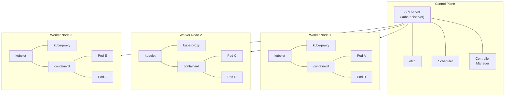

---
tags:
  - Kubernetes
  - Débutant
  - Concept
description: "Introduction à Kubernetes : architecture, composants et cas d'utilisation"
estimated_time: "60 min"
fiche_number: 1
total_fiches: 12
cursus: "Kubernetes"
---

# 01 - Introduction à Kubernetes

> **En bref** : À la fin de cette fiche, tu sauras ce qu'est Kubernetes, pourquoi il existe, comment son architecture fonctionne (control plane, nodes, etcd, API server, scheduler, kubelet) et quand l'utiliser. Lecture estimée : 60 min.

## Prérequis

- Avoir lu le [cursus Docker](../../01-docker/index.md) pour connaître les bases des conteneurs
- Savoir ce qu'est une image Docker et un conteneur
- Savoir utiliser le terminal (ouvrir un terminal, taper une commande, lire le résultat)
- Aucune connaissance préalable de Kubernetes n'est requise (tout est expliqué ci-dessous)

## Versions utilisées dans cette fiche

| Technologie | Version |
| ----------- | ------- |
| Kubernetes  | 1.31+ (stable courante souvent plus récente, ex. 1.36 en 2026) |
| kubectl     | 1.31+   |

## Objectif de cette fiche

À la fin de cette fiche, tu sauras ce qu'est Kubernetes, pourquoi il est devenu le standard de l'orchestration de conteneurs, et tu comprendras l'architecture complète d'un cluster Kubernetes.

---

## Concepts

Cette section explique tous les concepts nécessaires. Lis-la entièrement avant de passer aux étapes pratiques.

### Qu'est-ce que l'orchestration de conteneurs ?

**Définition** : L'orchestration de conteneurs est la gestion automatisée du déploiement, de la mise à l'échelle et de la disponibilité de conteneurs sur un ensemble de machines.

**Le problème que l'orchestration résout** :

Sans orchestration, voici les problèmes rencontrés quand tu utilises Docker seul en production :

1. **Gestion manuelle** : Si tu as 50 conteneurs répartis sur 10 machines, tu dois te connecter à chaque machine pour démarrer, arrêter ou mettre à jour chaque conteneur manuellement.
2. **Pas de résilience** : Si une machine tombe en panne, les conteneurs qu'elle héberge disparaissent. Personne ne les relance automatiquement sur une autre machine.
3. **Pas de mise à l'échelle** : Si ton application reçoit soudainement 10 fois plus de trafic, tu dois créer manuellement de nouveaux conteneurs et configurer un répartiteur de charge.
4. **Pas de mises à jour sans interruption** : Pour mettre à jour une application, tu dois arrêter l'ancienne version puis démarrer la nouvelle. Pendant ce temps, les utilisateurs voient une erreur.
5. **Réseau complexe** : Les conteneurs sur des machines différentes ne peuvent pas communiquer entre eux sans configuration réseau manuelle.

**Comment l'orchestration résout ces problèmes** :

| Problème | Solution apportée par l'orchestration |
| -------- | ------------------------------------- |
| Gestion manuelle | Tu décris l'état souhaité dans un fichier. L'orchestrateur se charge du reste |
| Pas de résilience | L'orchestrateur détecte les pannes et relance les conteneurs sur d'autres machines |
| Pas de mise à l'échelle | L'orchestrateur ajoute ou supprime des conteneurs automatiquement selon la charge |
| Pas de mises à jour sans interruption | L'orchestrateur remplace les conteneurs un par un (rolling update) |
| Réseau complexe | L'orchestrateur crée un réseau virtuel entre toutes les machines du cluster |

**Analogie concrète** : Imagine un grand hôtel avec 200 chambres. Sans orchestration, c'est comme si un seul réceptionniste gérait tout à la main : attribuer les chambres, appeler le ménage, gérer les plaintes, une par une. L'orchestration, c'est un logiciel de gestion hôtelière qui attribue automatiquement les chambres libres, déclenche le ménage quand un client part, et répartit les demandes entre le personnel disponible.

---

### Qu'est-ce que Kubernetes ?

**Définition** : Kubernetes (abrégé K8s) est un système open source d'orchestration de conteneurs. Il a été créé par Google en 2014, basé sur 15 ans d'expérience avec des systèmes internes (Borg et Omega). Il est maintenant maintenu par la Cloud Native Computing Foundation (CNCF).

**Le problème que Kubernetes résout** :

Sans Kubernetes, voici les problèmes rencontrés :

1. **Docker Compose est limité à une seule machine** : Docker Compose permet de gérer plusieurs conteneurs, mais uniquement sur la même machine. Si cette machine tombe en panne, tout s'arrête.
2. **Docker Swarm est peu adopté** : Docker Swarm est l'orchestrateur natif de Docker, mais il a perdu la bataille face à Kubernetes. Son écosystème d'outils et sa communauté sont beaucoup plus petits.
3. **Pas de standard** : Chaque fournisseur cloud proposait sa propre solution d'orchestration, incompatible avec les autres. Migrer d'un fournisseur à l'autre nécessitait de tout réécrire.

**Comment Kubernetes résout ces problèmes** :

| Problème | Solution apportée par Kubernetes |
| -------- | -------------------------------- |
| Docker Compose limité à une machine | Kubernetes gère des conteneurs sur des dizaines, centaines ou milliers de machines |
| Docker Swarm peu adopté | Kubernetes est le standard de l'industrie avec le plus grand écosystème |
| Pas de standard | Kubernetes fonctionne sur tous les clouds (AWS, Azure, GCP) et on-premise |

**Analogie concrète** : Docker Compose, c'est un chef de cuisine qui gère un seul restaurant. Il connaît ses recettes, ses cuisiniers et sa salle. Kubernetes, c'est le directeur d'une chaîne de restaurants. Il décide combien de restaurants ouvrir, répartit les commandes entre eux, remplace un restaurant fermé par un autre, et s'assure que chaque client est servi même si un restaurant est plein.

**Ce que Kubernetes n'est PAS** :

- Kubernetes n'est pas un remplacement de Docker. Docker crée et exécute des conteneurs. Kubernetes les organise et les gère à grande échelle. Tu as besoin des deux : Docker (ou un autre runtime) pour créer les conteneurs, Kubernetes pour les orchestrer.
- Kubernetes n'est pas un PaaS (Platform as a Service) comme Heroku. Kubernetes ne déploie pas ton code directement. Tu dois d'abord créer une image Docker, puis Kubernetes la déploie.
- Kubernetes n'est pas simple. Il a une courbe d'apprentissage importante. C'est un outil conçu pour la production à grande échelle. Pour un petit projet personnel, Docker Compose est souvent suffisant.

**Comparaison Docker Compose vs Kubernetes** :

| Critère | Docker Compose | Kubernetes |
| ------- | -------------- | ---------- |
| Nombre de machines | 1 seule | 1 à des milliers |
| Haute disponibilité | Non | Oui (réplication automatique) |
| Mise à l'échelle | Manuelle | Automatique (HPA) |
| Rolling updates | Non | Oui (natif) |
| Réseau multi-machines | Non | Oui (réseau virtuel intégré) |
| Complexité | Faible | Élevée |
| Cas d'utilisation | Développement local, petits projets | Production, applications critiques |

---

### Architecture d'un cluster Kubernetes

**Définition** : Un cluster Kubernetes est un ensemble de machines (appelées nodes) qui exécutent des conteneurs. Le cluster est composé de deux parties : le **control plane** (cerveau du cluster) et les **worker nodes** (machines qui exécutent les conteneurs).

**Le problème que cette architecture résout** :

Sans séparation entre control plane et worker nodes :

1. **Mélange des responsabilités** : Les décisions de gestion et l'exécution des conteneurs se feraient sur les mêmes machines, créant des conflits de ressources.
2. **Pas de haute disponibilité** : Si la machine de gestion tombe, il n'y a plus personne pour gérer les conteneurs.
3. **Pas de scalabilité** : Ajouter de la capacité d'exécution nécessiterait de toucher à la logique de gestion.

**Comment cette architecture résout ces problèmes** :

| Problème | Solution |
| -------- | -------- |
| Mélange des responsabilités | Le control plane décide, les worker nodes exécutent |
| Pas de haute disponibilité | Le control plane peut être répliqué sur 3 ou 5 machines |
| Pas de scalabilité | On ajoute des worker nodes sans toucher au control plane |

**Analogie concrète** : Un cluster Kubernetes fonctionne comme une entreprise de livraison. Le control plane est le siège social : il reçoit les commandes, décide quel livreur les prend, et surveille que tout se passe bien. Les worker nodes sont les livreurs : ils transportent les colis (conteneurs) et signalent leur état au siège.

---

### Les composants du control plane

**Définition** : Le control plane est l'ensemble des composants qui prennent les décisions globales du cluster. Il comprend quatre composants principaux.

#### API Server (kube-apiserver)

**Rôle** : Point d'entrée unique pour toutes les interactions avec le cluster. Toute commande `kubectl` passe par l'API server.

**Fonctionnement** :

- Reçoit les requêtes REST (créer un pod, lister les services, supprimer un déploiement)
- Valide les requêtes (format correct, permissions)
- Enregistre l'état dans etcd
- Notifie les autres composants des changements

#### etcd

**Rôle** : Base de données clé-valeur distribuée qui stocke tout l'état du cluster.

**Fonctionnement** :

- Stocke la configuration de chaque objet Kubernetes (pods, services, deployments)
- Seul l'API server communique directement avec etcd
- Peut être répliqué sur plusieurs machines pour la haute disponibilité
- Utilise l'algorithme de consensus Raft pour garantir la cohérence des données

#### Scheduler (kube-scheduler)

**Rôle** : Décide sur quel worker node placer chaque nouveau pod.

**Fonctionnement** :

- Surveille les pods non assignés (ceux qui n'ont pas encore de node)
- Évalue chaque node selon des critères : ressources disponibles (CPU, mémoire), contraintes d'affinité, taints et tolerations
- Assigne le pod au node le plus adapté
- Ne lance pas le pod lui-même : il informe l'API server de sa décision

#### Controller Manager (kube-controller-manager)

**Rôle** : Exécute les boucles de contrôle qui surveillent l'état du cluster et le corrigent si nécessaire.

**Fonctionnement** :

- Contient plusieurs contrôleurs qui tournent en boucle :
  - **ReplicaSet controller** : vérifie que le nombre de pods correspond au nombre demandé
  - **Node controller** : surveille l'état des nodes et réagit quand un node tombe
  - **Job controller** : gère les tâches ponctuelles
  - **ServiceAccount controller** : crée les comptes de service par défaut

---

### Les composants des worker nodes

**Définition** : Chaque worker node exécute trois composants qui permettent de lancer et gérer les conteneurs.

#### kubelet

**Rôle** : Agent qui tourne sur chaque worker node. Il reçoit les instructions du control plane et s'assure que les conteneurs demandés tournent correctement.

**Fonctionnement** :

- Communique avec l'API server pour recevoir les spécifications de pods
- Demande au container runtime de démarrer ou arrêter les conteneurs
- Envoie régulièrement l'état du node et de ses pods au control plane
- Exécute les health checks (liveness et readiness probes)

#### kube-proxy

**Rôle** : Gère les règles réseau sur chaque node pour permettre la communication entre les pods et les services.

**Fonctionnement** :

- Maintient les règles iptables ou IPVS sur le node
- Redirige le trafic vers les bons pods quand tu appelles un service
- Permet l'accès aux services depuis l'extérieur du cluster

#### Container runtime

**Rôle** : Logiciel qui exécute réellement les conteneurs. Kubernetes ne lance pas les conteneurs directement.

**Fonctionnement** :

- Kubernetes utilise l'interface CRI (Container Runtime Interface) pour communiquer avec le runtime
- Runtimes supportés : containerd (le plus courant), CRI-O (utilisé par OpenShift)
- Docker n'est plus supporté directement depuis Kubernetes 1.24 (mais les images Docker fonctionnent toujours)

---

### Le modèle déclaratif

**Définition** : Kubernetes utilise un modèle déclaratif. Tu décris l'état souhaité (desired state) dans un fichier YAML, et Kubernetes fait tout le nécessaire pour atteindre cet état.

**Le problème que le modèle déclaratif résout** :

Sans modèle déclaratif (modèle impératif), voici ce qui se passe :

1. **Commandes manuelles** : Tu dois taper chaque commande une par une (créer un conteneur, configurer le réseau, ouvrir un port).
2. **Pas de reproductibilité** : Si tu dois refaire la même chose sur un autre cluster, tu dois te souvenir de toutes les commandes dans le bon ordre.
3. **Pas de correction automatique** : Si un conteneur plante, personne ne le relance automatiquement.

**Comment le modèle déclaratif résout ces problèmes** :

| Problème | Solution |
| -------- | -------- |
| Commandes manuelles | Tu écris un fichier YAML une fois, tu l'appliques avec `kubectl apply` |
| Pas de reproductibilité | Le fichier YAML est versionné dans Git. Tu l'appliques sur n'importe quel cluster |
| Pas de correction automatique | Kubernetes compare en permanence l'état réel à l'état souhaité et corrige les écarts |

**Analogie concrète** : Le modèle impératif, c'est dire à un cuisinier étape par étape : "Prends une casserole, remplis-la d'eau, mets-la sur le feu, ajoute le sel...". Le modèle déclaratif, c'est donner la recette complète au cuisinier : "Je veux une soupe de légumes pour 4 personnes". Le cuisinier sait quoi faire pour arriver au résultat.

**Ce que le modèle déclaratif n'est PAS** :

- Le modèle déclaratif n'empêche pas les commandes impératives. Tu peux toujours utiliser `kubectl run` ou `kubectl create` directement. Mais en production, on utilise toujours des fichiers YAML.

---

### Les objets Kubernetes principaux

Kubernetes organise tout sous forme d'objets. Voici les principaux, que tu découvriras en détail dans les fiches suivantes :

| Objet | Rôle | Fiche |
| ----- | ---- | ----- |
| **Pod** | Plus petite unité déployable. Contient un ou plusieurs conteneurs | Fiche 03 |
| **Deployment** | Gère la création et la mise à jour des pods | Fiche 04 |
| **Service** | Expose les pods sur le réseau (interne ou externe) | Fiche 05 |
| **ConfigMap** | Stocke la configuration (variables d'environnement, fichiers) | Fiche 06 |
| **Secret** | Stocke les données sensibles (mots de passe, clés API) | Fiche 06 |
| **PersistentVolume** | Stockage persistant pour les données | Fiche 07 |
| **Namespace** | Isolation logique entre les projets dans un cluster | Fiche 08 |
| **Ingress** | Routage HTTP/HTTPS externe vers les services | Fiche 05 |

---

### Quand utiliser Kubernetes ?

Kubernetes n'est pas toujours la bonne solution. Voici un guide pour décider :

**Utilise Kubernetes quand** :

- Ton application a besoin de haute disponibilité (pas d'interruption de service)
- Tu déploies sur plusieurs machines (ou plusieurs datacenters)
- Tu as besoin de mise à l'échelle automatique (le trafic varie beaucoup)
- Tu as une architecture microservices (plusieurs applications qui communiquent)
- Tu veux des déploiements sans interruption (rolling updates, canary deployments)

**N'utilise PAS Kubernetes quand** :

- Tu as un petit projet personnel (utilise Docker Compose)
- Tu as une seule application monolithique avec peu de trafic
- Tu n'as pas le temps d'apprendre un outil complexe
- Tu es seul dans l'équipe et tu n'as pas besoin de haute disponibilité

---

## Étapes Pratiques

Cette fiche est théorique. Les étapes pratiques commencent dans la fiche 02 avec l'installation de Minikube.

### Étape 1 : Visualiser l'architecture

Voici un schéma textuel de l'architecture d'un cluster Kubernetes :



L'API Server est le point d'entrée unique du cluster. Toutes les commandes `kubectl` passent par lui. Le Scheduler décide sur quel node placer chaque pod. Le Controller Manager surveille l'état du cluster.

### Étape 2 : Comprendre le flux d'une requête

Quand tu tapes `kubectl apply -f mon-deployment.yaml`, voici ce qui se passe :

1. **kubectl** envoie le fichier YAML à l'**API server**
2. L'**API server** valide le contenu et l'enregistre dans **etcd**
3. Le **Controller Manager** détecte qu'un nouveau Deployment existe et crée les ReplicaSets et pods nécessaires
4. Le **Scheduler** voit les pods non assignés et choisit un worker node pour chacun
5. Le **kubelet** du worker node choisi reçoit l'instruction et demande à **containerd** de démarrer le conteneur
6. Le **kube-proxy** met à jour les règles réseau pour que le pod soit accessible

### Étape 3 : Comprendre le cycle de réconciliation

Kubernetes fonctionne en boucle permanente :

```text
1. Tu déclares : "Je veux 3 répliques de mon application"
2. Kubernetes constate : "Il y a actuellement 0 répliques"
3. Kubernetes agit : "Je crée 3 pods"
4. Un pod plante : "Il y a maintenant 2 répliques"
5. Kubernetes constate l'écart et agit : "Je crée 1 pod pour revenir à 3"
```

Ce cycle se répète en permanence. C'est le principe fondamental de Kubernetes : la **réconciliation continue**.

---

## Commandes Utiles

Ces commandes sont présentées ici pour référence. Tu les utiliseras à partir de la fiche 02.

| Commande | Action |
| -------- | ------ |
| `kubectl cluster-info` | Affiche les informations du cluster |
| `kubectl get nodes` | Liste les nodes du cluster |
| `kubectl get pods` | Liste les pods dans le namespace courant |
| `kubectl get all` | Liste toutes les ressources du namespace courant |
| `kubectl describe node <nom>` | Affiche les détails d'un node |
| `kubectl version` | Affiche la version de kubectl et du serveur |
| `kubectl api-resources` | Liste tous les types de ressources disponibles |

---

## Pièges Fréquents

### Piège 1 : Confondre Docker et Kubernetes

⚠️ **Problème** : Croire que Kubernetes remplace Docker. On entend parfois "Kubernetes a abandonné Docker" (depuis la version 1.24).

✅ **Solution** : Kubernetes n'a pas abandonné Docker. Il a abandonné le **dockershim**, un composant qui permettait à Kubernetes de communiquer avec le daemon Docker. Les images Docker fonctionnent toujours sur Kubernetes. Kubernetes utilise maintenant containerd (qui était déjà le runtime sous Docker) directement, sans passer par le daemon Docker.

### Piège 2 : Vouloir utiliser Kubernetes pour tout

⚠️ **Problème** : Déployer un petit site statique sur Kubernetes parce que "c'est le standard".

✅ **Solution** : Kubernetes a un coût d'exploitation (temps d'apprentissage, maintenance, ressources). Pour un petit projet, Docker Compose ou un simple serveur suffit. Utilise Kubernetes quand tu as besoin de ses fonctionnalités (haute disponibilité, mise à l'échelle, multi-machines).

### Piège 3 : Confondre cluster et node

⚠️ **Problème** : Utiliser les termes "cluster" et "node" de manière interchangeable.

✅ **Solution** : Un **cluster** est l'ensemble complet (control plane + worker nodes). Un **node** est une seule machine dans le cluster. Un cluster contient plusieurs nodes. Analogie : un cluster est un orchestre, un node est un musicien.

---

## Checklist de Validation

- [ ] Je sais définir ce qu'est Kubernetes en une phrase
- [ ] Je comprends la différence entre Docker Compose et Kubernetes
- [ ] Je peux nommer les 4 composants du control plane et leur rôle
- [ ] Je peux nommer les 3 composants d'un worker node et leur rôle
- [ ] Je comprends le modèle déclaratif (état souhaité vs état réel)
- [ ] Je sais dans quels cas utiliser Kubernetes et dans quels cas ne pas l'utiliser
- [ ] Je comprends le cycle de réconciliation

---

## Exercice Pratique

**Énoncé** : Réponds aux questions suivantes sur papier ou dans un fichier texte, sans regarder la fiche.

1. Quel composant du control plane stocke tout l'état du cluster ?
2. Quel composant décide sur quel node placer un nouveau pod ?
3. Quel composant du worker node communique avec le control plane pour recevoir les instructions ?
4. Quelle est la différence entre le modèle impératif et le modèle déclaratif ?
5. Cite 3 cas où Kubernetes est utile et 2 cas où il ne l'est pas.
6. Explique le cycle de réconciliation en 3 étapes.

**Indications** :

- Relis la section "Concepts" si tu bloques sur une question
- Les réponses doivent être courtes (1 à 3 phrases par question)

**Résultat attendu** : Tu dois pouvoir répondre à toutes les questions sans regarder la fiche.

---

## Solution de l'Exercice

> **Note** : Cette section contient la solution complète. Essaie d'abord de résoudre l'exercice par toi-même avant de consulter cette solution.

---

1. **etcd** stocke tout l'état du cluster sous forme de paires clé-valeur.

2. Le **Scheduler** (kube-scheduler) décide sur quel node placer un nouveau pod, en évaluant les ressources disponibles et les contraintes.

3. Le **kubelet** est l'agent sur chaque worker node qui communique avec l'API server pour recevoir les spécifications de pods à exécuter.

4. Le modèle **impératif** consiste à donner des commandes une par une ("crée un conteneur", "ouvre le port 80"). Le modèle **déclaratif** consiste à décrire l'état final souhaité dans un fichier YAML, et Kubernetes se charge d'atteindre cet état.

5. Kubernetes est utile quand :
   - L'application nécessite une haute disponibilité
   - Le trafic varie et nécessite une mise à l'échelle automatique
   - L'architecture est basée sur des microservices

   Kubernetes n'est pas utile quand :
   - Le projet est petit et personnel (Docker Compose suffit)
   - L'équipe est petite et n'a pas le temps d'apprendre un outil complexe

6. Le cycle de réconciliation :
   - **Déclarer** : Tu spécifies l'état souhaité (ex. : 3 répliques)
   - **Observer** : Kubernetes compare l'état réel à l'état souhaité
   - **Agir** : Si l'état réel diffère, Kubernetes effectue les actions nécessaires pour le corriger

---

## Navigation

→ Fiche suivante : **[02 - Installation locale (Minikube)](02-installation-minikube.md)**
