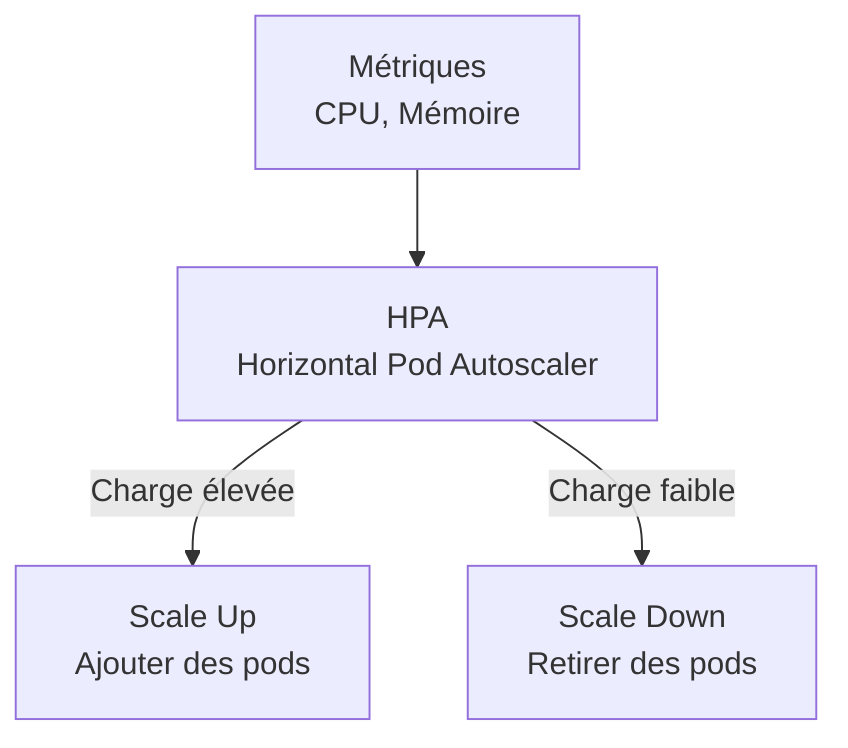

---
tags:
  - Kubernetes
  - Avancé
  - Pratique
description: "Health checks et autoscaling : surveiller la santé des pods et ajuster automatiquement les ressources"
estimated_time: "75 min"
fiche_number: 9
total_fiches: 12
cursus: "Kubernetes"
---

# 09 - Health checks et autoscaling

> **En bref** : À la fin de cette fiche, tu sauras configurer des probes (liveness, readiness, startup) pour surveiller la santé des pods, et mettre en place le HorizontalPodAutoscaler pour ajuster automatiquement le nombre de répliques selon la charge. Lecture estimée : 75 min.

## Prérequis

- Fiche **[08 - Namespaces et RBAC](08-namespaces-rbac.md)**
- Avoir un cluster Minikube démarré et fonctionnel
- Savoir créer des Deployments et des Services

## Versions utilisées dans cette fiche

| Technologie | Version |
| ----------- | ------- |
| Kubernetes  | 1.31+   |
| kubectl     | 1.31+   |
| Minikube    | 1.34+   |

## Objectif de cette fiche

À la fin de cette fiche, tu sauras configurer les health checks pour que Kubernetes détecte et corrige automatiquement les pods défaillants, et mettre en place l'autoscaling pour adapter le nombre de pods à la charge.

---

## Concepts

Cette section explique tous les concepts nécessaires. Lis-la entièrement avant de passer aux étapes pratiques.

### Qu'est-ce qu'une probe ?

**Définition** : Une probe (sonde) est un mécanisme de vérification de santé. Kubernetes exécute les probes régulièrement pour déterminer si un conteneur fonctionne correctement.

**Le problème que les probes résolvent** :

Sans probes :

1. **Pas de détection des pannes silencieuses** : Un conteneur peut être en status `Running` mais l'application à l'intérieur peut être bloquée (deadlock, connexion perdue à la base de données). Kubernetes ne le détecte pas.
2. **Trafic vers des pods non prêts** : Pendant le démarrage, un pod reçoit du trafic alors que l'application n'a pas encore fini de s'initialiser. Les utilisateurs voient des erreurs.
3. **Pas de redémarrage automatique** : Si l'application plante silencieusement (sans que le processus s'arrête), Kubernetes ne redémarre pas le conteneur.

**Comment les probes résolvent ces problèmes** :

| Problème | Solution |
| -------- | -------- |
| Pannes silencieuses | La liveness probe détecte les blocages et redémarre le conteneur |
| Trafic vers pods non prêts | La readiness probe empêche le trafic vers les pods non prêts |
| Pas de redémarrage automatique | La liveness probe déclenche un redémarrage quand l'application ne répond plus |

**Analogie concrète** : Les probes sont comme les capteurs de sécurité dans une usine. Le capteur de liveness vérifie que la machine tourne (et l'éteint/rallume si elle est bloquée). Le capteur de readiness vérifie que la machine est prête à recevoir des pièces (et arrête l'approvisionnement si elle n'est pas prête). Le capteur de startup attend que la machine ait fini son préchauffage avant d'activer les autres capteurs.

---

### Les trois types de probes

#### Liveness Probe

**Rôle** : Vérifie que le conteneur est vivant (son application fonctionne). Si la liveness probe échoue, Kubernetes redémarre le conteneur.

**Quand l'utiliser** : Toujours. C'est la probe la plus importante.

#### Readiness Probe

**Rôle** : Vérifie que le conteneur est prêt à recevoir du trafic. Si la readiness probe échoue, le pod est retiré du Service (il ne reçoit plus de requêtes) mais n'est pas redémarré.

**Quand l'utiliser** : Quand l'application a besoin de temps pour s'initialiser (connexion à la base de données, chargement du cache) ou peut devenir temporairement indisponible.

#### Startup Probe

**Rôle** : Vérifie que le conteneur a fini de démarrer. Tant que la startup probe n'a pas réussi, les liveness et readiness probes sont désactivées.

**Quand l'utiliser** : Pour les applications avec un temps de démarrage long (plusieurs minutes). La startup probe évite que la liveness probe ne redémarre le conteneur pendant son initialisation.

**Ordre d'exécution** :

```text
1. Le pod démarre
2. Startup probe (si définie) vérifie le démarrage
3. Une fois la startup probe réussie :
   - Liveness probe commence ses vérifications régulières
   - Readiness probe commence ses vérifications régulières
```

---

### Les trois méthodes de vérification

| Méthode | Description | Quand l'utiliser |
| ------- | ----------- | ---------------- |
| `httpGet` | Envoie une requête HTTP GET. Réussite si le code retour est entre 200 et 399 | Applications web avec un endpoint de santé |
| `tcpSocket` | Ouvre une connexion TCP. Réussite si la connexion est établie | Bases de données, services non-HTTP |
| `exec` | Exécute une commande dans le conteneur. Réussite si le code de sortie est 0 | Vérifications personnalisées |

---

### Les paramètres des probes

| Paramètre | Description | Valeur par défaut |
| ---------- | ----------- | ----------------- |
| `initialDelaySeconds` | Temps d'attente avant la première vérification | 0 |
| `periodSeconds` | Intervalle entre chaque vérification | 10 |
| `timeoutSeconds` | Temps maximum pour une vérification | 1 |
| `successThreshold` | Nombre de réussites consécutives pour considérer la probe comme réussie | 1 |
| `failureThreshold` | Nombre d'échecs consécutifs avant d'agir (redémarrer ou retirer du Service) | 3 |

---

### Qu'est-ce que le HorizontalPodAutoscaler (HPA) ?

**Définition** : Le HPA est un objet Kubernetes qui ajuste automatiquement le nombre de répliques d'un Deployment en fonction de la charge (CPU, mémoire, ou métriques personnalisées).

**Le problème que le HPA résout** :

Sans HPA :

1. **Scaling manuel** : Tu dois surveiller la charge et exécuter `kubectl scale` manuellement quand le trafic augmente.
2. **Gaspillage de ressources** : Si tu configures trop de répliques en permanence, tu payes pour des ressources inutilisées en période de faible trafic.
3. **Temps de réaction lent** : Le temps de détecter une surcharge et d'agir manuellement peut causer des lenteurs ou des erreurs.

**Comment le HPA résout ces problèmes** :

| Problème | Solution apportée par le HPA |
| -------- | ---------------------------- |
| Scaling manuel | Le HPA ajuste automatiquement le nombre de pods |
| Gaspillage de ressources | Le HPA réduit les pods quand la charge baisse |
| Temps de réaction lent | Le HPA vérifie les métriques toutes les 15 secondes |

**Analogie concrète** : Le HPA est comme un responsable de caisse dans un supermarché. Quand il y a beaucoup de clients (charge CPU élevée), il ouvre plus de caisses (pods). Quand le supermarché se vide, il ferme les caisses inutiles. Il n'ouvre jamais plus de 10 caisses (maxReplicas) et garde toujours au moins 2 caisses ouvertes (minReplicas).

Le diagramme suivant montre le fonctionnement du HPA : il ajuste le nombre de pods en fonction des métriques de charge.



**Ce que le HPA n'est PAS** :

- Le HPA ne gère pas le scaling vertical (augmenter les ressources d'un pod). Pour ça, il existe le VerticalPodAutoscaler (VPA), qui n'est pas couvert dans cette fiche.
- Le HPA nécessite le metrics-server pour fonctionner. Sans metrics-server, le HPA ne peut pas connaître la consommation CPU/mémoire.

---

## Étapes Pratiques

### Étape 1 : Configurer une liveness probe HTTP

Crée un fichier `liveness-http.yaml` :

```yaml
# liveness-http.yaml
# Pod avec une liveness probe HTTP
apiVersion: v1
kind: Pod
metadata:
  name: liveness-http
spec:
  containers:
    - name: web
      image: nginx:1.26
      ports:
        - containerPort: 80
      # Liveness probe : vérifie que Nginx répond sur /
      livenessProbe:
        httpGet:
          path: /
          port: 80
        # Attends 5 secondes avant la première vérification
        initialDelaySeconds: 5
        # Vérifie toutes les 10 secondes
        periodSeconds: 10
        # Timeout de 3 secondes par vérification
        timeoutSeconds: 3
        # Redémarre après 3 échecs consécutifs
        failureThreshold: 3
```

```bash
# Crée le pod
kubectl apply -f liveness-http.yaml

# Vérifie le pod
kubectl get pods liveness-http

# Affiche les détails pour voir la configuration des probes
kubectl describe pod liveness-http
```

**Résultat attendu** (extrait de describe) :

```text
Liveness:       http-get http://:80/ delay=5s timeout=3s period=10s #success=1 #failure=3
```

---

### Étape 2 : Simuler un échec de liveness probe

Crée un fichier `liveness-fail.yaml` :

```yaml
# liveness-fail.yaml
# Pod dont la liveness probe va échouer après 30 secondes
apiVersion: v1
kind: Pod
metadata:
  name: liveness-fail
spec:
  containers:
    - name: app
      image: busybox:1.36
      command:
        - sh
        - -c
        - |
          # Crée un fichier /tmp/healthy au démarrage
          touch /tmp/healthy
          echo "Application demarree"
          # Après 30 secondes, supprime le fichier (simule une panne)
          sleep 30
          rm /tmp/healthy
          echo "Application en panne (fichier supprime)"
          # Continue de tourner (le processus ne s'arrête pas)
          sleep 3600
      # Liveness probe : vérifie que le fichier /tmp/healthy existe
      livenessProbe:
        exec:
          command:
            - cat
            - /tmp/healthy
        initialDelaySeconds: 5
        periodSeconds: 5
        failureThreshold: 3
```

```bash
# Crée le pod
kubectl apply -f liveness-fail.yaml

# Surveille le pod (il sera redémarré après ~45 secondes)
kubectl get pods liveness-fail -w
```

**Résultat attendu** (après environ 45 secondes) :

```text
NAME             READY   STATUS    RESTARTS   AGE
liveness-fail    1/1     Running   0          10s
liveness-fail    1/1     Running   1 (2s ago)   48s
```

Le compteur RESTARTS passe de 0 à 1. Kubernetes a détecté l'échec de la liveness probe et a redémarré le conteneur.

```bash
# Vérifie les événements
kubectl describe pod liveness-fail | grep -A 5 Events
```

**Résultat attendu** (extrait) :

```text
Warning  Unhealthy  ... Liveness probe failed: cat: can't open '/tmp/healthy': No such file or directory
Normal   Killing    ... Container app failed liveness probe, will be restarted
```

---

### Étape 3 : Configurer une readiness probe

Crée un fichier `readiness-deployment.yaml` :

```yaml
# readiness-deployment.yaml
# Deployment avec readiness probe
apiVersion: apps/v1
kind: Deployment
metadata:
  name: web-ready
spec:
  replicas: 3
  selector:
    matchLabels:
      app: web-ready
  template:
    metadata:
      labels:
        app: web-ready
    spec:
      containers:
        - name: nginx
          image: nginx:1.26
          ports:
            - containerPort: 80
          # Readiness probe : le pod ne reçoit du trafic que si Nginx répond
          readinessProbe:
            httpGet:
              path: /
              port: 80
            initialDelaySeconds: 3
            periodSeconds: 5
            failureThreshold: 2
          # Liveness probe : redémarre le pod si Nginx ne répond plus
          livenessProbe:
            httpGet:
              path: /
              port: 80
            initialDelaySeconds: 10
            periodSeconds: 10
            failureThreshold: 3
---
apiVersion: v1
kind: Service
metadata:
  name: web-ready-svc
spec:
  selector:
    app: web-ready
  ports:
    - port: 80
      targetPort: 80
```

```bash
# Crée les ressources
kubectl apply -f readiness-deployment.yaml

# Vérifie les pods (READY doit afficher 1/1)
kubectl get pods -l app=web-ready

# Vérifie les endpoints du Service
kubectl get endpoints web-ready-svc
```

**Résultat attendu** :

```text
NAME            ENDPOINTS                                   AGE
web-ready-svc   172.17.0.3:80,172.17.0.4:80,172.17.0.5:80   30s
```

Les 3 pods sont listés dans les endpoints car leur readiness probe a réussi.

---

### Étape 4 : Configurer une startup probe

Crée un fichier `startup-pod.yaml` :

```yaml
# startup-pod.yaml
# Pod avec une startup probe pour une application lente à démarrer
apiVersion: v1
kind: Pod
metadata:
  name: slow-start
spec:
  containers:
    - name: app
      image: busybox:1.36
      command:
        - sh
        - -c
        - |
          echo "Demarrage en cours..."
          # Simule un démarrage long (20 secondes)
          sleep 20
          echo "Application prete"
          touch /tmp/started
          # Simule un serveur qui tourne
          while true; do
            echo "OK" > /tmp/health
            sleep 5
          done
      # Startup probe : attend que l'application ait fini de démarrer
      startupProbe:
        exec:
          command:
            - cat
            - /tmp/started
        # Vérifie toutes les 5 secondes
        periodSeconds: 5
        # Autorise jusqu'à 12 échecs (12 x 5s = 60s max de démarrage)
        failureThreshold: 12
      # Liveness probe : ne commence qu'après la réussite de la startup probe
      livenessProbe:
        exec:
          command:
            - cat
            - /tmp/health
        periodSeconds: 10
        failureThreshold: 3
```

```bash
# Crée le pod
kubectl apply -f startup-pod.yaml

# Surveille : le pod sera READY après ~20 secondes
kubectl get pods slow-start -w
```

---

### Étape 5 : Activer le metrics-server

Le HPA a besoin du metrics-server pour connaître la consommation CPU et mémoire :

```bash
# Active le metrics-server sur Minikube
minikube addons enable metrics-server

# Vérifie que le metrics-server tourne
kubectl get pods -n kube-system -l k8s-app=metrics-server

# Attends ~1 minute puis vérifie les métriques
kubectl top nodes
```

**Résultat attendu** :

```text
NAME       CPU(cores)   CPU%   MEMORY(bytes)   MEMORY%
minikube   250m         12%    1200Mi          30%
```

```bash
# Vérifie les métriques des pods
kubectl top pods -A
```

---

### Étape 6 : Créer un Deployment pour l'autoscaling

Crée un fichier `hpa-deployment.yaml` :

```yaml
# hpa-deployment.yaml
# Deployment avec des limites de ressources (obligatoire pour le HPA)
apiVersion: apps/v1
kind: Deployment
metadata:
  name: php-apache
spec:
  replicas: 1
  selector:
    matchLabels:
      app: php-apache
  template:
    metadata:
      labels:
        app: php-apache
    spec:
      containers:
        - name: php-apache
          # Image officielle de test pour le HPA
          image: registry.k8s.io/hpa-example
          ports:
            - containerPort: 80
          # Les limites de ressources sont OBLIGATOIRES pour le HPA
          resources:
            requests:
              cpu: "200m"
            limits:
              cpu: "500m"
---
apiVersion: v1
kind: Service
metadata:
  name: php-apache-svc
spec:
  selector:
    app: php-apache
  ports:
    - port: 80
      targetPort: 80
```

```bash
# Crée les ressources
kubectl apply -f hpa-deployment.yaml

# Vérifie
kubectl get pods -l app=php-apache
```

---

### Étape 7 : Créer un HorizontalPodAutoscaler

```bash
# Crée un HPA qui maintient l'utilisation CPU à 50%
# Minimum 1 pod, maximum 10 pods
kubectl autoscale deployment php-apache --cpu-percent=50 --min=1 --max=10
```

Tu peux aussi le faire via un fichier YAML :

```yaml
# hpa.yaml
apiVersion: autoscaling/v2
kind: HorizontalPodAutoscaler
metadata:
  name: php-apache-hpa
spec:
  # Le Deployment à scaler
  scaleTargetRef:
    apiVersion: apps/v1
    kind: Deployment
    name: php-apache
  # Nombre minimum et maximum de répliques
  minReplicas: 1
  maxReplicas: 10
  # Métriques de scaling
  metrics:
    - type: Resource
      resource:
        name: cpu
        target:
          # Cible : 50% d'utilisation CPU
          type: Utilization
          averageUtilization: 50
```

```bash
# Vérifie le HPA
kubectl get hpa
```

**Résultat attendu** :

```text
NAME              REFERENCE               TARGETS   MINPODS   MAXPODS   REPLICAS   AGE
php-apache-hpa    Deployment/php-apache   0%/50%    1         10        1          30s
```

---

### Étape 8 : Simuler une charge pour déclencher l'autoscaling

Dans un premier terminal, surveille le HPA :

```bash
# Surveille le HPA en temps réel
kubectl get hpa -w
```

Dans un second terminal, génère de la charge :

```bash
# Lance un pod qui envoie des requêtes en boucle
kubectl run load-generator --rm -it --image=busybox:1.36 -- sh -c "while true; do wget -q -O- http://php-apache-svc; done"
```

**Résultat attendu** (dans le premier terminal, après 1-2 minutes) :

```text
NAME              REFERENCE               TARGETS    MINPODS   MAXPODS   REPLICAS   AGE
php-apache-hpa    Deployment/php-apache   0%/50%     1         10        1          2m
php-apache-hpa    Deployment/php-apache   165%/50%   1         10        1          3m
php-apache-hpa    Deployment/php-apache   165%/50%   1         10        4          3m30s
php-apache-hpa    Deployment/php-apache   82%/50%    1         10        4          4m
php-apache-hpa    Deployment/php-apache   55%/50%    1         10        7          4m30s
```

Le HPA augmente progressivement le nombre de répliques pour maintenir l'utilisation CPU autour de 50%.

```bash
# Arrête le générateur de charge (Ctrl+C dans le second terminal)
# Après quelques minutes, le HPA réduit le nombre de pods
kubectl get hpa -w
```

Le scale-down est plus lent que le scale-up (par conception, pour éviter les oscillations).

---

### Étape 9 : Combiner probes et HPA

Crée un fichier `complete-deployment.yaml` :

```yaml
# complete-deployment.yaml
# Deployment complet avec probes et HPA
apiVersion: apps/v1
kind: Deployment
metadata:
  name: production-app
spec:
  replicas: 2
  selector:
    matchLabels:
      app: production-app
  template:
    metadata:
      labels:
        app: production-app
    spec:
      containers:
        - name: nginx
          image: nginx:1.26
          ports:
            - containerPort: 80
          resources:
            requests:
              cpu: "100m"
              memory: "128Mi"
            limits:
              cpu: "300m"
              memory: "256Mi"
          # Startup probe : attend que Nginx soit prêt
          startupProbe:
            httpGet:
              path: /
              port: 80
            periodSeconds: 2
            failureThreshold: 15
          # Liveness probe : redémarre si Nginx ne répond plus
          livenessProbe:
            httpGet:
              path: /
              port: 80
            periodSeconds: 10
            failureThreshold: 3
          # Readiness probe : retire du Service si Nginx est surchargé
          readinessProbe:
            httpGet:
              path: /
              port: 80
            periodSeconds: 5
            failureThreshold: 2
---
apiVersion: autoscaling/v2
kind: HorizontalPodAutoscaler
metadata:
  name: production-app-hpa
spec:
  scaleTargetRef:
    apiVersion: apps/v1
    kind: Deployment
    name: production-app
  minReplicas: 2
  maxReplicas: 8
  metrics:
    - type: Resource
      resource:
        name: cpu
        target:
          type: Utilization
          averageUtilization: 60
```

```bash
# Crée les ressources
kubectl apply -f complete-deployment.yaml

# Vérifie
kubectl get pods -l app=production-app
kubectl get hpa
```

---

### Étape 10 : Nettoyer

```bash
# Supprime toutes les ressources
kubectl delete -f complete-deployment.yaml
kubectl delete hpa php-apache-hpa 2>/dev/null
kubectl delete -f hpa-deployment.yaml
kubectl delete -f readiness-deployment.yaml
kubectl delete pod liveness-http liveness-fail slow-start

# Vérifie
kubectl get all
```

---

## Commandes Utiles

| Commande | Action |
| -------- | ------ |
| `kubectl describe pod <nom>` | Affiche les probes configurées et les événements |
| `kubectl get pods -w` | Surveille les pods en temps réel |
| `kubectl top nodes` | Affiche la consommation CPU/mémoire des nodes |
| `kubectl top pods` | Affiche la consommation CPU/mémoire des pods |
| `kubectl autoscale deployment <nom> --cpu-percent=50 --min=1 --max=10` | Crée un HPA |
| `kubectl get hpa` | Liste les HPAs |
| `kubectl get hpa -w` | Surveille les HPAs en temps réel |
| `kubectl describe hpa <nom>` | Affiche les détails d'un HPA |
| `kubectl delete hpa <nom>` | Supprime un HPA |

---

## Pièges Fréquents

### Piège 1 : Liveness probe trop agressive

⚠️ **Problème** : La liveness probe redémarre le pod en boucle car l'application met plus de temps que prévu à démarrer.

✅ **Solution** : Ajoute une startup probe ou augmente `initialDelaySeconds` et `failureThreshold` :

```yaml
# Autorise un démarrage de 60 secondes max
startupProbe:
  httpGet:
    path: /health
    port: 80
  periodSeconds: 5
  failureThreshold: 12
```

### Piège 2 : Le HPA affiche "unknown" dans TARGETS

⚠️ **Problème** : `kubectl get hpa` affiche `<unknown>/50%`.

✅ **Solution** : Le metrics-server n'est pas installé ou les pods n'ont pas de `resources.requests` définies :

```bash
# Vérifie que le metrics-server tourne
kubectl get pods -n kube-system -l k8s-app=metrics-server

# Vérifie que les pods ont des requests CPU
kubectl describe deployment <nom> | grep -A 2 Requests
```

### Piège 3 : Confondre liveness et readiness

⚠️ **Problème** : Utiliser la liveness probe pour gérer les surcharges temporaires. Résultat : les pods redémarrent alors qu'ils pourraient récupérer.

✅ **Solution** :

- **Liveness** : "Le conteneur est-il vivant ?" → Si non, redémarre.
- **Readiness** : "Le conteneur est-il prêt à servir ?" → Si non, arrête d'envoyer du trafic.

Pour une surcharge temporaire, utilise la readiness probe. Pour un blocage définitif (deadlock), utilise la liveness probe.

### Piège 4 : Le HPA ne réduit pas le nombre de pods

⚠️ **Problème** : Après la fin de la charge, le nombre de pods ne diminue pas.

✅ **Solution** : Le scale-down est intentionnellement lent (5 minutes par défaut) pour éviter les oscillations. Attends au moins 5 minutes après la fin de la charge. Tu peux vérifier le comportement avec `kubectl describe hpa`.

---

## Checklist de Validation

- [ ] Je comprends la différence entre liveness, readiness et startup probes
- [ ] Je sais configurer une probe HTTP, TCP et exec
- [ ] Je comprends les paramètres des probes (initialDelay, period, timeout, failureThreshold)
- [ ] Je sais activer le metrics-server sur Minikube
- [ ] Je sais créer un HPA en ligne de commande et en YAML
- [ ] Je comprends le fonctionnement du scale-up et du scale-down
- [ ] Je sais combiner les probes avec le HPA dans un Deployment

---

## Exercice Pratique

**Énoncé** : Crée un Deployment résilient avec autoscaling.

1. Crée un Deployment `resilient-app` (2 répliques, image `nginx:1.26`, port 80)
2. Configure :
   - Une startup probe HTTP sur `/` (max 30s de démarrage)
   - Une liveness probe HTTP sur `/` (toutes les 15s, timeout 5s, 3 échecs)
   - Une readiness probe HTTP sur `/` (toutes les 5s, 2 échecs)
   - Des limites de ressources (requests: 100m CPU, 128Mi mémoire ; limits: 250m CPU, 256Mi mémoire)
3. Crée un Service ClusterIP pour le Deployment
4. Crée un HPA qui cible 60% d'utilisation CPU, min 2 pods, max 6 pods
5. Vérifie que tout fonctionne avec `kubectl get hpa` et `kubectl describe pod`
6. Supprime tout

**Indications** :

- La startup probe doit avoir un `failureThreshold` suffisant (ex. : 6 x 5s = 30s)
- N'oublie pas `resources.requests.cpu` sinon le HPA ne fonctionnera pas

**Résultat attendu** : Le Deployment a des probes fonctionnelles et un HPA configuré.

---

## Solution de l'Exercice

> **Note** : Cette section contient la solution complète. Essaie d'abord de résoudre l'exercice par toi-même avant de consulter cette solution.

---

Crée le fichier `exercise-health.yaml` :

```yaml
# exercise-health.yaml
apiVersion: apps/v1
kind: Deployment
metadata:
  name: resilient-app
spec:
  replicas: 2
  selector:
    matchLabels:
      app: resilient-app
  template:
    metadata:
      labels:
        app: resilient-app
    spec:
      containers:
        - name: nginx
          image: nginx:1.26
          ports:
            - containerPort: 80
          resources:
            requests:
              cpu: "100m"
              memory: "128Mi"
            limits:
              cpu: "250m"
              memory: "256Mi"
          startupProbe:
            httpGet:
              path: /
              port: 80
            periodSeconds: 5
            failureThreshold: 6
          livenessProbe:
            httpGet:
              path: /
              port: 80
            periodSeconds: 15
            timeoutSeconds: 5
            failureThreshold: 3
          readinessProbe:
            httpGet:
              path: /
              port: 80
            periodSeconds: 5
            failureThreshold: 2
---
apiVersion: v1
kind: Service
metadata:
  name: resilient-app-svc
spec:
  selector:
    app: resilient-app
  ports:
    - port: 80
      targetPort: 80
---
apiVersion: autoscaling/v2
kind: HorizontalPodAutoscaler
metadata:
  name: resilient-app-hpa
spec:
  scaleTargetRef:
    apiVersion: apps/v1
    kind: Deployment
    name: resilient-app
  minReplicas: 2
  maxReplicas: 6
  metrics:
    - type: Resource
      resource:
        name: cpu
        target:
          type: Utilization
          averageUtilization: 60
```

```bash
# Crée les ressources
kubectl apply -f exercise-health.yaml

# Vérifie les pods
kubectl get pods -l app=resilient-app

# Vérifie les probes
kubectl describe pod -l app=resilient-app | grep -A 3 Liveness
kubectl describe pod -l app=resilient-app | grep -A 3 Readiness
kubectl describe pod -l app=resilient-app | grep -A 3 Startup

# Vérifie le HPA
kubectl get hpa

# Supprime tout
kubectl delete -f exercise-health.yaml
```

---

## Navigation

← Fiche précédente : **[08 - Namespaces et RBAC](08-namespaces-rbac.md)**

→ Fiche suivante : **[10 - Helm - Gestionnaire de packages](10-helm-gestionnaire-packages.md)**
