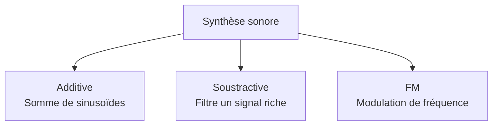

---
tags:
  - Faust
  - Débutant
  - Concept
description: "Synthèse sonore - théorie des méthodes de synthèse audio : additive, soustractive, FM, granulaire et modélisation physique"
estimated_time: "105 min"
fiche_number: 4
total_fiches: 4
cursus: "Phase 1 - Fondamentaux acoustique"
---

# 04 - Synthèse sonore - théorie

> **En bref** : À la fin de cette fiche, tu sauras décrire les principales méthodes de synthèse sonore, expliquer leurs différences et choisir la méthode adaptée à un son cible. Lecture estimée : 105 min.


## Prérequis

- Avoir lu la fiche [01 - Acoustique et psychoacoustique](01-acoustique-psychoacoustique.md) pour connaître les notions d'onde, fréquence, amplitude, timbre et spectre harmonique
- Avoir lu la fiche [02 - Audio numérique et théorie du signal](02-audio-numerique-theorie-signal.md) pour comprendre l'échantillonnage, le théorème de Nyquist-Shannon et la transformée de Fourier

## Objectif de cette fiche

À la fin de cette fiche, tu sauras décrire les principales méthodes de synthèse sonore, expliquer leurs différences et choisir la méthode adaptée à un son cible.

---

## Concepts

Cette section explique tous les concepts nécessaires. Lis-la entièrement avant de passer aux étapes pratiques.

### Qu'est-ce que la synthèse sonore ?

**Définition** : La synthèse sonore est le processus de création de sons à partir de zéro, en utilisant des opérations mathématiques sur des signaux électriques ou numériques. Au lieu d'enregistrer un son existant (un piano, une voix), on le construit artificiellement.

**Le problème que la synthèse sonore résout** :

Sans synthèse sonore, voici les problèmes rencontrés :

1. **Dépendance aux enregistrements** : Pour utiliser un son de piano, il faut un vrai piano et un micro. Chaque son nécessite un enregistrement séparé.
2. **Sons figés** : Un enregistrement est fixe. On ne peut pas modifier le timbre, la durée ou le caractère du son de manière flexible.
3. **Sons impossibles à enregistrer** : Certains sons n'existent pas dans la nature (textures électroniques, nappes atmosphériques, effets spéciaux).
4. **Coût et logistique** : Enregistrer un orchestre complet coûte cher et nécessite un studio, des musiciens, des instruments.

**Comment la synthèse sonore résout ces problèmes** :

| Problème                          | Solution apportée par la synthèse                                               |
| --------------------------------- | -------------------------------------------------------------------------------- |
| Dépendance aux enregistrements    | On génère le son mathématiquement, sans micro ni instrument                      |
| Sons figés                        | On contrôle chaque paramètre en temps réel (timbre, durée, hauteur)             |
| Sons impossibles à enregistrer    | On peut créer n'importe quel son imaginable, même s'il n'existe pas dans la nature |
| Coût et logistique                | Un ordinateur ou un synthétiseur suffit pour produire des milliers de sons       |

**Analogie concrète** : La synthèse sonore est comme la cuisine. Un enregistrement, c'est un plat acheté tout fait au supermarché : tu le manges tel quel. La synthèse, c'est cuisiner toi-même : tu choisis chaque ingrédient (les oscillateurs), tu doses les épices (les paramètres), tu règles la cuisson (l'enveloppe). Tu peux inventer des recettes qui n'existent dans aucun livre.

**Ce que la synthèse sonore n'est PAS** :

- La synthèse sonore n'est pas du sampling (échantillonnage). Le sampling utilise des enregistrements courts de vrais instruments qu'on rejoue. La synthèse crée le son à partir de formules mathématiques, sans aucun enregistrement.
- La synthèse sonore n'est pas de l'édition audio. L'édition audio modifie un son existant (couper, coller, normaliser). La synthèse crée un son qui n'existait pas avant.

Le diagramme suivant présente les trois grandes familles de synthèse sonore et leur principe distinctif.



---

### Qu'est-ce que la synthèse additive ?

**Définition** : La synthèse additive construit un son complexe en additionnant plusieurs sinusoïdes simples, chacune avec sa propre fréquence, amplitude et phase. C'est l'application directe de la série de Fourier : tout son périodique peut être décomposé en une somme de sinusoïdes.

**Le problème que la synthèse additive résout** :

Sans synthèse additive, voici les problèmes rencontrés :

1. **Contrôle limité du timbre** : Avec un seul oscillateur, on obtient un son simple (sinusoïde pure, dent de scie). On ne peut pas sculpter finement le contenu harmonique.
2. **Reproduire des timbres naturels** : Les instruments acoustiques ont un spectre harmonique complexe. Une seule forme d'onde ne suffit pas à reproduire ce spectre.
3. **Évolution temporelle du timbre** : Le timbre d'un instrument change au cours du temps (l'attaque d'un piano est plus riche que sa résonance). Un oscillateur simple ne peut pas reproduire cette évolution.

**Comment la synthèse additive résout ces problèmes** :

| Problème                          | Solution apportée par la synthèse additive                                      |
| --------------------------------- | ------------------------------------------------------------------------------- |
| Contrôle limité du timbre         | Chaque harmonique est contrôlée individuellement en fréquence et amplitude      |
| Reproduire des timbres naturels   | On analyse le spectre d'un instrument réel et on le reconstruit harmonique par harmonique |
| Évolution temporelle du timbre    | Chaque harmonique peut avoir sa propre enveloppe d'amplitude dans le temps      |

**Principe mathématique** :

Un son périodique de fréquence fondamentale $f_0$ se décompose en :

$$\text{signal}(t) = A_1 \cdot \sin(2\pi \cdot f_0 \cdot t) + A_2 \cdot \sin(2\pi \cdot 2f_0 \cdot t) + A_3 \cdot \sin(2\pi \cdot 3f_0 \cdot t) + \cdots + A_n \cdot \sin(2\pi \cdot n f_0 \cdot t)$$

Chaque terme $A_n \cdot \sin(2\pi \cdot n f_0 \cdot t)$ est une sinusoïde dont :

- $n \cdot f_0$ est la fréquence (multiple entier de la fondamentale)
- $A_n$ est l'amplitude (contrôle la "présence" de cette harmonique)

**Exemple concret - l'orgue de Hammond** :

L'orgue Hammond (1935) est l'exemple historique de synthèse additive. Il utilise des tirettes harmoniques (drawbars) pour doser 9 harmoniques :

```text
Tirette    Harmonique    Rapport     Nom musical
──────────────────────────────────────────────────
  16'         1           1:1        Sous-fondamentale
  5 1/3'      3           3:1        Quinte (*)
  8'          2           2:1        Fondamentale (octave)
  4'          4           4:1        Double octave
  2 2/3'      6           6:1        Quinte + octave (*)
  2'          8           8:1        Triple octave
  1 3/5'      10          10:1       Tierce + 2 octaves (*)
  1 1/3'      12          12:1       Quinte + 2 octaves (*)
  1'          16          16:1       Quadruple octave

Note : le numéro d'harmonique est relatif au registre 16' (harmonique 1).
L'ordre physique des tirettes ne suit donc pas la suite des harmoniques :
le 8' (harmonique 2) est le registre perçu comme la fondamentale du jeu.

(*) Les tirettes 5 1/3', 2 2/3', 1 3/5' et 1 1/3' ajoutent des
    harmoniques non-octave pour enrichir le timbre.
```

Chaque tirette a 9 positions (0 à 8) qui règlent le volume de l'harmonique correspondante. La combinaison de ces tirettes produit des timbres variés : orgue d'église, orgue jazz, percussion.

**Analogie concrète** : La synthèse additive fonctionne comme un mélangeur de peinture. Tu as des pots de couleurs pures (les sinusoïdes). En dosant chaque couleur (l'amplitude de chaque harmonique), tu obtiens la teinte exacte que tu veux (le timbre final). Plus tu mélanges de couleurs, plus le résultat est riche et complexe.

**Ce que la synthèse additive n'est PAS** :

- La synthèse additive n'est pas de la synthèse soustractive. L'additive part du silence et ajoute des composantes. La soustractive part d'un son riche et enlève des composantes.
- La synthèse additive n'est pas limitée aux harmoniques. On peut aussi additionner des sinusoïdes à des fréquences non-harmoniques (non multiples de $f_0$) pour créer des sons inharmoniques comme des cloches ou des gongs.

---

### Qu'est-ce que la synthèse soustractive ?

**Définition** : La synthèse soustractive part d'un signal harmoniquement riche (dent de scie, onde carrée, bruit) et utilise des filtres pour retirer des fréquences indésirables. Le son est sculpté par soustraction, comme un sculpteur qui retire de la matière d'un bloc de pierre.

**Le problème que la synthèse soustractive résout** :

Sans synthèse soustractive, voici les problèmes rencontrés :

1. **Trop d'oscillateurs nécessaires** : En synthèse additive, reproduire un son riche comme une dent de scie nécessite des dizaines d'oscillateurs (un par harmonique). C'est coûteux en calcul.
2. **Difficulté à créer des sons chauds** : Les sinusoïdes pures sonnent "froides" et "cliniques". Les sons analogiques ont un caractère "chaud" difficile à obtenir par addition.
3. **Contrôle intuitif du timbre** : Régler 30 amplitudes d'harmoniques individuellement est complexe. Il faut un moyen plus simple de façonner le timbre.

**Comment la synthèse soustractive résout ces problèmes** :

| Problème                          | Solution apportée par la synthèse soustractive                                  |
| --------------------------------- | ------------------------------------------------------------------------------- |
| Trop d'oscillateurs nécessaires   | Un seul oscillateur riche (dent de scie) contient déjà toutes les harmoniques   |
| Difficulté à créer des sons chauds | Les formes d'onde riches + filtres analogiques produisent naturellement de la chaleur |
| Contrôle intuitif du timbre       | Un filtre avec 2 paramètres (fréquence de coupure + résonance) suffit           |

**Chaîne de signal typique** :

```text
┌──────────────┐    ┌──────────────┐    ┌──────────────┐    ┌──────────────┐
│  OSCILLATEUR │───▶│    FILTRE    │───▶│  ENVELOPPE   │───▶│   SORTIE     │
│              │    │              │    │              │    │              │
│ Dent de scie │    │ Passe-bas    │    │ ADSR         │    │ Amplitude    │
│ Carrée       │    │ Fréq. coupure│    │              │    │ finale       │
│ Bruit        │    │ Résonance    │    │              │    │              │
└──────────────┘    └──────────────┘    └──────────────┘    └──────────────┘
```

**Formes d'onde utilisées comme source** :

```text
Dent de scie (sawtooth)         Onde carrée (square)
Contient TOUTES les harmoniques  Contient les harmoniques IMPAIRES
Amplitude : 1/n                  Amplitude : 1/n (n impair)

    /|  /|  /|                    ┌──┐  ┌──┐  ┌──┐
   / | / | / |                    │  │  │  │  │  │
  /  |/  |/  |               ────┘  └──┘  └──┘  └──

Triangle                         Bruit blanc (white noise)
Harmoniques impaires             Toutes les fréquences
Amplitude : 1/n²                 Amplitude aléatoire

   /\    /\    /\                 ▓░▒▓░▓▒░▓░▒▓▒░▓░▒
  /  \  /  \  /  \               ▒▓░▒▓▒░▓▒░▓░▒▓░▒▓
 /    \/    \/    \              ░▒▓▒░▓░▒▓▒░▓▒░▓▒░▓
```

**Exemple concret - le Moog** :

Le synthétiseur Moog (1964) est l'instrument emblématique de la synthèse soustractive. Sa chaîne de signal :

1. **Oscillateur VCO** : génère une dent de scie ou une onde carrée
2. **Filtre VCF** (Voltage Controlled Filter) : filtre passe-bas à 24 dB/octave avec résonance. La fréquence de coupure détermine la "brillance" du son
3. **Amplificateur VCA** : contrôle le volume final via une enveloppe ADSR

Le son "basse Moog" caractéristique s'obtient avec : oscillateur en dent de scie, filtre passe-bas avec la fréquence de coupure réglée bas (autour de 500 Hz), et une légère résonance.

**Analogie concrète** : La synthèse soustractive fonctionne comme la sculpture sur bois. Tu commences avec un bloc de bois brut (le signal riche en harmoniques). Avec tes outils (les filtres), tu retires de la matière pour révéler la forme souhaitée. Le bloc contient déjà toutes les formes possibles, tu choisis ce que tu enlèves.

**Ce que la synthèse soustractive n'est PAS** :

- La synthèse soustractive n'est pas l'inverse de la synthèse additive au sens strict. En additive, on contrôle chaque harmonique individuellement. En soustractive, le filtre agit sur des bandes de fréquences entières, pas sur des harmoniques individuelles.
- La synthèse soustractive n'est pas limitée aux filtres passe-bas. On peut utiliser des filtres passe-haut, passe-bande, coupe-bande (notch) ou des combinaisons de filtres.

**Comparaison synthèse additive vs soustractive** :

| Critère              | Synthèse additive                        | Synthèse soustractive                    |
| -------------------- | ---------------------------------------- | ---------------------------------------- |
| Point de départ      | Silence (on ajoute des sinusoïdes)       | Signal riche (on retire des fréquences)  |
| Nombre d'oscillateurs | Nombreux (un par harmonique)            | Un ou deux suffisent                     |
| Contrôle du timbre   | Précis (harmonique par harmonique)       | Global (fréquence de coupure + résonance)|
| Coût en calcul       | Élevé (beaucoup d'oscillateurs)          | Faible (un oscillateur + un filtre)      |
| Sons typiques        | Orgue, cloches, sons analytiques         | Basses, leads, pads, sons "analogiques"  |
| Instrument historique | Orgue Hammond (1935)                    | Moog (1964)                              |

---

### Qu'est-ce que la synthèse FM (modulation de fréquence) ?

**Définition** : La synthèse FM (Frequency Modulation) utilise un oscillateur (le modulateur) pour faire varier la fréquence d'un autre oscillateur (la porteuse) à une vitesse audible. Cette variation rapide de fréquence crée de nouvelles harmoniques qui n'existaient dans aucun des deux oscillateurs pris séparément.

**Le problème que la synthèse FM résout** :

Sans synthèse FM, voici les problèmes rencontrés :

1. **Spectres complexes coûteux** : En synthèse additive, créer un son de cloche avec des harmoniques inharmoniques nécessite des dizaines d'oscillateurs indépendants.
2. **Manque de vivacité** : La synthèse soustractive produit des sons qui manquent de "brillance métallique". Les filtres retirent de l'énergie mais n'en créent pas.
3. **Évolution spectrale limitée** : Avec un oscillateur + filtre, les variations de timbre restent prévisibles. On ne peut pas créer facilement des timbres qui évoluent de manière complexe.

**Comment la synthèse FM résout ces problèmes** :

| Problème                          | Solution apportée par la synthèse FM                                            |
| --------------------------------- | ------------------------------------------------------------------------------- |
| Spectres complexes coûteux        | Deux oscillateurs suffisent pour créer des dizaines d'harmoniques               |
| Manque de vivacité                | La FM crée de l'énergie dans les hautes fréquences (sons métalliques, brillants)|
| Évolution spectrale limitée       | L'index de modulation permet des variations de timbre riches et complexes       |

**Principe de fonctionnement** :

```text
┌───────────────┐              ┌───────────────┐
│  MODULATEUR   │──────────────▶  PORTEUSE     │──────▶ Sortie audio
│               │  modifie la  │               │
│ Fréquence: fm │  fréquence   │ Fréquence: fc │
│ Amplitude: Am │              │               │
└───────────────┘              └───────────────┘
```

Signal de sortie :

$$y(t) = \sin(2\pi \cdot f_c \cdot t + I \cdot \sin(2\pi \cdot f_m \cdot t))$$

Où :

- $f_c$ = fréquence de la porteuse (détermine la hauteur perçue)
- $f_m$ = fréquence du modulateur (détermine l'espacement des harmoniques)
- $I$ = index de modulation ($\Delta f / f_m$, ou $\Delta f$ est la deviation maximale de fréquence en Hz) (détermine la richesse du timbre)

**Les deux paramètres clés** :

**Paramètre 1 - Ratio porteuse/modulatrice ($f_c : f_m$)** : détermine quelles harmoniques apparaissent.

```text
Ratio fc:fm    Harmoniques produites         Caractère sonore
────────────────────────────────────────────────────────────────
  1:1          1, 2, 3, 4, 5...              Harmonique (comme dent de scie)
  1:2          1, 3, 5, 7, 9...              Harmonique impaire (comme carré)
  1:3          1, 2, 4, 5, 7, 8...           Harmonique avec trous
  1:1.41       Non-entières                  Inharmonique (cloche, métal)
  1:√2         Irrationnelles                Bruit tonal (gong, cymbale)
```

**Paramètre 2 - Index de modulation ($I$)** : détermine combien d'harmoniques sont audibles.

```text
Index I = 0    → son pur (sinusoïde simple, pas de modulation)
Index I = 1    → quelques harmoniques (son légèrement brillant)
Index I = 5    → beaucoup d'harmoniques (son riche et métallique)
Index I = 10+  → spectre très dense (son agressif, proche du bruit)

I faible ──────────────────────────────────── I élevé
 ●                ●●●             ●●●●●●●●●●●●●●●
 ▏                ▏▏▏             ▏▏▏▏▏▏▏▏▏▏▏▏▏▏▏
 ▏    ▏           ▏▏▏  ▏  ▏      ▏▏▏▏▏▏▏▏▏▏▏▏▏▏▏
───────────────  ───────────────  ───────────────
  Fréquence →      Fréquence →     Fréquence →
  (peu d'harm.)   (harmoniques    (spectre dense)
                   modérées)
```

**Exemple concret - le Yamaha DX7** :

Le DX7 (1983) est le synthétiseur FM le plus célèbre. Il utilise 6 "opérateurs" (oscillateurs sinusoïdaux) arrangés en 32 "algorithmes" (configurations de routage). Chaque opérateur peut être porteuse ou modulateur.

```text
Algorithme 1 du DX7 (simplifié) :

  [OP6]──▶[OP5]──▶[OP4]──▶[OP3]──▶[OP2]──▶[OP1]──▶ Sortie
   mod      mod     mod     mod     mod    porteuse

  6 opérateurs en série : chacun module le suivant.
  Seul OP1 (la porteuse finale) produit le son audible.
```

Le son de piano électrique "E.Piano 1" du DX7 est devenu emblématique de la musique pop des années 1980.

**Analogie concrète** : La synthèse FM fonctionne comme un vibrato poussé à l'extrême. Quand un chanteur fait un vibrato lent (5-6 Hz), tu entends une ondulation agréable de la hauteur. Maintenant, imagine que ce vibrato accélère à 200 Hz, puis 500 Hz, puis 1000 Hz. La variation est si rapide que ton oreille ne perçoit plus un mouvement de hauteur : elle perçoit de nouvelles "couleurs" dans le son, de nouvelles harmoniques. C'est exactement ce que fait la FM.

**Ce que la synthèse FM n'est PAS** :

- La synthèse FM n'est pas de la modulation d'amplitude (AM). En AM, c'est le volume qui varie. En FM, c'est la fréquence. L'AM produit des bandes latérales symétriques simples. La FM produit un spectre beaucoup plus riche.
- La synthèse FM n'est pas intuitive à programmer. Contrairement à la soustractive où "tourner le filtre" donne un résultat prévisible, de petits changements en FM peuvent radicalement transformer le son. C'est à la fois sa force (richesse) et sa faiblesse (difficulté de programmation).

---

### Qu'est-ce que la modélisation physique ?

**Définition** : La modélisation physique simule les lois de la physique qui produisent le son dans un instrument réel. Au lieu de copier le résultat sonore (l'enregistrement), on reproduit le mécanisme de production : la vibration d'une corde, le souffle dans un tube, la frappe sur une membrane.

**Le problème que la modélisation physique résout** :

Sans modélisation physique, voici les problèmes rencontrés :

1. **Expressivité limitée** : Les méthodes de synthèse classiques produisent des sons statiques. Un vrai instrument réagit différemment selon la force de jeu, la position du doigt, le souffle du musicien.
2. **Transitions non naturelles** : Passer d'une note à une autre sur un vrai instrument implique des phénomènes physiques (glissando, résonance sympathique) impossibles à reproduire avec des oscillateurs simples.
3. **Comportements émergents absents** : Un vrai instrument a des comportements non programmés (résonance du corps, couplage entre cordes, saturation naturelle). Les autres méthodes de synthèse ne produisent pas ces comportements spontanément.

**Comment la modélisation physique résout ces problèmes** :

| Problème                           | Solution apportée par la modélisation physique                                 |
| ---------------------------------- | ------------------------------------------------------------------------------ |
| Expressivité limitée               | Le modèle réagit naturellement aux paramètres de jeu (vélocité, pression)     |
| Transitions non naturelles         | La physique simulée produit des transitions réalistes entre les notes          |
| Comportements émergents absents    | Les interactions physiques génèrent spontanément des détails réalistes         |

**Exemple - algorithme de Karplus-Strong** :

L'algorithme de Karplus-Strong (1983) simule une corde pincée avec un principe simple :

```text
Étape 1 : Remplir un buffer avec du bruit aléatoire
          (simule l'énergie initiale du pincement)

Étape 2 : Lire le buffer en boucle, et à chaque passage,
          faire la moyenne de chaque échantillon avec le suivant
          (simule l'amortissement de la corde)

┌─────────────────────────────────────────────────────────────┐
│                                                             │
│  Bruit ──▶ [Buffer de N échantillons] ──▶ Sortie audio     │
│              ▲           │                                  │
│              │           ▼                                  │
│              └── Moyenne((n) + (n+1)) / 2 ◀────────────────│
│                  (filtre passe-bas = amortissement)         │
│                                                             │
│  La taille du buffer N détermine la hauteur :               │
│  fréquence = taux_échantillonnage / N                       │
│  Exemple : 44100 / 100 = 441 Hz (La4 ≈ 440 Hz)            │
│                                                             │
└─────────────────────────────────────────────────────────────┘
```

**Résultat dans le temps** :

```text
Début (bruit initial = pincement) :
  ▓░▒▓░▓▒░▓░▒▓▒░▓░▒▓░▒▓▒░▓▒░▓░▒

Après quelques cycles (forme d'onde émerge) :
  ─╱╲─╱╲─╱╲─╱╲─╱╲─╱╲─╱╲─╱╲─╱╲─

Après plus de cycles (amortissement) :
  ──/\──/\──/\──/\──/\──/\──/\──
     amplitude diminue progressivement

Fin (corde ne vibre plus) :
  ─────────────────────────────────
```

**Autres instruments modélisables** :

```text
Instrument        Modèle physique utilisé
───────────────────────────────────────────────────────
Corde pincée      Karplus-Strong (ligne de délai + filtre)
Corde frottée     Waveguide bidirectionnelle + excitation par archet
Flûte / clarinette Tube cylindrique (guide d'onde) + embouchure
Trompette         Tube conique + modèle de lèvres
Tambour           Membrane 2D (guide d'onde 2D)
Cloche            Synthèse modale (modes de résonance)
```

**Analogie concrète** : La modélisation physique fonctionne comme un simulateur de vol. Un jeu vidéo d'avion classique affiche un avion qui "ressemble" à un vrai, mais son comportement est simplifié. Un simulateur de vol calcule la portance, la traînée, le vent, la gravité. L'avion se comporte comme un vrai parce qu'il obéit aux mêmes lois physiques. De même, un instrument modélisé physiquement "sonne" comme un vrai parce qu'il vibre selon les mêmes lois.

**Ce que la modélisation physique n'est PAS** :

- La modélisation physique n'est pas du sampling. Le sampling rejoue des enregistrements. La modélisation physique calcule le son en temps réel à partir d'équations.
- La modélisation physique n'est pas limitée aux instruments existants. On peut simuler des instruments impossibles à construire : une corde de 100 mètres, un tube qui change de diamètre en temps réel, un matériau qui n'existe pas.

---

### Qu'est-ce que la synthèse granulaire ?

**Définition** : La synthèse granulaire découpe le son en micro-fragments appelés "grains" (durée entre 1 et 100 millisecondes). Ces grains sont ensuite réassemblés, superposés et modifiés (position, hauteur, densité) pour créer de nouvelles textures sonores.

**Le problème que la synthèse granulaire résout** :

Sans synthèse granulaire, voici les problèmes rencontrés :

1. **Étirement temporel dégrade le son** : Ralentir un enregistrement classique baisse aussi sa hauteur. Les techniques de time-stretching traditionnelles créent des artefacts audibles.
2. **Textures impossibles** : Certaines textures sonores (nappes évolutives, nuages de son, transitions morphologiques) ne peuvent pas être créées par les méthodes de synthèse classiques.
3. **Transformation fluide entre sons** : Passer graduellement d'un son de pluie à un son de voix est impossible avec des oscillateurs ou des filtres.

**Comment la synthèse granulaire résout ces problèmes** :

| Problème                            | Solution apportée par la synthèse granulaire                                   |
| ----------------------------------- | ------------------------------------------------------------------------------ |
| Étirement temporel dégrade le son   | On change la vitesse de lecture des grains sans modifier leur hauteur           |
| Textures impossibles                | La superposition de centaines de grains modifiés crée des textures inédites    |
| Transformation fluide entre sons    | On mélange progressivement des grains de sources différentes                   |

**Principe de fonctionnement** :

```text
Son source (enregistrement ou synthèse) :
  ══════════════════════════════════════════

Découpage en grains (1-100 ms chacun) :
  [grain1][grain2][grain3][grain4][grain5][grain6]...

Chaque grain reçoit une enveloppe (fenêtre) pour éviter les clics :
      ╱╲      ╱╲      ╱╲      ╱╲
     ╱  ╲    ╱  ╲    ╱  ╲    ╱  ╲
    ╱    ╲  ╱    ╲  ╱    ╲  ╱    ╲
   ╱      ╲╱      ╲╱      ╲╱      ╲

Réassemblage avec modifications :
  - Position : d'où dans la source on prend les grains
  - Pitch : hauteur de chaque grain (indépendante)
  - Densité : combien de grains par seconde (10 à 1000+)
  - Durée : taille de chaque grain
  - Panoramique : placement stéréo de chaque grain
```

**Paramètres typiques** :

```text
Paramètre       Valeur typique     Effet
──────────────────────────────────────────────────────────
Taille grain     10-50 ms          Court = texture granuleuse
                                   Long = son plus lisse
Densité          50-200 grains/s   Faible = grains distincts
                                   Élevée = texture continue
Position         0-100%            Où lire dans la source
Randomisation    0-100%            0% = lecture linéaire
                                   100% = grains aléatoires
Pitch            -24 à +24 demi-t  Transposition par grain
Pitch random     0-12 demi-tons    Variation aléatoire
```

**Analogie concrète** : La synthèse granulaire fonctionne comme un mur de mosaïque. Tu prends une photo (le son source), tu la découpes en centaines de petits carreaux (les grains). Tu peux ensuite réarranger ces carreaux dans un ordre différent, en changer la couleur (la hauteur), en mettre plus ou moins (la densité), ou mélanger des carreaux de photos différentes. Le résultat est une nouvelle image qui contient l'essence de l'originale, mais transformée.

**Ce que la synthèse granulaire n'est PAS** :

- La synthèse granulaire n'est pas un simple découpage/collage. Le découpage audio classique travaille avec des morceaux de plusieurs secondes. La granulaire travaille avec des fragments de 1 à 100 millisecondes, en dessous du seuil de perception d'un "événement sonore" individuel.
- La synthèse granulaire n'est pas limitée aux sons enregistrés. On peut aussi granulariser des signaux de synthèse (sinusoïdes, bruit) pour créer des textures purement synthétiques.

---

### Qu'est-ce que la synthèse par table d'ondes (wavetable) ?

**Définition** : La synthèse par table d'ondes (wavetable synthesis) stocke plusieurs formes d'onde pré-calculées dans une table. L'oscillateur lit une forme d'onde de la table, et on peut balayer (morpher) entre les différentes formes d'onde stockées pour faire évoluer le timbre dans le temps.

**Le problème que la synthèse par table d'ondes résout** :

Sans synthèse par table d'ondes, voici les problèmes rencontrés :

1. **Formes d'onde limitées** : Les oscillateurs classiques offrent 4-5 formes d'onde (sinus, carré, dent de scie, triangle, bruit). Le choix est restreint.
2. **Transitions de timbre complexes** : En synthèse soustractive, faire évoluer le timbre nécessite de moduler le filtre. Les possibilités restent limitées à ce que le filtre peut produire.
3. **Coût de calcul de la FM** : La synthèse FM produit des timbres riches mais consomme du CPU. Les tables d'ondes pré-calculées sont moins coûteuses à lire.

**Comment la synthèse par table d'ondes résout ces problèmes** :

| Problème                           | Solution apportée par la wavetable                                             |
| ---------------------------------- | ------------------------------------------------------------------------------ |
| Formes d'onde limitées             | La table peut contenir des centaines de formes d'onde différentes              |
| Transitions de timbre complexes    | Le balayage entre formes d'onde crée des évolutions de timbre fluides          |
| Coût de calcul                     | Lire une table est très peu coûteux en CPU                                     |

**Principe de fonctionnement** :

```text
Table d'ondes = collection de formes d'onde indexées

Position 0%           Position 50%          Position 100%
┌──────────┐          ┌──────────┐          ┌──────────┐
│  ╱╲      │          │ ╱╲  ╱╲   │          │▓░▒▓░▓▒░▓ │
│ ╱  ╲     │          │╱  ╲╱  ╲  │          │▒▓░▒▓▒░▓▒ │
│╱    ╲────│          │        ╲─│          │░▒▓▒░▓░▒▓ │
│ Sinusoïde│          │ Complexe │          │  Bruit   │
└──────────┘          └──────────┘          └──────────┘

       ◀──────── Balayage (wavetable position) ────────▶

L'oscillateur lit une forme d'onde à la position courante.
En balayant la position de 0% à 100%, le timbre évolue
progressivement de "pur" à "bruiteux".
```

**Analogie concrète** : La synthèse par table d'ondes fonctionne comme un livre de coloriage à pages transparentes. Chaque page contient un dessin différent (une forme d'onde). En superposant et en faisant glisser les pages, tu vois les dessins se transformer progressivement l'un en l'autre. Le balayage de la table d'ondes, c'est tourner lentement les pages de ce livre.

**Ce que la synthèse par table d'ondes n'est PAS** :

- La wavetable n'est pas du sampling. Le sampling stocke un enregistrement complet (plusieurs secondes). La wavetable stocke un seul cycle de forme d'onde (quelques centaines d'échantillons) qui est lu en boucle.
- La wavetable n'est pas figée. Bien que les formes d'onde soient pré-calculées, le balayage entre elles et la modulation de la position créent des timbres dynamiques et évolutifs.

---

### Qu'est-ce qu'une enveloppe ADSR ?

**Définition** : Une enveloppe ADSR (Attack, Decay, Sustain, Release) est une courbe qui contrôle l'évolution d'un paramètre dans le temps, le plus souvent l'amplitude (volume) d'un son. Elle décrit ce qui se passe entre le moment où tu appuies sur une touche et le moment où le son disparaît.

**Le problème que l'enveloppe ADSR résout** :

Sans enveloppe ADSR, voici les problèmes rencontrés :

1. **Son statique** : Un oscillateur produit un son constant. Appuyer sur une touche donne un son qui démarre instantanément au volume maximum et s'arrête instantanément quand on relâche. Aucun instrument réel ne fonctionne ainsi.
2. **Pas de caractère** : C'est l'enveloppe qui donne son caractère à un son. Un piano et un orgue jouent la même note, mais le piano a une attaque rapide et un déclin, tandis que l'orgue a un niveau constant.
3. **Clics audibles** : Démarrer et arrêter un signal brusquement crée des clics désagréables (discontinuités dans le signal).

**Comment l'enveloppe ADSR résout ces problèmes** :

| Problème                | Solution apportée par l'enveloppe ADSR                                         |
| ----------------------- | ------------------------------------------------------------------------------ |
| Son statique            | L'enveloppe donne une forme temporelle au son (crescendo, déclin, extinction)  |
| Pas de caractère        | Les 4 paramètres ADSR définissent le "comportement" du son dans le temps       |
| Clics audibles          | L'attack et le release créent des transitions douces (pas de discontinuité)    |

**Les 4 phases de l'enveloppe ADSR** :

```text
Amplitude
    ▲
    │      ╱╲
max │     ╱  ╲
    │    ╱    ╲─────────────╲
    │   ╱  D   ╲  S (sustain) ╲
    │  ╱        ╲   level      ╲  R
    │ ╱  A       ╲──────────────╲
    │╱                            ╲
    └──────────────────────────────────▶ Temps
    │    │     │              │       │
    ▼    ▼     ▼              ▼       ▼
  Note   Fin   Fin         Note     Son
  ON    Attack Decay       OFF     éteint

  A = Attack  : temps pour atteindre le volume maximum
  D = Decay   : temps pour descendre au niveau de sustain
  S = Sustain : niveau maintenu tant que la touche est enfoncée (*)
  R = Release : temps pour revenir au silence après relâchement

  (*) Sustain est un NIVEAU (0-100%), pas un temps.
      Les 3 autres (A, D, R) sont des DURÉES (en ms ou secondes).
```

**Exemples d'enveloppes par type de son** :

```text
Piano (attaque rapide, déclin naturel) :
  A = 1 ms    D = 500 ms    S = 0%    R = 200 ms
      ╱╲
     ╱  ╲
    ╱    ╲
   ╱      ╲──────
  ╱         ──────────

Orgue (attaque et extinction constantes) :
  A = 10 ms   D = 0 ms      S = 100%  R = 10 ms
       ┌──────────────────┐
      ╱│                  │╲
     ╱ │                  │ ╲
    ╱  │                  │  ╲

Cordes / nappe (pad) (tout est lent) :
  A = 800 ms  D = 500 ms    S = 70%   R = 1000 ms
           ╱╲
          ╱  ╲
         ╱    ╲───────────╲
        ╱      ╲           ╲
       ╱                    ╲
      ╱                      ╲

Percussion (très court, pas de sustain) :
  A = 0.1 ms  D = 100 ms    S = 0%    R = 50 ms
     ╱╲
    ╱  ╲
   ╱    ╲
  ╱      ╲
 ╱        ╲──
```

**Applications de l'enveloppe au-delà de l'amplitude** :

L'enveloppe ADSR ne contrôle pas seulement le volume. On peut l'appliquer à :

| Paramètre modulé            | Effet obtenu                                                  |
| --------------------------- | ------------------------------------------------------------- |
| Amplitude (volume)          | Forme temporelle du son (piano, orgue, pad...)                |
| Fréquence de coupure filtre | Le son devient plus brillant puis plus sombre (filtre qui s'ouvre et se ferme) |
| Hauteur (pitch)             | Le son monte puis redescend à sa note (effet "zap" ou "tom") |
| Index de modulation FM      | Le timbre FM évolue dans le temps (brillant puis doux)        |
| Position wavetable           | La forme d'onde change pendant la durée de la note           |

**Analogie concrète** : L'enveloppe ADSR fonctionne comme le cycle de luminosité d'une ampoule à variateur. Tu tournes le variateur rapidement vers le maximum (Attack), la lumière redescend un peu vers un niveau confortable (Decay vers Sustain), elle reste à ce niveau tant que tu le souhaites (Sustain), puis quand tu coupes, elle s'éteint progressivement (Release). La vitesse de chaque phase détermine l'ambiance : un éclairage brutal (attack court) ou tamisé progressif (attack long).

**Ce que l'enveloppe ADSR n'est PAS** :

- L'enveloppe ADSR n'est pas un effet audio. Elle ne modifie pas le signal directement. Elle contrôle un paramètre (amplitude, filtre, pitch) qui, lui, modifie le signal.
- L'enveloppe ADSR n'est pas la seule forme d'enveloppe. Il existe des enveloppes plus simples (AR : Attack-Release) et plus complexes (DAHDSR, multi-segment). L'ADSR est la plus courante car elle couvre la majorité des besoins.

---

### Comparaison des méthodes de synthèse

Ce tableau récapitulatif permet de choisir la méthode adaptée à un son cible :

| Méthode             | Complexité | Richesse spectrale | Usage typique                    | Instrument historique | Coût CPU   |
| ------------------- | ---------- | ------------------- | -------------------------------- | --------------------- | ---------- |
| Additive            | Élevée     | Contrôlée           | Orgue, cloches, analyse/resynthèse | Hammond (1935)     | Élevé      |
| Soustractive        | Faible     | Moyenne             | Basses, leads, pads analogiques  | Moog (1964)           | Faible     |
| FM                  | Moyenne    | Très élevée         | Piano élec., cloches, métallique | Yamaha DX7 (1983)     | Moyen      |
| Modélisation phys.  | Très élevée | Très réaliste      | Instruments acoustiques simulés  | Stanford CCRMA        | Élevé      |
| Granulaire          | Moyenne    | Variable            | Textures, nappes, time-stretch   | Composers (1970s+)    | Moyen-Élevé|
| Wavetable           | Faible     | Élevée              | Leads évolutifs, basses modernes | PPG Wave (1981)       | Faible     |

**Guide de choix rapide** :

```text
Tu veux créer...              → Méthode recommandée
───────────────────────────────────────────────────────
Un son de basse profonde      → Soustractive
Un son de piano électrique    → FM
Un son de guitare acoustique  → Modélisation physique
Un son de cloche              → FM ou Additive
Une nappe atmosphérique       → Granulaire ou Wavetable
Un son d'orgue                → Additive
Un effet sonore évolutif      → Granulaire
Un lead synthétique mordant   → Soustractive ou Wavetable
Un son qui n'existe pas       → Granulaire ou FM
Un instrument réaliste        → Modélisation physique
```

---

## Étapes Pratiques

Ces étapes sont des descriptions textuelles. Aucun logiciel n'est nécessaire : l'objectif est de comprendre les chaînes de signal avant de les implémenter en Faust dans les fiches suivantes.

### Étape 1 : Décrire une chaîne de synthèse additive

Pour créer un son d'orgue de type Hammond, la chaîne de signal est :

```text
Chaîne de signal - Synthèse additive (orgue) :

  [Osc. sinus f0]──────────────────┐
  [Osc. sinus 2*f0]────────────────┤
  [Osc. sinus 3*f0]────────────────┼──▶ [Sommateur] ──▶ [Enveloppe] ──▶ Sortie
  [Osc. sinus 4*f0]────────────────┤       (addition)     ADSR
  [Osc. sinus 5*f0]────────────────┤
  [Osc. sinus 6*f0]────────────────┘

  Chaque oscillateur a sa propre amplitude (tirette).
```

**Paramètres typiques pour un son d'orgue** :

```text
Harmonique    Fréquence (La3 = 220 Hz)    Amplitude relative
──────────────────────────────────────────────────────────────
    1              220 Hz                      1.0  (100%)
    2              440 Hz                      0.8  (80%)
    3              660 Hz                      0.6  (60%)
    4              880 Hz                      0.3  (30%)
    5             1100 Hz                      0.1  (10%)
    6             1320 Hz                      0.05 (5%)

Enveloppe ADSR :
  A = 10 ms   D = 0 ms   S = 100%   R = 10 ms
  (orgue : son constant tant que la touche est enfoncée)
```

**Résultat attendu** :

```text
Le son résultant est un timbre d'orgue chaud.
Les harmoniques graves (1, 2, 3) dominent, donnant un son plein.
Les harmoniques aiguës (5, 6) ajoutent une légère brillance.
L'enveloppe plate (S=100%) donne un son constant, caractéristique de l'orgue.
```

---

### Étape 2 : Décrire une chaîne de synthèse soustractive

Pour créer un son de basse synthétique, la chaîne de signal est :

```text
Chaîne de signal - Synthèse soustractive (basse) :

  ┌──────────────┐    ┌──────────────────┐    ┌──────────────┐    ┌────────┐
  │  OSCILLATEUR │───▶│   FILTRE         │───▶│  ENVELOPPE   │───▶│ SORTIE │
  │              │    │                  │    │   amplitude  │    │        │
  │ Dent de scie │    │ Passe-bas        │    │   ADSR       │    │        │
  │ 55 Hz (La1)  │    │ Coupure: 300 Hz  │    │              │    │        │
  │              │    │ Résonance: 30%   │    │              │    │        │
  └──────────────┘    │ Pente: 24 dB/oct │    └──────────────┘    └────────┘
                      └──────────────────┘
                              ▲
                      ┌───────┴────────┐
                      │  ENVELOPPE     │
                      │  filtre ADSR   │
                      │  (modulation)  │
                      └────────────────┘
```

**Paramètres typiques pour un son de basse** :

```text
Oscillateur :
  Forme d'onde  = Dent de scie
  Fréquence     = 55 Hz (La1) - registre grave

Filtre passe-bas :
  Fréquence de coupure = 300 Hz (retire les harmoniques au-dessus)
  Résonance            = 30% (léger pic à la fréquence de coupure)
  Pente                = 24 dB/octave (coupure franche)

Enveloppe d'amplitude :
  A = 5 ms   D = 200 ms   S = 70%   R = 100 ms

Enveloppe de filtre (module la fréquence de coupure) :
  A = 1 ms   D = 300 ms   S = 0%    R = 50 ms
  Profondeur = 2000 Hz (la coupure monte à 2300 Hz à l'attaque,
                         puis redescend à 300 Hz)
```

**Résultat attendu** :

```text
Le son attaque avec un "wah" brillant (le filtre s'ouvre brièvement à 2300 Hz),
puis se referme rapidement vers un son sourd et profond (coupure à 300 Hz).
C'est le son de basse caractéristique des synthétiseurs analogiques.
La résonance à 30% ajoute un léger "nez" nasal au moment de l'attaque.
```

---

### Étape 3 : Décrire une chaîne de synthèse FM

Pour créer un son de cloche, la chaîne de signal est :

```text
Chaîne de signal - Synthèse FM (cloche) :

  ┌───────────────┐              ┌───────────────┐
  │  MODULATEUR   │─────────────▶│   PORTEUSE    │──▶ [Enveloppe] ──▶ Sortie
  │               │  modulation  │               │       ADSR
  │ fm = 366 Hz   │  de fréq.    │ fc = 200 Hz   │
  │               │              │               │
  └───────────────┘              └───────────────┘
         ▲
  ┌──────┴────────┐
  │  ENVELOPPE    │
  │  index ADSR   │
  │  (mod. index) │
  └───────────────┘
```

**Paramètres typiques pour un son de cloche** :

Porteuse : $f_c = 200\ \text{Hz}$ (hauteur perçue de la cloche)

Modulateur : $f_m = 366\ \text{Hz}$

Ratio $f_c : f_m = 1 : 1.83$ (ratio NON entier - son inharmonique). Les cloches ont des partiels inharmoniques, c'est pourquoi on choisit un ratio non entier.

Index de modulation :

- $I_{\text{initial}} = 8$ (spectre riche au moment de la frappe)
- $I_{\text{final}} = 0.5$ (spectre simplifié pendant la résonance)

```text
Enveloppe d'amplitude :
  A = 0.5 ms   D = 3000 ms   S = 0%   R = 2000 ms
  (attaque très courte, longue résonance, pas de sustain)

Enveloppe d'index de modulation :
  A = 0.5 ms   D = 2000 ms   S = 10%   R = 1000 ms
  (l'index diminue : le son perd ses harmoniques en résonant)
```

**Résultat attendu** :

```text
Le son commence par une frappe métallique brillante (index élevé = beaucoup
d'harmoniques inharmoniques). Puis le son s'adoucit progressivement pendant
3 secondes (l'index diminue, les harmoniques hautes disparaissent).
Le ratio non entier (1:1.83) donne le caractère "métallique" typique d'une cloche.
Un ratio entier (1:1 ou 1:2) donnerait un son harmonique, pas une cloche.
```

---

### Étape 4 : Décrire une chaîne de synthèse granulaire

Pour créer une nappe atmosphérique à partir d'un son de voix, la chaîne de signal est :

```text
Chaîne de signal - Synthèse granulaire (nappe) :

  ┌──────────────────┐     ┌─────────────────────┐     ┌────────┐
  │   SON SOURCE     │────▶│  MOTEUR GRANULAIRE   │────▶│ SORTIE │
  │                  │     │                     │     │        │
  │ Enregistrement   │     │ Taille grain: 40 ms │     │ Stéréo │
  │ de voix parlée   │     │ Densité: 100 gr/s   │     │        │
  │                  │     │ Position: 30-60%    │     │        │
  │                  │     │ Pitch rand: ±3 dt   │     │        │
  │                  │     │ Pan rand: 100%      │     │        │
  │                  │     │ Fenêtre: Hanning    │     │        │
  └──────────────────┘     └─────────────────────┘     └────────┘
```

**Paramètres typiques pour une nappe granulaire** :

```text
Source :
  Son de voix parlée (quelques secondes)

Grains :
  Taille             = 40 ms (assez long pour conserver le timbre vocal)
  Densité            = 100 grains/seconde (texture continue)
  Position de lecture = 30% à 60% (on pioche dans le milieu de la source)
  Randomisation pos. = 50% (variation modérée de la position)

Modifications par grain :
  Pitch              = ±3 demi-tons aléatoire (légère variation de hauteur)
  Panoramique        = aléatoire 100% (grains répartis en stéréo)
  Fenêtre            = Hanning (enveloppe douce, pas de clics)

Résultat :
  Nappe continue et évolutive qui conserve la "couleur" de la voix
  mais sans mots intelligibles. Texture éthérée et atmosphérique.
```

---

### Étape 5 : Comparer les enveloppes ADSR pour différents sons

Voici un résumé visuel des enveloppes ADSR adaptées à chaque type de son :

```text
Son de flûte (attaque douce, son maintenu) :
  A = 100 ms   D = 50 ms   S = 80%   R = 200 ms
         ╱──╲
        ╱    ╲──────────────╲
       ╱                     ╲
      ╱                       ╲

Son de marimba (attaque percussive, déclin rapide) :
  A = 1 ms   D = 400 ms   S = 0%   R = 100 ms
     ╱╲
    ╱  ╲
   ╱    ╲
  ╱      ╲
 ╱        ╲────

Son de violon (attaque moyennement lente, son maintenu) :
  A = 200 ms   D = 100 ms   S = 90%   R = 300 ms
            ╱╲
           ╱  ╲────────────────╲
          ╱                     ╲
         ╱                       ╲
        ╱                         ╲

Son de harpe (attaque rapide, longue résonance) :
  A = 2 ms   D = 2000 ms   S = 0%   R = 500 ms
    ╱╲
   ╱  ╲
  ╱    ╲
 ╱      ╲
╱        ╲
          ╲─────
```

---

## Commandes Utiles

Cette fiche est théorique. Il n'y a pas de commandes à exécuter. Les commandes de synthèse en Faust seront abordées dans la Phase 4 (DSP Appliqué).

| Concept                    | Fiche d'implémentation Faust correspondante                        |
| -------------------------- | ------------------------------------------------------------------ |
| Synthèse additive/soust.   | Phase 4, Fiche 01 - Oscillateurs et synthèse                      |
| Filtres (soustractive)     | Phase 4, Fiche 02 - Filtres                                       |
| Synthèse FM                | Phase 4, Fiche 01 - Oscillateurs et synthèse                      |
| Modélisation physique      | Phase 4, Fiche 04 - Modélisation physique                         |
| Enveloppes ADSR            | Phase 4, Fiche 01 - Oscillateurs et synthèse                      |

---

## Pièges Fréquents

### Piège 1 : Confondre harmonique et partiel

**Problème** : On utilise souvent "harmonique" et "partiel" comme synonymes, mais ce n'est pas la même chose.

**Solution** :

- **Harmonique** : fréquence qui est un multiple entier de la fondamentale ($2f$, $3f$, $4f$...). Produit un son "musical".
- **Partiel** : toute composante fréquentielle d'un son, harmonique ou non. Une cloche a des partiels non-harmoniques ($1.0f$, $2.76f$, $5.40f$...).

```text
Son harmonique (corde, voix) :    Son inharmonique (cloche, gong) :
  f, 2f, 3f, 4f, 5f...             f, 2.76f, 5.40f, 8.93f...
  │  │  │  │  │                     │     │        │         │
  ▏  ▏  ▏  ▏  ▏                     ▏     ▏        ▏         ▏
──┴──┴──┴──┴──┴──▶ freq          ───┴─────┴────────┴─────────┴──▶ freq
  Régulièrement espacés              Irrégulièrement espacés
```

---

### Piège 2 : Confondre Sustain (niveau) et les autres phases (durées)

**Problème** : On pense que les 4 paramètres ADSR sont tous des durées. C'est faux.

**Solution** :

- **A** (Attack) = durée en millisecondes
- **D** (Decay) = durée en millisecondes
- **S** (Sustain) = **niveau** (pourcentage de l'amplitude maximale, de 0% à 100%)
- **R** (Release) = durée en millisecondes

Le Sustain est le seul paramètre qui n'est pas une durée. Il définit à quel niveau le son se stabilise après le Decay. La durée du Sustain dépend de combien de temps tu maintiens la touche enfoncée.

---

### Piège 3 : Croire que la FM ne produit que des sons métalliques

**Problème** : La synthèse FM est souvent associée uniquement aux sons de cloche et aux timbres métalliques.

**Solution** : La FM peut produire une grande variété de sons :

| Ratio et index           | Type de son obtenu              |
| ------------------------ | ------------------------------- |
| Ratio entier, index bas  | Son doux, harmonique (flûte)    |
| Ratio entier, index haut | Son brillant (cuivre, orgue)    |
| Ratio non entier, index bas | Son légèrement inharmonique  |
| Ratio non entier, index haut | Son métallique (cloche, gong)|

Le piano électrique du DX7 utilise des ratios entiers avec un index modéré. Ce n'est pas un son métallique du tout.

---

### Piège 4 : Confondre wavetable et sampling

**Problème** : On confond la synthèse par table d'ondes et le sampling parce que les deux utilisent des données pré-enregistrées.

**Solution** :

| Wavetable                             | Sampling                                |
| ------------------------------------- | --------------------------------------- |
| Stocke UN cycle de forme d'onde       | Stocke un enregistrement complet        |
| Quelques centaines d'échantillons     | Des milliers à millions d'échantillons  |
| Lu en boucle à la fréquence voulue    | Rejoué tel quel (ou transposé)          |
| Le son est synthétique                | Le son est un enregistrement réel       |
| Peut morphen entre formes d'onde      | Peut crossfader entre échantillons      |

---

## Checklist de Validation

- [ ] Je sais expliquer la différence entre synthèse additive et soustractive
- [ ] Je sais ce que font les 4 paramètres d'une enveloppe ADSR
- [ ] Je sais que le Sustain est un niveau (pas une durée)
- [ ] Je sais expliquer le rôle du ratio et de l'index en synthèse FM
- [ ] Je sais pourquoi un ratio non entier produit un son inharmonique (cloche)
- [ ] Je sais décrire le principe de Karplus-Strong pour une corde pincée
- [ ] Je sais ce qu'est un grain en synthèse granulaire
- [ ] Je sais choisir une méthode de synthèse adaptée à un son cible
- [ ] Je connais la différence entre wavetable et sampling

---

## Exercice Pratique

**Énoncé** : Décris la chaîne de signal et les paramètres ADSR pour créer les trois sons suivants. Pour chaque son, indique : la méthode de synthèse choisie, les composants de la chaîne de signal, et les valeurs ADSR adaptées.

1. **Un son de flûte** (méthode : additive)
2. **Un son de basse synthétique** (méthode : soustractive)
3. **Un son de cloche** (méthode : FM)

**Indications** :

- Pour la flûte : pense au spectre harmonique d'une flûte (fondamentale forte, peu d'harmoniques, harmoniques impaires dominantes)
- Pour la basse : pense à la chaîne oscillateur - filtre - amplificateur. Quel type de filtre ? Quelle fréquence de coupure ?
- Pour la cloche : pense au ratio porteuse/modulateur. Entier ou non entier ? Index élevé ou faible ?
- Pour chaque son, demande-toi : l'attaque est-elle rapide ou lente ? Le son est-il maintenu ou bref ? Le relâchement est-il court ou long ?

**Résultat attendu** : Pour chaque son, un schéma de la chaîne de signal (texte), les paramètres de synthèse et les valeurs ADSR.

---

## Solution de l'Exercice

> **Note** : Cette section contient la solution complète. Essaie d'abord de résoudre l'exercice par toi-même avant de consulter cette solution.

---

### Son 1 : Flûte (synthèse additive)

**Pourquoi la synthèse additive** : La flûte a un spectre simple avec peu d'harmoniques. La fondamentale domine largement. C'est un cas idéal pour l'additive car on n'a besoin que de 3-4 sinusoïdes.

**Chaîne de signal** :

```text
  [Osc. sinus f0   - A=1.0]──────┐
  [Osc. sinus 2*f0 - A=0.3]──────┼──▶ [Sommateur] ──▶ [Env. ADSR] ──▶ Sortie
  [Osc. sinus 3*f0 - A=0.15]─────┤
  [Osc. sinus 4*f0 - A=0.05]─────┘
```

**Paramètres** :

Fondamentale : $f_0 = 523\ \text{Hz}$ (Do5 - registre typique de flûte)

Harmoniques :

- $H_1$ (523 Hz) = amplitude 1.0 - très dominant
- $H_2$ (1046 Hz) = amplitude 0.3 - présent mais discret
- $H_3$ (1569 Hz) = amplitude 0.15 - faible
- $H_4$ (2092 Hz) = amplitude 0.05 - à peine audible

```text
Justification : La flûte est proche d'une sinusoïde pure.
La fondamentale domine car le tube ouvert favorise le mode fondamental.
```

**Enveloppe ADSR** :

```text
  A = 80 ms    (le souffle met un instant à stabiliser le son)
  D = 50 ms    (légère baisse après le transitoire d'attaque)
  S = 75%      (son maintenu à un niveau stable)
  R = 150 ms   (le son s'éteint assez vite quand le souffle s'arrête)
```

---

### Son 2 : Basse synthétique (synthèse soustractive)

**Pourquoi la synthèse soustractive** : La basse synthétique utilise un signal riche filtré pour obtenir un son grave et puissant. La dent de scie fournit toutes les harmoniques, et le filtre passe-bas taille le haut du spectre.

**Chaîne de signal** :

```text
  ┌──────────────┐    ┌──────────────────┐    ┌──────────────┐
  │  OSCILLATEUR │───▶│ FILTRE PASSE-BAS │───▶│  ENV. AMPL.  │──▶ Sortie
  │              │    │                  │    │              │
  │ Dent de scie │    │ Coupure: 400 Hz  │    │ ADSR         │
  │ 55 Hz (La1)  │    │ Résonance: 40%   │    │              │
  └──────────────┘    │ 24 dB/octave     │    └──────────────┘
                      └──────────────────┘
                              ▲
                      ┌───────┴────────┐
                      │ ENV. FILTRE    │
                      │ A=2 D=250 S=0% │
                      │ R=50 Prof=1800 │
                      └────────────────┘
```

**Paramètres** :

```text
Oscillateur :
  Forme d'onde      = Dent de scie
  Fréquence         = 55 Hz (La1)

Filtre :
  Type              = Passe-bas
  Fréquence coupure = 400 Hz (au repos, son sombre)
  Résonance         = 40% (caractère nasal marqué)
  Pente             = 24 dB/octave

Enveloppe du filtre :
  A = 2 ms   D = 250 ms   S = 0%   R = 50 ms
  Profondeur = 1800 Hz
  (La coupure monte à 2200 Hz à l'attaque, puis revient à 400 Hz)
```

**Enveloppe d'amplitude ADSR** :

```text
  A = 5 ms     (attaque quasi instantanée - son percussif)
  D = 150 ms   (légère baisse après l'attaque)
  S = 80%      (son soutenu à bon niveau)
  R = 80 ms    (coupure assez rapide pour du jeu rythmique)
```

---

### Son 3 : Cloche (synthèse FM)

**Pourquoi la synthèse FM** : Les cloches ont des partiels inharmoniques (non multiples de la fondamentale). La FM avec un ratio non entier produit exactement ce type de spectre, avec seulement 2 oscillateurs.

**Chaîne de signal** :

```text
  ┌───────────────┐              ┌───────────────┐
  │  MODULATEUR   │─────────────▶│   PORTEUSE    │──▶ [Env. ADSR] ──▶ Sortie
  │               │  modulation  │               │
  │ fm = 280 Hz   │  de fréq.    │ fc = 200 Hz   │
  └───────────────┘              └───────────────┘
         ▲
  ┌──────┴────────┐
  │ ENV. INDEX    │
  │ A=1 D=2500    │
  │ S=5% R=1500   │
  └───────────────┘
```

**Paramètres** :

Porteuse : $f_c = 200\ \text{Hz}$

Modulateur : $f_m = 280\ \text{Hz}$

Ratio $f_c : f_m = 1 : 1.4$ (non entier - son inharmonique = cloche)

Index de modulation :

- $I_{\text{début}} = 10$ (spectre très riche à la frappe)
- $I_{\text{fin}} = 0.5$ (spectre simplifié pendant la résonance)

```text
Enveloppe d'index :
  A = 1 ms   D = 2500 ms   S = 5%   R = 1500 ms
  (l'index décroît lentement : le son perd ses harmoniques aiguës)
```

**Enveloppe d'amplitude ADSR** :

```text
  A = 0.5 ms   (frappe instantanée du battant sur le métal)
  D = 4000 ms  (très longue résonance - la cloche vibre longtemps)
  S = 0%       (pas de sustain - le son décline naturellement)
  R = 2000 ms  (si on "étouffe" la cloche, le son met du temps à mourir)

  Justification : Une cloche n'a pas de sustain. L'énergie est donnée
  une seule fois (la frappe) et le son décline progressivement.
```

---

## Navigation

← Fiche précédente : **[03 - Mathématiques pour le DSP](03-mathematiques-dsp.md)**
