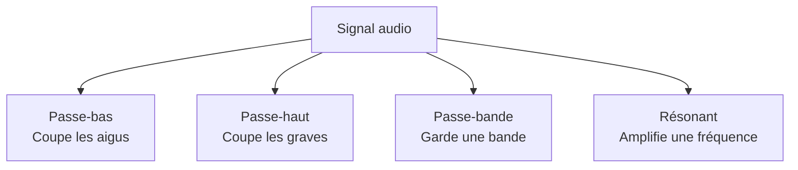

---
tags:
  - Faust
  - Intermédiaire
  - Pratique
description: "Filtres en Faust - passe-bas, passe-haut, résonant, biquad, FIR vs IIR et égalisation paramétrique"
estimated_time: "80 min"
fiche_number: 2
total_fiches: 6
cursus: "Phase 4 - DSP appliqué"
---

# 02 - Filtres

> **En bref** : À la fin de cette fiche, tu sauras utiliser les filtres de la bibliothèque Faust, construire des filtres FIR et IIR manuellement, et créer un égaliseur paramétrique. Lecture estimée : 80 min.


## Prérequis

- [Fiche 04 - Mémoire et délais](../03-langage-faust-fondamentaux/04-memoire-delais.md) : opérateurs `'`, `@` et `~`, lecture/écriture en mémoire
- [Fiche 03 - Mathématiques pour le DSP](../01-fondamentaux-acoustique/03-mathematiques-dsp.md) : nombres complexes, transformée en Z, pôles et zéros

## Objectif de cette fiche

À la fin de cette fiche, tu sauras utiliser les filtres de la bibliothèque Faust, construire des filtres FIR et IIR manuellement, et créer un égaliseur paramétrique.

---

## Concepts

Cette section explique tous les concepts nécessaires. Lis-la entièrement avant de passer aux étapes pratiques.

### Qu'est-ce qu'un filtre audio ?

**Définition** : Un filtre audio est un processeur de signal qui modifie le contenu fréquentiel d'un son en atténuant ou en amplifiant certaines plages de fréquences, tout en laissant les autres inchangées.

**Le problème que les filtres résolvent** :

Sans filtres, voici les problèmes rencontrés :

1. **Son brut inutilisable** : un microphone capte toutes les fréquences, y compris les bruits parasites qu'on veut éliminer
2. **Synthèse sonore limitée** : un oscillateur en dents de scie produit un son riche mais figé. Impossible de sculpter son timbre sans filtre
3. **Mixage impossible** : deux instruments qui occupent les mêmes fréquences se masquent mutuellement

**Comment les filtres résolvent ces problèmes** :

| Problème | Solution apportée par les filtres |
| -------- | --------------------------------- |
| Son brut inutilisable | Un passe-haut coupe les grondements, un passe-bas coupe les sifflements |
| Synthèse sonore limitée | Un passe-bas balayé crée le son classique de synthétiseur soustractif |
| Mixage impossible | Des filtres EQ sculptent chaque instrument pour lui donner sa place dans le spectre |

**Analogie concrète** : Un filtre audio fonctionne comme un tamis de cuisine. Un tamis à mailles fines retient les gros morceaux et laisse passer les petits (filtre passe-bas : laisse les basses fréquences). En choisissant la taille des mailles, tu contrôles ce qui passe.

**Ce qu'un filtre n'est PAS** :

- Un filtre n'est pas un égaliseur de volume. Il agit sur des fréquences spécifiques, pas sur le volume global.
- Un filtre n'est pas un effet temporel. Il modifie le spectre à chaque instant. Un delay agit sur la dimension temporelle.

Le diagramme suivant illustre les quatre types de filtres audio les plus courants et leur effet sur le signal :



---

### Filtre passe-bas (lowpass) et passe-haut (highpass)

**Passe-bas** : laisse passer les fréquences sous fc, atténue au-dessus. En Faust : `fi.lowpass(ordre, fc)`.

**Passe-haut** : laisse passer les fréquences au-dessus de fc, atténue en dessous. En Faust : `fi.highpass(ordre, fc)`.

| Paramètre | Signification | Valeurs typiques |
| --------- | ------------- | ---------------- |
| fc (fréquence de coupure) | Fréquence où le signal est atténué de -3 dB | 20 à 20 000 Hz |
| Ordre | Pente d'atténuation (ordre 1 = -6 dB/octave, ordre 2 = -12 dB/octave) | 1 à 5 |

**Comparaison** :

| Passe-bas (lowpass) | Passe-haut (highpass) |
| ------------------- | --------------------- |
| Laisse passer sous fc | Laisse passer au-dessus de fc |
| Son plus chaud, plus sourd | Son plus fin, plus brillant |
| `fi.lowpass(ordre, fc)` | `fi.highpass(ordre, fc)` |

```faust
import("stdfaust.lib");

// Passe-bas d'ordre 3 à 1000 Hz
process = fi.lowpass(3, 1000);

// Passe-haut d'ordre 2 à 200 Hz
// process = fi.highpass(2, 200);
```

---

### Filtre passe-bande (bandpass)

**Définition** : Laisse passer une bande de fréquences autour de fc, atténue en dessous et au-dessus.

| Paramètre | Signification |
| --------- | ------------- |
| fc | Fréquence centrale de la bande passante |
| Q (facteur de qualité) | Q élevé = bande étroite, Q faible = bande large |
| Bande passante | $bw = f_c / Q$ |

**Analogie concrète** : Le passe-bande est comme une fenêtre dans un mur opaque. La position correspond à fc, la largeur correspond au Q.

```faust
import("stdfaust.lib");

// Passe-bande via combinaison passe-haut + passe-bas
process = fi.highpass(2, 800) : fi.lowpass(2, 1200);
```

---

### Filtre résonant

**Définition** : Un filtre passe-bas avec un pic d'amplitude à fc, contrôlé par Q. En Faust : `fi.resonlp(fc, q, gain)`.

| Paramètre | Signification | Valeurs typiques |
| --------- | ------------- | ---------------- |
| fc | Fréquence de coupure/résonance | 20 à 20 000 Hz |
| q | Hauteur du pic (0.7 = pas de pic, 100 = forte résonance) | 0.7 à 100 |
| gain | Gain global du filtre | 0.0 à 1.0 |

**Analogie concrète** : Le filtre résonant est comme une balançoire. Le Q détermine la hauteur : Q faible = la balançoire bouge à peine, Q extrême = la balançoire fait un tour complet (auto-oscillation).

```faust
import("stdfaust.lib");

// Filtre résonant : fc = 800 Hz, Q = 5, gain = 1.0
process = fi.resonlp(800, 5, 1.0);
```

---

### Filtre biquad

**Définition** : Forme générique de filtre numérique à 2 pôles/2 zéros. En Faust : `fi.tf2(b0, b1, b2, a1, a2)`. Avec 5 coefficients, il peut réaliser n'importe quel filtre du second ordre.

Équation aux différences :

$$y[n] = b_0 \cdot x[n] + b_1 \cdot x[n-1] + b_2 \cdot x[n-2] - a_1 \cdot y[n-1] - a_2 \cdot y[n-2]$$

**Analogie concrète** : Le biquad est un moule à gâteau universel. En tournant 5 molettes (coefficients), tu obtiens n'importe quelle forme (passe-bas, passe-haut, notch, peak EQ, shelf, allpass).

```faust
import("stdfaust.lib");

// Biquad : passe-bas Butterworth, fc = 1000 Hz, SR = 48000
process = fi.tf2(0.00415, 0.00831, 0.00415, -1.86153, 0.87816);
```

---

### FIR vs IIR

**FIR** (Finite Impulse Response) : la sortie dépend uniquement de l'entrée. Pas de rétroaction. En Faust : construit avec `@` et `+`.

**IIR** (Infinite Impulse Response) : la sortie dépend de l'entrée ET des sorties précédentes. En Faust : construit avec `~`.

| Critère | FIR | IIR |
| ------- | --- | --- |
| Rétroaction | Non | Oui |
| Stabilité | Toujours stable | Peut devenir instable |
| Phase | Peut être linéaire | Non linéaire |
| Coût CPU pour pente raide | Élevé | Faible |
| Imitation filtres analogiques | Difficile | Naturelle |
| Opérateur Faust | `@` (délai) | `~` (récursif) |

**FIR manuellement** (filtre moyenneur) :

```faust
import("stdfaust.lib");

// Moyenneur de 4 échantillons : y[n] = (x[n] + x[n-1] + x[n-2] + x[n-3]) / 4
process = _ <: (_, @(1), @(2), @(3)) :> _ * 0.25;
```

**IIR manuellement** (passe-bas du premier ordre) :

```faust
import("stdfaust.lib");

// y[n] = (1-p) * x[n] + p * y[n-1]
// p = e^(-2π × fc / SR)
fc = hslider("fc [scale:log]", 1000, 20, 20000, 1);
p = exp(-2 * ma.PI * fc / ma.SR);
process = *(1 - p) : + ~ *(p);
```

```text
Conversion p vers fc (SR = 48000 Hz) :
- fc = 100 Hz   →  p ≈ 0.987
- fc = 1000 Hz  →  p ≈ 0.877
- fc = 5000 Hz  →  p ≈ 0.519
```

**Règle de choix** : FIR pour phase linéaire ou convolution. IIR pour efficacité CPU, résonance, EQ temps réel.

---

### Égalisation paramétrique

**Définition** : Système de filtrage où chaque bande a trois paramètres : fréquence centrale, gain (dB) et Q.

| Paramètre | Description | Valeurs typiques |
| --------- | ----------- | ---------------- |
| Fréquence (fc) | Fréquence centrale | 20 à 20 000 Hz (échelle log) |
| Gain (dB) | Boost (+) ou coupe (-) | -12 à +12 dB |
| Q | Largeur (Q haut = étroit, Q bas = large) | 0.1 à 10 |

**Structure classique** : low shelf + bandes paramétriques + high shelf, en série.

**Analogie concrète** : L'EQ paramétrique est un outil de chirurgien pour le son : chaque curseur peut être déplacé horizontalement (fréquence), monté ou descendu (gain), et élargi ou rétréci (Q).

---

### Visualisation avec faust2plot

`faust2plot` génère les données de sortie d'un programme Faust pour les tracer.

```bash
# Réponse impulsionnelle d'un filtre
faust2plot -n 1024 filtre.dsp | gnuplot
```

Le Faust IDE (<https://faustide.grame.fr>) intègre un affichage de la réponse en fréquence directement dans le navigateur.

---

### Filtres de la bibliothèque fi : tour d'horizon

| Fonction | Description |
| -------- | ----------- |
| `fi.lowpass(N, fc)` | Passe-bas Butterworth d'ordre N |
| `fi.highpass(N, fc)` | Passe-haut Butterworth d'ordre N |
| `fi.bandpass(N, fl, fh)` | Passe-bande d'ordre N |
| `fi.bandstop(N, fl, fh)` | Coupe-bande d'ordre N |
| `fi.resonlp(fc, q, gain)` | Passe-bas résonant |
| `fi.resonhp(fc, q, gain)` | Passe-haut résonant |
| `fi.resonbp(fc, q, gain)` | Passe-bande résonant |
| `fi.peak_eq(gain, fc, bw)` | EQ peak (bande passante en Hz) |
| `fi.peak_eq_cq(gain, fc, Q)` | EQ peak (Q constant) |
| `fi.low_shelf(gain, fc)` | Shelf bas |
| `fi.high_shelf(gain, fc)` | Shelf haut |
| `fi.allpass_fcomb(maxdel, del, gain)` | Allpass comb |
| `fi.notchw(bw, fc)` | Notch (coupe-bande étroit) |
| `fi.tf2(b0, b1, b2, a1, a2)` | Biquad générique |

**Conseil** : Cherche toujours dans `fi` avant de construire un filtre manuellement. La bibliothèque gère les cas limites (stabilité, Nyquist).

---

## Étapes Pratiques

### Étape 1 : Appliquer un filtre passe-bas sur du bruit blanc

Crée un fichier `filtre-lowpass.dsp` :

```faust
import("stdfaust.lib");

fc = hslider("Fréquence de coupure [scale:log]", 1000, 20, 20000, 1);

// Ordre du filtre (constante à la compilation, non modifiable en temps réel)
// fi.lowpass exige un ordre constant car il détermine le nombre de sections du filtre
ordre = 3;

// Bruit blanc filtré par un passe-bas
process = no.noise : fi.lowpass(ordre, fc);
```

```bash
faust2jaqt filtre-lowpass.dsp && ./filtre-lowpass
```

**Résultat attendu** :

```text
- fc = 20000 Hz : souffle uniforme (non filtré)
- fc = 500 Hz : son grave et étouffé
- fc = 100 Hz : grondement sourd
- Ordre élevé : coupure plus franche
```

---

### Étape 2 : Implémenter un filtre moyenneur FIR manuellement

Crée un fichier `fir-moyenneur.dsp` :

```faust
import("stdfaust.lib");

N = 8;

// FIR moyenneur : duplique en N copies retardées, somme, divise
// par(i, N, @(i)) crée @(0), @(1), ..., @(7) en parallèle
filtre_fir = _ <: par(i, N, @(i)) :> _ / N;

// Compare bruit brut (gauche) au bruit filtré (droit)
process = no.noise <: (_, filtre_fir);
```

```bash
faust2jaqt fir-moyenneur.dsp && ./fir-moyenneur
```

**Résultat attendu** :

```text
- Canal gauche : bruit blanc non filtré
- Canal droit : son plus sourd (aigus atténués)
- Première annulation (notch) à SR / N = 48000 / 8 = 6000 Hz
  (la coupure réelle à -3 dB est plus basse : environ 0,44 x SR/N ≈ 2640 Hz)
```

---

### Étape 3 : Implémenter un filtre IIR passe-bas du premier ordre avec `~`

Crée un fichier `iir-premier-ordre.dsp` :

```faust
import("stdfaust.lib");

fc = hslider("Fréquence de coupure [scale:log]", 1000, 20, 20000, 1);

// p = e^(-2π × fc / SR) : coefficient de feedback
p = exp(-2 * ma.PI * fc / ma.SR);

// IIR 1er ordre : *(1-p) atténue l'entrée, + ~ *(p) ajoute le feedback
process = no.noise : *(1 - p) : + ~ *(p);
```

```bash
faust2jaqt iir-premier-ordre.dsp && ./iir-premier-ordre
```

**Résultat attendu** :

```text
- Comportement identique à fi.lowpass(1, fc)
- fc = 100 Hz : très étouffé, fc = 10000 Hz : presque non filtré
- Coupure douce (-6 dB/octave) car premier ordre
```

---

### Étape 4 : Créer un filtre résonant avec sweep de fréquence

Crée un fichier `resonant-sweep.dsp` :

```faust
import("stdfaust.lib");

vitesse = hslider("Vitesse (Hz)", 0.5, 0.05, 5, 0.01);
freq_min = hslider("Fréquence min [scale:log]", 200, 20, 2000, 1);
freq_max = hslider("Fréquence max [scale:log]", 5000, 500, 20000, 1);
q = hslider("Résonance (Q)", 5, 0.7, 30, 0.1);

// LFO sinusoïdal entre 0 et 1
lfo = (os.osc(vitesse) + 1) / 2;

// Balayage exponentiel pour perception uniforme
fc = freq_min * pow(freq_max / freq_min, lfo);

// Dent de scie filtrée par résonant
source = os.sawtooth(220) * 0.3;
process = source : fi.resonlp(fc, q, 1);
```

```bash
faust2jaqt resonant-sweep.dsp && ./resonant-sweep
```

**Résultat attendu** :

```text
- Le timbre change de façon cyclique (wah automatique)
- Q faible (0.7) : balayage subtil
- Q élevé (20-30) : sifflement à la fréquence de coupure
- Son typique de la synthèse soustractive
```

---

### Étape 5 : Construire un EQ 3 bandes (low shelf, parametric mid, high shelf)

Crée un fichier `eq-3-bandes.dsp` :

```faust
import("stdfaust.lib");

source = no.noise * 0.5;

// Bande 1 : Low Shelf
fc1 = hslider("[1]Low Shelf/Fréquence [scale:log]", 200, 20, 2000, 1);
gain1 = hslider("[1]Low Shelf/Gain (dB)", 0, -12, 12, 0.1);

// Bande 2 : Parametric Mid
fc2 = hslider("[2]Mid Peak/Fréquence [scale:log]", 1000, 100, 10000, 1);
gain2 = hslider("[2]Mid Peak/Gain (dB)", 0, -12, 12, 0.1);
Q2 = hslider("[2]Mid Peak/Q", 1, 0.1, 10, 0.1);

// Bande 3 : High Shelf
fc3 = hslider("[3]High Shelf/Fréquence [scale:log]", 5000, 1000, 20000, 1);
gain3 = hslider("[3]High Shelf/Gain (dB)", 0, -12, 12, 0.1);

// Conversion Q → bande passante pour fi.peak_eq : bw = fc / Q
bw2 = fc2 / Q2;

// Chaîne en série : low shelf → mid peak → high shelf
process = source
        : fi.low_shelf(gain1, fc1)
        : fi.peak_eq(gain2, fc2, bw2)
        : fi.high_shelf(gain3, fc3);
```

```bash
faust2jaqt eq-3-bandes.dsp && ./eq-3-bandes
```

**Résultat attendu** :

```text
- Gains à 0 dB : son non modifié
- Low Shelf +6 dB : basses renforcées
- Mid Peak +6 dB, Q = 5 : pic étroit dans les médiums
- High Shelf -6 dB : son mat et étouffé
```

---

### Étape 6 : Visualiser les réponses en fréquence

Crée un fichier `visualiser-filtre.dsp` :

```faust
import("stdfaust.lib");

// Générateur d'impulsion : 1 au premier échantillon, 0 ensuite
impulse = 1 - 1';

// Applique le filtre à l'impulsion
process = impulse : fi.lowpass(4, 2000);
```

```bash
# Tracer la réponse impulsionnelle
faust2plot -n 1024 visualiser-filtre.dsp | gnuplot
```

**Avec le Faust IDE** :

```text
1. Ouvre https://faustide.grame.fr
2. Colle le code du filtre, clique "Run"
3. Clique sur "Frequency Response"
4. Pour un passe-bas ordre 4 à 2000 Hz :
   - 0 dB de 20 Hz à ~1500 Hz
   - -3 dB à 2000 Hz (point de coupure)
   - Pente de -24 dB/octave au-dessus (4 × -6 dB/octave)
```

---

## Commandes Utiles

| Commande / Fonction | Action |
| -------------------- | ------ |
| `fi.lowpass(N, fc)` | Passe-bas Butterworth d'ordre N |
| `fi.highpass(N, fc)` | Passe-haut Butterworth d'ordre N |
| `fi.resonlp(fc, q, gain)` | Passe-bas résonant |
| `fi.tf2(b0, b1, b2, a1, a2)` | Biquad générique (5 coefficients) |
| `fi.peak_eq(gain, fc, bw)` | EQ peak (bande passante en Hz) |
| `fi.peak_eq_cq(gain, fc, Q)` | EQ peak (Q constant) |
| `fi.low_shelf(gain, fc)` | Shelf bas |
| `fi.high_shelf(gain, fc)` | Shelf haut |
| `fi.notchw(bw, fc)` | Notch (coupe-bande) |
| `_ <: par(i, N, @(i)) :> _` | FIR à N taps (structure manuelle) |
| `+ ~ *(p)` | IIR du premier ordre |
| `no.noise` | Bruit blanc (signal de test) |
| `faust2jaqt fichier.dsp` | Compiler avec interface Qt + JACK |
| `faust2plot -n 1024 fichier.dsp` | Réponse impulsionnelle |

---

## Pièges Fréquents

### Piège 1 : Fréquence de coupure supérieure à Nyquist

**Problème** : fc > `ma.SR / 2` provoque des instabilités.

**Solution** : Limiter fc à 20 000 Hz ou `ma.SR/2 - 1`.

```faust
// ❌ fc peut dépasser Nyquist
fc = hslider("fc", 1000, 20, 50000, 1);

// ✅ fc limitée
fc = hslider("fc", 1000, 20, 20000, 1) : min(ma.SR/2 - 1);
```

---

### Piège 2 : Filtre IIR instable

**Problème** : Un coefficient de feedback >= 1 fait exploser le signal (danger pour les enceintes et les oreilles).

**Solution** : Le coefficient p doit être strictement entre -1 et 1.

```faust
// ❌ p peut valoir 1 ou plus
process = + ~ *(hslider("p", 0.5, 0, 2, 0.01));

// ✅ p limité sous 1
process = + ~ *(hslider("p", 0.5, 0, 0.999, 0.001));
```

---

### Piège 3 : Confondre Q et bande passante

**Problème** : `fi.peak_eq` attend une bande passante en Hz, pas un Q. Passer Q = 5 crée un filtre de 5 Hz de large.

**Solution** : Convertir avec `bw = fc / Q`, ou utiliser `fi.peak_eq_cq` qui accepte directement le Q.

```faust
// ❌ On passe Q = 5 comme bande passante → filtre de 5 Hz !
process = fi.peak_eq(6, 1000, 5);

// ✅ Conversion Q → bw
process = fi.peak_eq(6, 1000, 1000/5); // bw = 200 Hz

// ✅ Ou utiliser la variante avec Q
process = fi.peak_eq_cq(6, 1000, 5);
```

---

### Piège 4 : Ordre de filtre trop élevé

**Problème** : `fi.lowpass(10, fc)` introduit des artefacts numériques (erreurs d'arrondi).

**Solution** : Deux filtres d'ordre modéré en série plutôt qu'un seul d'ordre élevé.

```faust
// ❌ Ordre 10
process = fi.lowpass(10, fc);

// ✅ Deux ordres 4 en série = -48 dB/octave
process = fi.lowpass(4, fc) : fi.lowpass(4, fc);
```

---

### Piège 5 : Oublier l'échelle logarithmique

**Problème** : Un slider linéaire de 20 à 20 000 Hz rend le contrôle inutilisable dans les basses.

**Solution** : Ajouter `[scale:log]` aux sliders de fréquence.

```faust
// ❌ Linéaire
fc = hslider("fc", 1000, 20, 20000, 1);

// ✅ Logarithmique
fc = hslider("fc [scale:log]", 1000, 20, 20000, 1);
```

---

## Checklist de Validation

- [ ] Je sais expliquer la différence entre passe-bas, passe-haut et passe-bande
- [ ] Je sais utiliser `fi.lowpass(N, fc)` et `fi.highpass(N, fc)`
- [ ] Je comprends le rôle du Q dans `fi.resonlp`
- [ ] Je sais ce qu'est un biquad et quand utiliser `fi.tf2`
- [ ] Je sais expliquer la différence entre FIR et IIR
- [ ] Je sais construire un FIR manuellement avec `<:`, `@` et `:>`
- [ ] Je sais construire un IIR du premier ordre avec `~`
- [ ] Je sais créer un EQ paramétrique avec `fi.peak_eq` ou `fi.peak_eq_cq`
- [ ] Je sais combiner `fi.low_shelf`, `fi.peak_eq` et `fi.high_shelf` en série
- [ ] Je sais utiliser `[scale:log]` sur les sliders de fréquence
- [ ] Je sais visualiser la réponse en fréquence d'un filtre

---

## Exercice Pratique

**Énoncé** : Construis un égaliseur paramétrique 3 bandes complet. Chaque bande doit avoir trois paramètres réglables : fréquence (20-20 000 Hz, échelle logarithmique), gain (-12 à +12 dB) et Q (0.1 à 10). Ajoute un bypass global qui permet de comparer le son avec et sans EQ.

**Indications** :

- Utilise `fi.peak_eq_cq(gain, fc, Q)` pour chaque bande
- Connecte les trois bandes en série avec `:`
- Pour le bypass, utilise `ba.bypass1(bypass, chaine_eq)`
- Organise les sliders dans des groupes avec `hgroup`
- Ajoute `[scale:log]` sur tous les sliders de fréquence
- Utilise `no.noise * 0.5` comme source de test
- Valeurs par défaut : Bande 1 = 250 Hz, Bande 2 = 1000 Hz, Bande 3 = 4000 Hz, gains = 0 dB, Q = 1.0

**Résultat attendu** :

- 3 groupes de 3 sliders + bouton bypass
- Bypass on : signal non modifié
- Bande 1 boost à 250 Hz : basses renforcées
- Bande 2 coupe à 1000 Hz, Q = 5 : encoche étroite dans les médiums
- Bande 3 boost à 4000 Hz : son plus brillant

---

## Solution de l'Exercice

> **Note** : Cette section contient la solution complète. Essaie d'abord de résoudre l'exercice par toi-même avant de consulter cette solution.

---

```faust
import("stdfaust.lib");

// Source de test : bruit blanc à -6 dB
source = no.noise * 0.5;

// Bypass global
bypass_on = checkbox("[0] Bypass");

// Bande 1
fc1 = hgroup("[1] Bande 1", hslider("[1] Fréquence [scale:log]", 250, 20, 20000, 1));
gain1 = hgroup("[1] Bande 1", hslider("[2] Gain (dB)", 0, -12, 12, 0.1));
Q1 = hgroup("[1] Bande 1", hslider("[3] Q", 1, 0.1, 10, 0.1));

// Bande 2
fc2 = hgroup("[2] Bande 2", hslider("[1] Fréquence [scale:log]", 1000, 20, 20000, 1));
gain2 = hgroup("[2] Bande 2", hslider("[2] Gain (dB)", 0, -12, 12, 0.1));
Q2 = hgroup("[2] Bande 2", hslider("[3] Q", 1, 0.1, 10, 0.1));

// Bande 3
fc3 = hgroup("[3] Bande 3", hslider("[1] Fréquence [scale:log]", 4000, 20, 20000, 1));
gain3 = hgroup("[3] Bande 3", hslider("[2] Gain (dB)", 0, -12, 12, 0.1));
Q3 = hgroup("[3] Bande 3", hslider("[3] Q", 1, 0.1, 10, 0.1));

// 3 bandes peak EQ en série
eq_chain = fi.peak_eq_cq(gain1, fc1, Q1)
         : fi.peak_eq_cq(gain2, fc2, Q2)
         : fi.peak_eq_cq(gain3, fc3, Q3);

// ba.bypass1 : bypass mono (lisse la transition on/off)
process = source : ba.bypass1(bypass_on, eq_chain);
```

**Pour compiler et tester** :

```bash
faust2jaqt eq-parametrique.dsp && ./eq-parametrique
```

**Tests à effectuer** :

```text
Test 1 : Gains à 0 dB, bypass on/off → aucune différence
Test 2 : Bande 1 gain +12 dB, Q 1, fc 250 Hz → basses renforcées
Test 3 : Bande 2 gain -12 dB, Q 10, fc 1000 Hz → encoche étroite (notch)
Test 4 : Bande 3 gain +6 dB, Q 0.5, fc 4000 Hz → aigus plus aériens
Test 5 : Réglages combinés + bypass → alterner pour entendre la différence
```

---

## Navigation

← Fiche précédente : **[01 - Oscillateurs et synthèse](01-oscillateurs-synthese.md)**

→ Fiche suivante : **[03 - Effets audio](03-effets-audio.md)**
